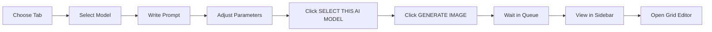

# Home Page Overview

Complete guide to the main generation interface.

## 🏠 Home Page Layout

The Home page is your primary workspace for generating images.

[SCREENSHOT: Full home page interface]

---

## 📑 Tab Structure

### 7 Main Tabs

```
┌─────────────────────────────────────┐
│ Newbie │ Newbie Premium │ Newbie Ultimate Premium │
│ Newbie Premium Tools │ Expert │ Presets │ Favorites │
└─────────────────────────────────────┘
```

**Each tab shows different models** based on:
- Your subscription level
- Model complexity
- Feature specialization

---

## 🎨 Tab Overview

### 1. Newbie Tab

**Who:** Free users, beginners  
**Shows:** 4-8 Baby (free) models  
**Interface:** Simplified, card-based

[SCREENSHOT: Newbie tab]

**Models shown:**
```
- Text to Minecraft Item Texture 16×16
- Text to Minecraft Block Texture 32×32  
- Text to Pixel Art 128×128
- And more...
```

**Best for:**
- First-time users
- Testing platform
- Learning basics

### 2. Newbie Premium Tab

**Who:** Premium users ($39.99+)  
**Shows:** Curated Standard/Ultimate models  
**Interface:** Card-based, user-friendly

[SCREENSHOT: Newbie Premium tab]

**Models shown:**
```
- Ultimate Premium 16px (4 models)
- Ultimate Premium 32px
- Logo generators
- High-quality item models
```

**Best for:**
- Premium users wanting simple interface
- Quick access to good models

### 3. Newbie Ultimate Premium Tab

**Who:** Ultimate users ($49.99+)  
**Shows:** Top-tier models  
**Interface:** Card-based

**Models shown:**
```
- Highest quality 16px models
- Highest quality 32px models
- Specialized tools
```

**Best for:**
- Ultimate users
- Quality-focused simple interface

### 4. Newbie Premium Tools Tab

**Who:** Premium users  
**Shows:** Processing tools  
**Interface:** Specialized tools

[SCREENSHOT: Newbie Premium Tools]

**Tools:**
```
- Color Palette Matcher
- Style Match to Color Palette
- Variant generators
```

**Best for:**
- Recoloring items
- Matching palettes
- Creating variations

### 5. Expert Tab ⭐

**Who:** All users (shows what you can access)  
**Shows:** ALL 300+ models  
**Interface:** Advanced, hierarchical

[SCREENSHOT: Expert tab]

**Structure:**
```
Expert
├── Baby (free)
├── Standard ($39.99+)
├── Pro ($39.99+)
├── Ultimate ($49.99+)
├── Elite ($99.99+)
├── Orion ($49.99+, limited)
├── Exclusive
└── Rescue Only
```

**Each tier has nested categories:**
```
Pixel Art
├── 16px
├── 32px
├── 64px
└── 256px (GUIs here!)
```

**Best for:**
- Advanced users
- Finding specific models
- Full control

:::tip Expert Tab is Most Complete
Newbie tabs show ~5% of models. Expert tab shows 100%. Explore Expert for best models!
:::

### 6. Presets Tab

**Who:** Premium users  
**Shows:** Specialized workflows  
**Interface:** Preset tools

[SCREENSHOT: Presets tab]

**Available presets:**
```
- Style Match to Color Palette
- MC GUI Editor (advanced GUI builder)
- Variant and Recolorize
- Animate Items
- Items to Armor Set
```

**Best for:**
- Specific tasks
- Armor generation
- Animations
- Advanced workflows

### 7. Favorites Tab

**Who:** All users  
**Shows:** Your favorited models  
**Interface:** Your saved models only

**How to add favorites:**
- Click ⭐ icon on any model
- Appears in Favorites tab
- Quick access

**Best for:**
- Frequently used models
- Personal workflow
- Quick access

---

## 🎛️ Generation Interface Elements

### Common Elements (All Tabs)

**Top section:**

```
┌─────────────────────────────────┐
│  Prompt Text Box (green)        │ ← Write description here
├─────────────────────────────────┤
│  Text Accuracy Slider           │ ← Adjust prompt following
├─────────────────────────────────┤
│  Collections Dropdown           │ ← Generate into collection
└─────────────────────────────────┘
```

[SCREENSHOT: Top section interface]

**Model section:**

```
┌─────────────────────────────────┐
│  SELECT THIS AI MODEL (button)  │ ← MUST CLICK!
├─────────────────────────────────┤
│  Model Version Selector         │
├─────────────────────────────────┤
│  Model Preset Save/Load         │
└─────────────────────────────────┘
```

**Parameters section:**

```
┌─────────────────────────────────┐
│  Model-specific parameters      │
│  - Generation Precision         │
│  - Creativity sliders           │
│  - Style Selector (if supported)│
└─────────────────────────────────┘
```

**Bottom section:**

```
┌─────────────────────────────────┐
│  GENERATE IMAGE (button)        │ ← Click to start
└─────────────────────────────────┘
```

---

## 📊 Sidebar Elements

### Left Sidebar - Generation Queue

[SCREENSHOT: Left sidebar]

**Shows:**
- Your current generations
- Progress indicators
- Status (generating, complete, failed)

**Elements:**

```
┌─────────────────────┐
│ Update button       │ ← Refresh list
├─────────────────────┤
│ Hide/Show images    │ ← Collapse/expand
├─────────────────────┤
│ Generation 1 [NEW]  │ ← Latest generation
│ Generation 2        │
│ Generation 3        │
└─────────────────────┘
```

**Actions on each generation:**
- Click thumbnail to view
- Click "Grid" to open Grid Editor
- Click "Download" to save
- Click "Delete" to remove

### Right Area - Recent Full Images

**Shows:**
- Larger previews
- Recent completions
- Auto-updates

**Refreshes automatically** when new generation completes.

---

## 🎯 Workflow Through Interface

### Typical Session



**Step-by-step navigation** through interface.

---

## 🔧 Interface Tips

:::tip Tip #1: Always Click "Select This AI Model"
Before generating, **must click** the green "Select This AI Model" button. Forgot this? Common beginner mistake!
:::

:::tip Tip #2: Use Update Button
If generation doesn't appear in sidebar, click **"Update"** button instead of refreshing page.
:::

:::tip Tip #3: Hide Sidebar for Space
Click **"Hide images"** to collapse left sidebar when adjusting parameters.
:::

:::tip Tip #4: Check Tab Carefully
Wrong tab = wrong models available. Make sure you're in correct tab for your plan level.
:::

---

## 🆘 Interface Troubleshooting

<details>
<summary>Can't find a model</summary>

**Check:**
1. Are you in right tab? (Most models in Expert)
2. Do you have required plan? (Premium/Ultimate/Elite)
3. Looking in right category? (Pixel Art → 16px → Item models)

**Solution:**
- Go to Expert tab
- Navigate through tiers/categories
- Use Model Explorer (Features menu)

</details>

<details>
<summary>Generate button doesn't work</summary>

**Check:**
1. Did you click "SELECT THIS AI MODEL" first?
2. Is prompt box filled in?
3. Any error messages shown?

**Common cause:** Forgot to select model first.

</details>

<details>
<summary>Sidebar shows no generations</summary>

**Solutions:**
1. Click "Update" button
2. Check you're logged in
3. Wait 1-2 minutes
4. Refresh page if still nothing

</details>

---

## ✅ Home Page Mastery Checklist

You understand Home page if you can:

- [ ] Navigate between tabs
- [ ] Find models in each tab
- [ ] Know where Expert tab is (most complete)
- [ ] Write prompt in text box
- [ ] Click "SELECT THIS AI MODEL" before generating
- [ ] Click "GENERATE IMAGE" to start
- [ ] Find generations in left sidebar
- [ ] Open Grid Editor

:::success Interface Mastered
[Learn about Expert tab →](expert-tab)

[Learn about Grid Editor →](../image-tools/image-grid-editor)
:::
