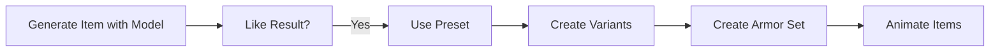

# Presets Tab

Specialized workflow tools.

## 🎯 What are Presets?

**Presets** = Pre-configured tools for specific tasks.

**Different from models:**
- Models: Generate from text prompts
- Presets: Process existing images or use workflows

---

## 🛠️ Available Presets

### 1. Style Match to Color Palette

**Purpose:** Match color palette from reference images

[SCREENSHOT: Color palette matcher interface]

**How it works:**
```
1. Upload reference image with desired colors
2. Upload target items to recolor
3. AI matches color palette
4. Download recolored items
```

**Best for:**
- Recoloring item sets
- Matching existing pack colors
- Creating color variants

**Access:** Newbie Premium Tools tab or Presets tab

### 2. MC GUI Editor

**Purpose:** Advanced GUI building tool

[SCREENSHOT: MC GUI Editor interface]

**Features:**
```
- Manual GUI construction
- Slot placement
- Color customization
- Advanced controls
```

**Complexity:** Very high

**Best for:**
- Advanced users
- Precise GUI control
- Complex interfaces

:::warning Advanced Feature
MC GUI Editor is extremely complex. Requires deep understanding of GUIs. Most users should use Style Selector GUI generation instead.
:::

### 3. Variant and Recolorize

**Purpose:** Create color variations of items

[SCREENSHOT: Variant tool]

**How it works:**
```
1. Upload base item image
2. AI creates color variants
3. Download variations
```

**Best for:**
- Testing color schemes
- Creating item variants
- Exploring palettes

### 4. Animate Items

**Purpose:** Generate item animations

[SCREENSHOT: Animate items tool]

**How it works:**
```
1. Upload base item (16×16 recommended)
2. Use white background
3. AI generates animation frames
4. Extract frames for Optifine CIT
```

**Best for:**
- Animated textures
- Optifine custom item animations
- Dynamic items

**Recommendation:** Use white background for best results.

### 5. Items to Armor Set

**Purpose:** Generate full armor from single item

[SCREENSHOT: Items to Armor tool]

**How it works:**
```
1. Upload item (e.g., chestplate)
2. AI generates matching helmet, leggings, boots
3. Download complete set
```

**Best for:**
- Quick armor set creation
- Matching armor pieces
- Consistent armor design

---

## 🎯 When to Use Presets

### Instead of Regular Generation

**Use presets when:**

```
You have existing item → Want variations
You have color scheme → Want to apply to items
You have one armor piece → Want full set
You have static item → Want animation
```

**Don't use presets for:**
```
Creating items from scratch → Use regular models
Generating new designs → Use regular models
```

### Workflow Integration



**Presets complement** regular generation.

---

## 🔧 Using Presets

### General Preset Workflow

**1. Access Presets tab**
```
Home → Presets
```

**2. Choose preset tool**
```
Click the preset you need
```

**3. Follow tool-specific instructions**
```
Each preset has different interface
Read yellow usage tips
```

**4. Upload required images**
```
Drag and drop or click to upload
Check image requirements (size, format)
```

**5. Generate/Process**
```
Click generate/process button
Wait for completion
```

**6. Download results**
```
Download individual results
Or download all as zip
```

---

## 🎨 Preset-Specific Guides

### Color Palette Matcher Usage

**Requirements:**
```
Reference images: Same size as target
Format: PNG preferred
Transparency: Maintained
```

**Steps:**
```
1. Upload reference with desired palette
2. Upload items to recolor (same size)
3. AI extracts palette from reference
4. AI applies to target items
5. Download recolored items
```

**Tips:**
- Use clean reference with clear colors
- Same-size images work best
- Transparency preserved

### Items to Armor Set Usage

**Requirements:**
```
Input: One armor piece (chestplate recommended)
Size: 16×16 or 32×32
Background: White recommended
```

**Steps:**
```
1. Upload chestplate image
2. AI generates matching helmet, leggings, boots
3. Download individual pieces
4. Arrange in armor layer template
```

**Output:**
- Individual armor pieces
- Matching style and colors
- Need manual layer assembly

---

## ⚠️ Preset Limitations

### Not Fully Automated

**Presets require:**
```
✅ Good quality input images
✅ Correct image sizes
✅ Some manual work after
```

**Example - Items to Armor Set:**
```
AI generates pieces ✓
You assemble layer template (manual)
You test in Minecraft (manual)
```

### Quality Depends on Input

**Garbage in = garbage out:**

```
Poor quality input → Poor quality output
Good quality input → Good quality output
```

**Use high-quality generated items** as preset inputs.

---

## 📊 Preset Comparison

| Preset | Complexity | Input Required | Output | Use Case |
|--------|-----------|----------------|--------|----------|
| Color Palette Matcher | Medium | Reference + items | Recolored items | Palette matching |
| MC GUI Editor | Very High | Manual input | Custom GUI | Advanced GUI |
| Variant Recolorize | Low | One item | Color variants | Exploring colors |
| Animate Items | Medium | One item | Animation frames | Optifine animations |
| Items to Armor Set | Low | One armor piece | Full set | Quick armor sets |

---

## 🔧 Preset Troubleshooting

<details>
<summary>Preset not working</summary>

**Check:**
- Correct image sizes uploaded?
- Images in PNG format?
- Following instructions exactly?
- Premium subscription active?

</details>

<details>
<summary>Poor quality preset results</summary>

**Causes:**
- Input image quality low
- Wrong image size
- Incorrect settings

**Fix:**
- Use higher quality input
- Verify image dimensions
- Re-read preset instructions

</details>

---

## ✅ Presets Checklist

Use presets effectively:

- [ ] Identified which preset solves my problem
- [ ] Have premium subscription (required)
- [ ] Prepared input images correctly
- [ ] Read preset-specific instructions
- [ ] Verified image sizes match requirements
- [ ] Ready for some manual post-processing

:::success Presets Understood
[Complete interface guide →](../interface/)

[Learn Grid Editor →](../image-tools/image-grid-editor)
:::
