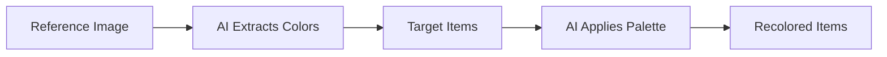

# Color Palette Matcher

Match color palettes across items.

## 🎨 What is Color Palette Matcher?

**Extracts color palette** from reference image and **applies to target items**.

**Use for:**
```
✅ Recoloring item sets
✅ Matching existing pack colors
✅ Creating color variants
✅ Maintaining palette consistency
```

**Access:** Newbie Premium Tools → Color Palette Matcher

[SCREENSHOT: Color Palette Matcher interface]

---

## 🎯 How It Works

### Process



**Example:**

**Reference:** Diamond armor (blue and cyan)

**Target items:** Iron tools (gray)

**Result:** Tools recolored to blue and cyan palette.

---

## 🚀 Step-by-Step Usage

### Step 1: Prepare Reference

**Create or find image with desired colors:**

```
Option A: Use existing generated item with good colors
Option B: Create colored image in Photopea
Option C: Find example image
```

**Requirements:**
```
✅ Clear, distinct colors
✅ Same size as target items
✅ PNG format
```

### Step 2: Prepare Target Items

**Items to recolor:**

```
Generate items normally
Download as PNGs
All same size as reference
```

**Example:**
```
5 iron tools (gray)
Want to recolor to blue
```

### Step 3: Access Tool

**Newbie Premium Tools → Color Palette Matcher**

Or **Presets → Style Match to Color Palette**

### Step 4: Upload Images

**Upload area has two sections:**

**Reference section:**
```
Upload: Image with desired palette
```

**Target section:**
```
Upload: Items to recolor
```

**All must be same size** (16×16, 32×32, etc.)

### Step 5: Generate

**Click process/generate button**

**AI:**
```
1. Analyzes reference colors
2. Extracts palette
3. Maps target colors to palette
4. Generates recolored versions
```

### Step 6: Download

**Downloads:**
```
ZIP with recolored items
Same names as originals
Ready to use
```

---

## 🎨 Use Cases

### Use Case 1: Pack Consistency

**Problem:**
```
Generated 20 items over time
Colors inconsistent across items
```

**Solution:**
```
1. Pick best colored item as reference
2. Recolor other 19 items to match
3. Now all items share palette
```

### Use Case 2: Theme Change

**Problem:**
```
Have medieval pack in brown/gray
Want nature pack in green/brown
```

**Solution:**
```
1. Create green/brown reference
2. Batch recolor all items
3. Pack now nature themed
```

### Use Case 3: Client Requirements

**Problem:**
```
Client wants specific brand colors
Need all items in those colors
```

**Solution:**
```
1. Create reference with client colors
2. Recolor all items
3. Matches brand perfectly
```

---

## 🔧 Color Matcher Tips

:::tip Same Size Requirement
Reference and target images **must be same size**. 16×16 reference with 32×32 targets won't work well.
:::

:::tip Clear Reference Colors
Use reference with distinct, clear colors. Avoid gradients or complex shading in reference.
:::

:::tip Transparency Preserved
Transparent areas in targets remain transparent after recoloring.
:::

:::tip Multiple References
Can't use multiple references. One reference palette applied to all targets.
:::

---

## ⚠️ Limitations

### Not Perfect Matching

```
AI interprets palette, doesn't copy exactly
Some color drift possible
May need manual adjustment
```

### Structural Changes

```
Tool recolors but may slightly alter structure
Usually minimal
Check results carefully
```

### Complexity Limit

```
Very complex color schemes may not transfer well
Simple palettes (3-8 colors) work best
```

---

## ✅ Color Matcher Checklist

Effective palette matching:

- [ ] Reference has clear color palette
- [ ] All images same size
- [ ] Target items are good quality
- [ ] Uploaded correctly (reference vs targets)
- [ ] Generated recolored versions
- [ ] Verified color accuracy
- [ ] Downloaded results

:::success Color Matching Mastered
[Complete special tools →](../special-tools/)

[Continue to account features →](../account/)
:::
