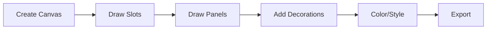

# MC GUI Editor

Advanced manual GUI construction tool.

:::warning Extremely Advanced
MC GUI Editor is the most complex tool on Pixel GPT. Requires deep understanding of GUIs, image editing, and patience.

**Most users should use Style Selector GUI generation instead.**
:::

## 🎯 What is MC GUI Editor?

**Manual GUI builder** with pixel-level control.

**Features:**
```
- Slot placement
- Panel drawing
- Color customization
- Layer management
- Export tools
```

**For:** Advanced users needing precise control.

---

## ⚠️ Prerequisites

**Before using MC GUI Editor:**

- [ ] Deep understanding of [GUI basics](../../fundamentals/minecraft-textures/gui-textures)
- [ ] Proficiency in image editing (Photopea, GIMP, etc.)
- [ ] Understanding of pixel art principles
- [ ] Experience with Style Selector GUI generation
- [ ] Patience for complex workflows

**If missing any:** Use Style Selector method instead.

---

## 🛠️ Accessing MC GUI Editor

**Presets tab → MC GUI Editor**

[SCREENSHOT: MC GUI Editor interface]

:::info Learning Curve
MC GUI Editor takes hours to learn. No comprehensive tutorial exists due to complexity. Experimentation required.
:::

---

## 📊 When to Use

### Use MC GUI Editor When

```
✅ Need pixel-perfect control
✅ Very specific slot arrangement
✅ Style Selector insufficient
✅ Manual editing preferred
✅ Complex custom layouts
```

### Don't Use When

```
❌ First time making GUIs (use Style Selector)
❌ Standard layouts (Style Selector easier)
❌ Limited time (too complex)
❌ Not comfortable with image editing
```

---

## 🎯 Basic Workflow (Simplified)

### Overview



### Extremely Brief Steps

**1. Create canvas**
```
Set size: 256×256
```

**2. Add layers**
```
Background layer
Slot layer
Decoration layer
```

**3. Draw slots**
```
18×18 pixel slots
Position manually
```

**4. Style panels**
```
Add colors
Add textures
Add decorations
```

**5. Export**
```
Export as PNG
Use in Minecraft
```

:::warning No Detailed Tutorial
MC GUI Editor is too complex for comprehensive documentation. Features change frequently. Tool is for advanced users comfortable with experimentation.
:::

---

## 💡 Recommendations

### For Most Users

**Use Style Selector instead:**

```
✅ Much easier
✅ Faster results
✅ Excellent quality
✅ Well-documented
```

[Style Selector GUI tutorial →](../../tutorials/gui-creation/gui-complete-guide)

### For Advanced Users

**If you insist on MC GUI Editor:**

```
1. Experiment extensively
2. Expect long learning curve
3. Join Discord for community tips
4. Share findings with others
5. Be patient
```

---

## ✅ MC GUI Editor Summary

- **Complexity:** Extremely high
- **Learning time:** Many hours
- **Documentation:** Limited (too complex)
- **Recommendation:** Use Style Selector instead
- **For:** Expert users only

:::tip Better Alternative
**95% of GUI needs met by Style Selector** with much less effort.

[Complete GUI tutorial with Style Selector →](../../tutorials/gui-creation/gui-complete-guide)
:::
