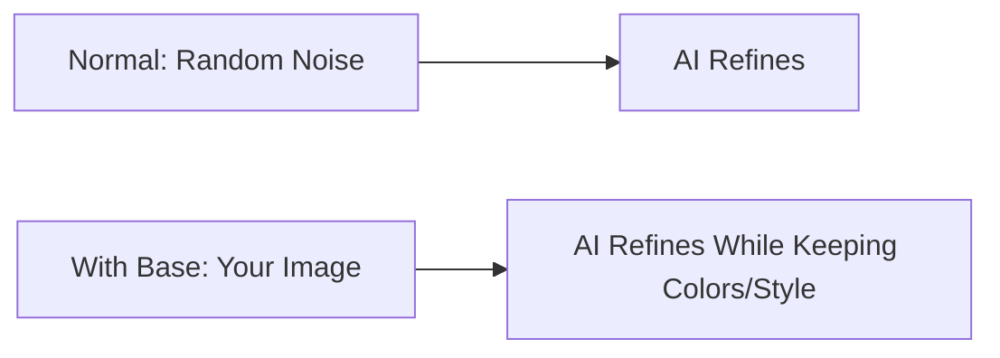

# Base Image

Understanding the Base [B] reference type.

## 🎨 What is Base Image?

**Base Image** guides **colors and style**.

**AI uses base image as starting point** instead of random noise.



**Result:** Generation matches base image's aesthetic.

---

## 🎯 What Base Image Controls

### Colors

**AI adopts color palette from base:**

```
Base image has: Blue, gold, red
Result will use: Blue, gold, red (similar shades)
```

[SCREENSHOT: Base image colors → Generated result colors]

**Not exact copy** - AI uses colors creatively.

### Style/Aesthetic

**AI matches artistic style:**

```
Base image style: Cartoon colorful
Result: Cartoon aesthetic

Base image style: Dark realistic
Result: Dark realistic aesthetic
```

### Composition (Partially)

**AI loosely follows layout:**

```
Image Strength 0: Ignores composition
Image Strength 5: Partially follows
Image Strength 10: Closely follows
```

**For precise composition control, use Shape image instead.**

---

## 🔧 Preparing Base Images

### For GUIs

**Recommended workflow:**

**1. Create base layout in Photopea:**
```
Size: 256×256
Draw: Simple GUI layout with desired colors
```

**2. Add noise:**
```
Filter → Noise → Add Noise → 20% Gaussian
```

**3. Export:**
```
Save as: base_image_noise.png
```

[SCREENSHOT: Base image with noise]

**Why add noise?**
```
✅ Gives AI creative freedom
✅ Prevents exact copying
✅ Better variation while keeping colors
```

### For Items

**Use existing item as base:**

```
1. Generate good item
2. Download it
3. Upload to My Reference Images
4. Use as base for similar items
```

**Result:** New items match first item's colors.

---

## ⚙️ Base Image Parameters

### Image Strength

**Controls influence of base image:**

```
Image Strength 0:
- Ignores base colors mostly
- Maximum creativity
- Uses base minimally

Image Strength 5:
- Balanced influence
- Uses base colors moderately
- Some creative freedom

Image Strength 10:
- Very close to base colors
- Minimal creativity
- Strong color matching
```

**Recommended:**
```
GUIs: 0-1 (low - let AI be creative with colors)
Items: 1-3 (low-medium - color guidance without copying)
Exact matching: 5-7 (medium-high)
```

### When to Adjust

**If result doesn't use base colors enough:**
```
Increase Image Strength: 1 → 3
```

**If result too similar to base:**
```
Decrease Image Strength: 5 → 1
Add more noise to base image
```

---

## 🎯 Base Image Use Cases

### Use Case 1: Color Scheme Matching

**Goal:** All items use blue and gold

**Process:**
```
1. Create image with blue and gold colors
2. Use as base for all generations
3. All results use blue/gold palette
```

**Consistency achieved.**

### Use Case 2: Style Consistency

**Goal:** Maintain artistic style across item set

**Process:**
```
1. Generate first item
2. Like the style
3. Use as base for next items
4. All match first item's style
```

### Use Case 3: GUI Theme

**Goal:** GUI with specific color theme

**Process:**
```
1. Create colored base in Photopea
2. Use warm brown/orange for shop theme
3. AI generates shop GUI in those colors
```

---

## 🔬 Base Image Examples

### Example 1: Warm Color Theme

**Base image:**
- Brown, orange, tan colors
- Warm color scheme

**Generation with base:**
- AI uses warm colors
- Results feel cohesive
- All match color family

[SCREENSHOT: Warm base → Warm results]

### Example 2: Cool Color Theme

**Base image:**
- Blue, purple, cyan colors
- Cool color scheme

**Generation with base:**
- AI uses cool colors
- Magical/mystical feel
- Matching palette

[SCREENSHOT: Cool base → Cool results]

---

## 🔧 Base Image Best Practices

### Image Requirements

**Format:**
```
✅ PNG (preferred) or JPEG
✅ Max 2150×2150 pixels
✅ Max 4MB file size
✅ Clear colors (not muddy/mixed)
```

### Quality Base Images

**Good base image:**
```
✅ Clear color areas
✅ Distinct palette
✅ Representative of desired style
✅ Noise added (for GUIs)
```

**Poor base image:**
```
❌ Muddy colors
❌ Too many colors (50+ colors)
❌ Unclear theme
❌ Very high contrast (black and white only)
```

### Adding Noise (GUIs)

**Why add noise:**
```
Without noise:
- AI copies base too literally
- Results too similar to base
- Less creative variation

With noise (20% Gaussian):
- AI has freedom to vary
- Keeps color theme but adds creativity
- Better results
```

**How to add noise in Photopea:**
```
1. Filter → Noise → Add Noise
2. Amount: 20%
3. Distribution: Gaussian
4. Monochrome: Checked
5. OK
```

[SCREENSHOT: Add noise dialog]

---

## ⚠️ Common Base Image Mistakes

<details>
<summary>Using grayscale/black and white base</summary>

**Problem:**
```
Base: Gray GUI layout
Result: Gray GUI (no colors)
```

**Fix:** Use colored base image with desired color scheme.

</details>

<details>
<summary>Not adding noise for GUIs</summary>

**Problem:**
```
Base without noise → AI copies exactly
Result: Flat, uninteresting GUI
```

**Fix:** Add 20% Gaussian noise to base image.

</details>

<details>
<summary>Wrong image size</summary>

**Problem:**
```
Using 512×512 base for 256×256 GUI model
Result: Poor quality, wrong aspect
```

**Fix:** Match base image size to model resolution.

</details>

---

## 📊 Base Image Impact

| Image Strength | Base Influence | Color Matching | Creativity |
|----------------|----------------|----------------|------------|
| 0 | Minimal | Low | Maximum |
| 1-3 | Low | Medium | High |
| 4-6 | Medium | Good | Medium |
| 7-9 | High | Very Good | Low |
| 10 | Maximum | Exact | Minimal |

**Most common: 0-3 for creative results with color guidance**

---

## ✅ Base Image Checklist

Effective base image:

- [ ] Correct size for model resolution
- [ ] PNG format
- [ ] Clear color palette
- [ ] Noise added (if for GUI)
- [ ] Uploaded to My Reference Images
- [ ] Selected as [B] in Style Selector
- [ ] Image Strength set appropriately (0-3 typical)

:::success Base Images Understood
[Learn about Shape images →](shape-image)
:::
