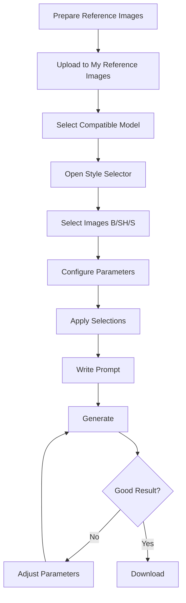

# Style Selector Workflow

Step-by-step guide to using Style Selector.

## 🎯 Complete Workflow



---

## 📋 Step-by-Step Guide

### Step 1: Prepare Reference Images

**Create or find reference images:**

**For GUIs:**
```
1. Open Photopea.com
2. New → 256×256
3. Draw simple GUI layout
4. Save as base_clean.png
5. Filter → Noise → Add Noise 20%
6. Save as base_noise.png
```

[SCREENSHOT: Preparing GUI references in Photopea]

**For items:**
```
Use existing generated item as reference
Or find example image of desired style
```

**Requirements:**
- PNG format preferred
- Correct size (match model resolution)
- Max 2150×2150, 4MB

### Step 2: Upload References

**Account → My Reference Images**

[SCREENSHOT: My Reference Images upload area]

**Drag and drop:**
```
base_noise.png (for Base)
base_clean.png (for Shape)
```

**Wait for upload** - images appear in gallery.

### Step 3: Select Compatible Model

**Not all models support Style Selector.**

**Look for green button:**

```
"Select Image References" or "Style Selector"
```

**Recommended models:**
```
Items: ultimate extreme mc item 16 v3
GUIs: ultimate extreme mc any gui v4
      orion pro ultra top hq gui v1
```

**Click "SELECT THIS AI MODEL"** first.

### Step 4: Open Style Selector

**Click green button:**

```
┌─────────────────────────────┐
│  Select Image References    │
└─────────────────────────────┘
```

**Popup opens** showing reference images.

[SCREENSHOT: Style Selector popup]

### Step 5: Select Reference Images

**For each uploaded image:**

**Choose type:**
```
[S] Style - Check box (multiple OK)
[B] Base - Radio button (only one)
[SH] Shape - Radio button (only one)
```

**Example for GUI:**
```
base_noise.png → Select [B] Base
base_clean.png → Select [SH] Shape
```

[SCREENSHOT: Images selected as B and SH]

### Step 6: Configure Parameters

**Set strength values:**

**For GUIs (recommended):**
```
Image Strength: 0-1
Shape Strength: 7-8
Shape Affected By Details: 8-10
Shape Generation %: 7-8
Overall Style Strength: 10
```

**For items:**
```
Adjust based on need:
- Color matching: Image Strength 1-3
- Shape matching: Shape Strength 7-8
```

[SCREENSHOT: Parameters configured]

### Step 7: Apply Selections

**Click "Apply Selections" button**

```
┌─────────────────────────────┐
│  Apply Selections           │
└─────────────────────────────┘
```

**Critical:** Must click this to save settings!

**Popup closes** - settings applied.

### Step 8: Write Prompt

**In main text box:**

```txt
For GUI:
"beautiful minecraft shop gui with wooden frame and 4x4 item grid"

For item:
"diamond sword"
```

**Prompt still important** - guides generation alongside references.

### Step 9: Generate

**Click "GENERATE IMAGE"** button at bottom.

**Wait for generation** (2-4 minutes typical).

### Step 10: Evaluate Result

**Check generated image:**

```
✓ Colors match base?
✓ Layout matches shape?
✓ Quality acceptable?
```

**If no:** Adjust parameters and regenerate.

**If yes:** Download and use!

---

## 🔄 Iteration with Style Selector

### Adjusting Parameters

**Based on results:**

**Result too similar to references:**
```
Lower: Image Strength (3 → 1)
Lower: Shape Strength (9 → 7)
Add: More noise to base
```

**Result too different from references:**
```
Raise: Image Strength (1 → 3)
Raise: Shape Strength (6 → 8)
Raise: Shape Generation % (6 → 8)
```

**Layout wrong (GUIs):**
```
Raise: Shape Strength (7 → 9)
Raise: Shape Details (8 → 10)
Redraw: Shape image with clearer slots
```

**Colors wrong:**
```
Change: Base image colors
Raise: Image Strength (0 → 2)
```

---

## 🎨 Common Workflows

### Workflow 1: GUI Generation

**Goal:** Create shop GUI

**References:**
```
Base [B]: Colored GUI layout with noise
Shape [SH]: Same layout without noise
```

**Settings:**
```
Image Strength: 0-1 (low - creative with colors)
Shape Strength: 7-8 (high - match layout)
Shape Details: 9-10 (high - precise slots)
Shape Generation %: 7-8 (high - structure priority)
```

**Prompt:**
```txt
"medieval shop gui with wooden frame and decorative corners"
```

**Expected iterations:** 3-7 tries

[Complete GUI tutorial →](../../tutorials/gui-creation/gui-complete-guide)

### Workflow 2: Matching Item Set

**Goal:** Create matching tool set

**References:**
```
Style [S]: First generated sword (checked)
```

**Settings:**
```
Style Strength: 7-8
```

**Prompt:**
```txt
"diamond pickaxe"
"diamond axe"
"diamond shovel"
```

**Result:** All tools match sword's style.

### Workflow 3: Exact Color Palette

**Goal:** All items use specific colors

**References:**
```
Base [B]: Image with exact color palette
```

**Settings:**
```
Image Strength: 3-5 (medium-high)
Use Color Style: On (if available)
```

**Prompts:**
```txt
"sword"
"pickaxe"
"helmet"
```

**Result:** All use same color palette.

---

## 🔧 Workflow Optimization

### Saving Parameter Presets

**Once you find good settings:**

**Model Presets section:**
```
Preset Name: "My GUI Settings"
[Save Preset]
```

**Load later:**
```
Select from dropdown → [Load Preset]
Settings restored instantly
```

**Saves time** on repeated tasks.

### Reusing References

**Keep successful references:**
```
Don't delete references that worked well
Build library of proven references
Reuse for similar projects
```

### Building Reference Library

**Organize by:**
```
base_gui_medieval.png
base_gui_futuristic.png
shape_gui_4x4grid.png
shape_gui_3x3grid.png
style_cartoon_items.png
```

**Systematic naming** helps find references later.

---

## 📊 Workflow Comparison

| Method | Control | Complexity | Consistency | Time |
|--------|---------|-----------|-------------|------|
| Text only | Low | Simple | 60% | Fast |
| Text + Base | Medium | Medium | 80% | Medium |
| Text + Shape | Medium | Medium | 85% | Medium |
| Text + Base + Shape | High | Complex | 95% | Slower |

**More control = more complexity** but better results.

---

## 🎯 Best Practices

### Do's

```
✅ Prepare references carefully
✅ Use correct image sizes
✅ Click "Apply Selections"
✅ Start with recommended settings
✅ Iterate and adjust
✅ Save successful presets
✅ Document what works
```

### Don'ts

```
❌ Skip clicking "Apply Selections"
❌ Use wrong image sizes
❌ Set all strengths to 10
❌ Give up after first try
❌ Forget to select [B] or [SH]
❌ Delete working references
```

---

## ✅ Style Selector Workflow Checklist

Complete workflow:

- [ ] Prepared reference images (correct size)
- [ ] Uploaded to My Reference Images
- [ ] Selected compatible model
- [ ] Opened Style Selector
- [ ] Selected images as [B], [SH], or [S]
- [ ] Configured parameters
- [ ] Clicked "Apply Selections"
- [ ] Wrote prompt
- [ ] Generated
- [ ] Ready to iterate if needed

:::success Workflow Mastered
[Complete Style Selector guide →](../style-selector/)

[Try GUI tutorial for practice →](../../tutorials/gui-creation/gui-complete-guide)
:::
