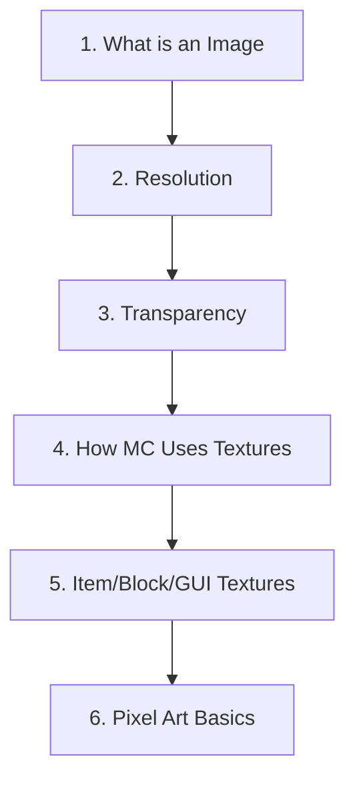

# Fundamentals

Essential concepts every Pixel GPT user must understand.

## 🎯 What You'll Learn

This section covers the **foundational knowledge** required to use Pixel GPT effectively.

:::warning Read Carefully
90% of user issues stem from not understanding these fundamentals. Take time to read this section.
:::

## 📚 Topics Covered

  

    

      

        

          <h3>🖼️ Images & Pixels</h3>
        

        

          <ul>
            <li><a href="images-and-pixels/what-is-an-image">What is an image?</a></li>
            <li><a href="images-and-pixels/understanding-resolution">Resolution</a></li>
            <li><a href="images-and-pixels/transparency-and-alpha">Transparency</a></li>
            <li><a href="images-and-pixels/pixel-density-and-mixels">Pixel density</a></li>
          </ul>
        

      

    

    

      

        

          <h3>⛏️ Minecraft Textures</h3>
        

        

          <ul>
            <li><a href="minecraft-textures/how-minecraft-uses-textures">How MC uses textures</a></li>
            <li><a href="minecraft-textures/item-textures">Items</a></li>
            <li><a href="minecraft-textures/block-textures">Blocks</a></li>
            <li><a href="minecraft-textures/gui-textures">GUIs</a></li>
          </ul>
        

      

    

  

## 🗺️ Reading Path

**Recommended order:**

| Priority | Topic | Why Important |
|----------|-------|---------------|
| 🔴 | [What is an Image](images-and-pixels/what-is-an-image) | Foundation of everything |
| 🔴 | [Transparency](images-and-pixels/transparency-and-alpha) | Critical for Minecraft |
| 🔴 | [How MC Uses Textures](minecraft-textures/how-minecraft-uses-textures) | Understand the end use |
| 🟡 | [Resolution](images-and-pixels/understanding-resolution) | Choose correct sizes |
| 🟡 | [Pixel Density](images-and-pixels/pixel-density-and-mixels) | Avoid common mistake |

:::tip Can I Skip This?
**No.** These concepts are referenced throughout all other sections. Understanding fundamentals = better results.
:::

---

## ⚠️ Common Misconceptions

### "I know what an image is"

Many users think they do, but don't understand:
- What transparency actually is
- Why 16×16 vs 32×32 matters
- How Minecraft displays textures
- What "pixel density" means

**Result:** Poor generations, wrong exports, Minecraft integration issues.

### "Minecraft uses 3D models for items"

**Wrong.** Minecraft uses 2D textures that are **extruded** (stretched on depth axis) to look 3D.

[SCREENSHOT: 2D sword texture → 3D appearance in game]

Understanding this affects how you prompt and what you expect.

### "I can use any image size"

**Wrong.** Each model has **specific resolution requirements**:
- 16px models need 16×16 images
- 32px models need 32×32 images
- GUI models need 256×256 images

Using wrong size = broken results.

---

## 🎓 Why Learn Fundamentals?

### Better Prompts

Understanding what an image is → Write prompts that describe images accurately

### Better Results

Knowing Minecraft texture requirements → Generate textures that actually work

### Fewer Errors

Understanding pixel density → Avoid mixel issues

### Faster Workflow

Knowing grid math → Extract items correctly first time

---

## 📖 Topics Explained

### Images & Pixels

**What you'll understand:**
- Images are 2D arrays of colored pixels
- Resolution = width × height in pixels
- Transparency = alpha channel
- File formats (PNG vs JPEG)

**Why it matters:**
- Choose correct model resolution
- Understand grid extraction math
- Know why transparency matters
- Export files correctly

### Minecraft Textures

**What you'll understand:**
- How Minecraft displays 2D textures as 3D
- Standard resolutions (16×16 most common)
- Different texture types (items, blocks, GUIs)
- Resource pack structure

**Why it matters:**
- Generate Minecraft-compatible textures
- Understand what to prompt for
- Integrate textures properly

### Pixel Art

**What you'll understand:**
- Pixel art as an art form
- Color palette principles
- Resolution consistency
- Style characteristics

**Why it matters:**
- Appreciate AI capabilities
- Recognize quality
- Choose appropriate styles

---

## 🚀 Quick vs Deep Learning

### Quick Path (1 hour)

**Read only:**
1. [What is an Image](images-and-pixels/what-is-an-image)
2. [Transparency](images-and-pixels/transparency-and-alpha)
3. [How MC Uses Textures](minecraft-textures/how-minecraft-uses-textures)

Then jump to [Prompting Guide](../prompting/)

### Deep Path (3 hours)

**Read everything in order:**
1. All Images & Pixels articles
2. All Minecraft Textures articles
3. Pixel Art basics
4. Glossary

Then continue to [Understanding AI](../understanding-ai/)

### Reference Path (as needed)

Use Fundamentals as **reference documentation**:
- Check when confused about terms
- Verify resolution requirements
- Confirm format specifications

---

## ✅ Self-Check Quiz

Test your understanding:

Question 1: What is a 16×16 image?

**Answer:** An image that is 16 pixels wide and 16 pixels tall, containing 256 total pixels (16 × 16 = 256).

Question 2: Why does Pixel GPT generate with white background?

**Answer:** AI generates opaque images. You must remove the background using the Grid Editor's magic wand tool to create transparency for Minecraft.

Question 3: What is pixel density?

**Answer:** The size of one pixel in the game world. All Minecraft items should have the same pixel density (usually 16×16) to avoid "mixels."

Question 4: Why do I need to extract items from a grid?

**Answer:** AI generates multiple variations at once (2×2, 3×3 grid). You need to extract individual items as separate 16×16 PNG files for Minecraft.

Question 5: What's the difference between 16px and 32px models?

**Answer:** 16px models generate 16×16 pixel textures (Minecraft standard). 32px models generate 32×32 pixel textures (higher resolution packs).

**Score 5/5?** → You're ready to continue!  
**Score &lt;5?** → Read the fundamentals carefully!

---

## 🎯 What's Next?

After completing Fundamentals:

**Option 1: Master Prompting**
→ [Prompting Guide](../prompting/) - Learn to write effective prompts

**Option 2: Explore Models**
→ [Models](../models/) - Understand model selection

**Option 3: Start Creating**
→ [Tutorials](../tutorials/) - Follow step-by-step guides

:::success Foundation Built
You now have the knowledge foundation. Choose your path and continue learning!
:::
