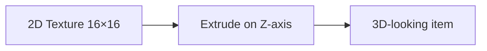
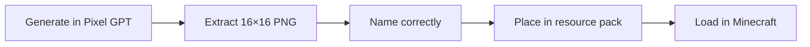

# How Minecraft Uses Textures

Understanding how Minecraft displays 2D textures.

## 🎮 Core Concept

**Minecraft items are NOT 3D models** - they are **2D textures** that Minecraft makes *look* 3D.

:::info Key Understanding
Minecraft takes a 2D image (like a sword texture) and **extrudes** it (stretches it on the depth axis) to create a 3D appearance.
:::

---

## 🔬 The Extrusion Process

### 2D Texture

**What you create:**
A flat 16×16 PNG image of a sword

[SCREENSHOT: Flat 2D sword texture]

### 3D Appearance

**What Minecraft displays:**
The same 2D image stretched backward to create depth

[SCREENSHOT: Same sword in 3D in Minecraft]

### How It Works



1. Takes your 2D texture
2. Stretches it backward (depth axis)
3. Creates illusion of 3D object

[SCREENSHOT: Diagram showing 2D → extrusion → 3D appearance]

---

## 🎨 Texture Types

### Items

**Examples:** Swords, pickaxes, food, potions

**Format:**
- 16×16 pixels (vanilla)
- PNG with transparency
- Transparent background required

**How displayed:**
- In inventory (2D view)
- In hand (extruded 3D view)
- Dropped on ground (3D view)

[SCREENSHOT: Item in inventory vs in hand vs dropped]

### Blocks

**Examples:** Stone, dirt, ores, wood

**Format:**
- 16×16 pixels per face
- PNG with transparency (optional)
- 6 faces for full block (top, bottom, 4 sides)

**How displayed:**
- Each face uses the texture
- Arranged in 3D cube
- Can have different texture per face

[SCREENSHOT: Block texture applied to 3D cube]

### GUIs

**Examples:** Chests, menus, custom interfaces

**Format:**
- 256×256 pixels (common)
- PNG with transparency
- Slots defined by position

**How displayed:**
- Flat 2D overlay on screen
- Not extruded (stays 2D)

[SCREENSHOT: GUI in-game]

---

## 📐 Why Resolution Matters

### Minecraft Standard: 16×16

**Vanilla Minecraft uses:**
```
All items = 16×16
All blocks = 16×16
Consistent pixel size everywhere
```

**Benefits:**
- Lightweight (small files)
- Fast rendering
- Classic aesthetic
- Universal compatibility

### HD Packs: 32×32 or Higher

**HD packs use:**
```
All items = 32×32 (or 64×64)
All blocks = 32×32 (or 64×64)
Consistent pixel size everywhere
```

**Benefits:**
- More detail possible
- Sharper appearance

**Drawbacks:**
- Larger file sizes
- More resource intensive
- Must be consistent

---

## 🎯 Practical Implications

### For Pixel GPT Users

**When generating items:**
```
Choose correct resolution model:
- Vanilla style → 16px models
- HD style → 32px models
```

**When prompting:**
```
Describe the 2D appearance:
✅ "sword with blue blade and golden handle"
❌ "3D sword model with depth and shadows"
```

**Why?** You're creating 2D textures, not 3D models.

### Transparency is Critical

**Without transparency:**
[SCREENSHOT: Sword with white background in Minecraft]

**With transparency:**
[SCREENSHOT: Sword with transparent background in Minecraft]

Only the sword pixels show, background is invisible.

---

## 🎨 Texture Application

### Items

```
1. Minecraft reads diamond_sword.png
2. Extrudes it backward
3. Displays as 3D-looking item
```

### Blocks

```
1. Minecraft reads stone.png
2. Applies to all 6 faces of cube
3. Creates 3D block
```

*OR different textures per face:*
```
grass_block_top.png → top face
grass_block_side.png → 4 side faces
dirt.png → bottom face
```

### GUIs

```
1. Minecraft reads gui texture
2. Displays as flat overlay
3. Slots defined by pixel position
```

---

## 📦 Resource Pack Structure

### Basic Structure

```
resource_pack/
├── pack.mcmeta
├── pack.png
└── assets/
    └── minecraft/
        └── textures/
            ├── item/
            │   ├── diamond_sword.png (16×16)
            │   └── iron_pickaxe.png (16×16)
            ├── block/
            │   ├── stone.png (16×16)
            │   └── dirt.png (16×16)
            └── gui/
                └── container/
                    └── generic_54.png (256×256)
```

### File Naming

**Must match Minecraft's names:**
```
✅ diamond_sword.png
✅ iron_pickaxe.png
✅ stone.png

❌ Diamond Sword.png (wrong capitalization)
❌ diamondsword.png (missing underscore)
❌ cool_sword.png (not a vanilla name)
```

**For custom items:** Any name works if used in datapack/plugin

---

## ⚙️ Integration Workflow

### From Pixel GPT to Minecraft



1. Generate with Pixel GPT
2. Remove background
3. Extract as 16×16 PNG
4. Rename to match Minecraft item
5. Place in resource pack structure
6. Load resource pack in Minecraft

---

## 🔍 Testing Your Textures

### In Minecraft

1. Place PNG in resource pack folder
2. Open Minecraft
3. Select resource pack
4. Check item in inventory

**Should see:**
- Clean item appearance
- No white background
- Proper transparency
- Correct size

[SCREENSHOT: Texture in Minecraft looking correct]

<details>
<summary>🔧 Texture shows white box</summary>

**Problem:** Background not transparent

**Solution:**
1. Reopen in Grid Editor
2. Remove background with magic wand
3. Re-export as PNG
4. Replace in resource pack

</details>

<details>
<summary>🔧 Texture not appearing</summary>

**Check:**
- File name matches Minecraft name exactly
- File is in correct folder
- File format is PNG
- Resource pack loaded in settings

</details>

---

## ✅ Key Takeaways

1. **Minecraft uses 2D textures, not 3D models** (for items)
2. **Textures are extruded** to create 3D appearance
3. **16×16 is standard** resolution
4. **PNG with transparency** is required
5. **File naming and structure** must match Minecraft's format

:::success Minecraft Textures Understood
You now understand how Minecraft uses textures! 

Continue learning:
- [Item Textures](item-textures) - Detailed item guide
- [Block Textures](block-textures) - Block specifics
- [GUI Textures](gui-textures) - Interface textures
:::
