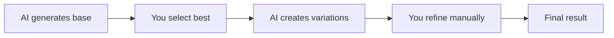

# Capabilities & Limitations

Understand what Pixel GPT can and cannot do.

## ✅ What Pixel GPT CAN Do

### Generate Textures

**Items (16×16 to 256×256)**
```txt
✅ Swords, tools, weapons
✅ Food, potions, materials
✅ Armor pieces
✅ Custom mod items
✅ Icons and badges
```

**Blocks**
```txt
✅ Ore blocks
✅ Decorative blocks
✅ Building materials
✅ Custom terrain
```

**GUIs**
```txt
✅ Shop interfaces
✅ Custom menus
✅ Inventory screens
✅ Server menus
```

**Art & Renders**
```txt
✅ 3D Minecraft renders
✅ Pixel art scenes
✅ Character sprites
✅ Logos and thumbnails
```

### Understand Prompts

**AI understands:**
```txt
✅ Colors: blue, red, golden, dark
✅ Materials: diamond, iron, wood, crystal
✅ Styles: medieval, futuristic, fantasy
✅ Objects: sword, pickaxe, apple, armor
✅ Details: glowing, ornate, rusty, sharp
```

### Create Variations

```txt
✅ Multiple versions in one generation (2×2, 3×3, 4×4 grids)
✅ Different angles/perspectives
✅ Color variations
✅ Style variations
```

### Match Styles

**With Style Selector:**
```txt
✅ Copy color palettes from reference images
✅ Match composition/layout
✅ Create consistent item sets
✅ Maintain coherent style across multiple items
```

---

## ❌ What Pixel GPT CANNOT Do

### No 3D Models

```txt
❌ Blockbench models (currently unreliable)
❌ .bbmodel files
❌ 3D rigged characters
❌ OBJ/FBX exports
```

:::info 3D Renders vs 3D Models
✅ Pixel GPT CAN generate 3D **renders** (2D images that look 3D)
❌ Pixel GPT CANNOT generate actual 3D **models** (geometry files)
:::

### No Perfect First Try

```txt
❌ Guarantee exact result on first generation
❌ Read your mind
❌ Understand very complex multi-element prompts
```

**Reality:** You need to iterate and refine.

### No Real-Time Updates

```txt
❌ Browse internet for latest trends
❌ Know new Minecraft versions
❌ Learn new mods/plugins
❌ Update knowledge automatically
```

**AI knowledge is fixed** from training data.

### No Multi-Item Prompts

```txt
❌ "diamond sword and ruby pickaxe and golden helmet"
✅ "diamond sword" (one prompt per item)
```

### No Text in Images

```txt
❌ Generate readable text/numbers
❌ Create logos with specific text
❌ Write words in GUIs
```

**Workaround:** Add text in image editor after generation.

### No Exact Specifications

```txt
❌ "Make the handle exactly 3 pixels wide"
❌ "Place the gem at pixel coordinates (5,7)"
❌ "Use exactly RGB(45, 123, 200)"
```

**AI works with descriptions**, not precise instructions.

---

## ⚠️ Limitations to Know

### Language Limitation

**English works best**
```txt
✅ English prompts: 95% success
⚠️ Other languages: 30-60% success
```

:::danger Always Use English
AI is primarily trained on English. Other languages produce significantly worse results.
:::

### Knowledge Gaps

**AI may not know:**
```txt
❌ Specific mod items (e.g., "Thermal Expansion wrench")
❌ Recent Minecraft additions (after training cutoff)
❌ Niche game references
❌ Very specific cultural references
```

**Solution:** Describe visually instead of using names.

### Style Mixing

**Difficult:**
```txt
❌ "Photorealistic AND pixel art" (conflicting styles)
❌ "16px resolution with ultra detailed textures" (impossible)
```

Choose one consistent style.

### Resolution Limits

**Model-specific:**
```txt
16px models → only 16×16 output
32px models → only 32×32 output
Cannot mix resolutions in single generation
```

### Generation Time

**Not instant:**
```txt
Free users: 1-3 minutes
Premium users: 30s-1 minute
GUIs: 2-4 minutes
High complexity: 3-5 minutes
```

### Daily Limits

**Free users:**
```txt
Limited generations per day (128 total)
Lower priority in queue
Public images only
```

**Premium users:**
```txt
Unlimited generations
Higher priority
Private images
Batch limits based on plan
```

---

## 🎯 Realistic Expectations

### What to Expect

**First Generation**
```txt
⚠️ May not be perfect
⚠️ Might need iteration
⚠️ Could require refinement
```

**After 3-5 Iterations**
```txt
✅ Usually get great results
✅ Learn what works
✅ Refine prompts effectively
```

### Quality Depends On

1. **Model choice** - Better models = better quality
2. **Prompt quality** - Specific prompts = better results
3. **Your skill** - Practice improves outcomes
4. **Iteration** - Try multiple times

### Success Rate

| Task | First Try Success | After Iteration |
|------|-------------------|----------------|
| Simple items | 70-80% | 95%+ |
| Complex items | 40-60% | 85%+ |
| GUIs (with Style Selector) | 30-50% | 80%+ |
| Matching existing style | 50-70% | 90%+ |

---

## 💡 Working Within Limitations

### Instead of Fighting Limitations

**Don't:**
```txt
❌ "Generate a sword and shield and helmet in one prompt"
❌ Try to force unsupported features
❌ Expect perfection immediately
```

**Do:**
```txt
✅ Generate each item separately
✅ Work with what AI does well
✅ Iterate and refine
```

### Use Strengths

**AI is excellent at:**
- Generating variations quickly
- Exploring different styles
- Creating consistent sets (with Style Selector)
- Accelerating creative process

**You are excellent at:**
- Providing creative direction
- Choosing best results
- Refining details manually
- Final integration

### Hybrid Workflow



1. AI generates multiple options
2. You pick favorites
3. AI generates variations of favorites
4. You refine in image editor (optional)
5. Use in project

---

## 🎓 Setting Yourself Up for Success

### Do's

```txt
✅ Use English prompts
✅ Be specific but not overly complex
✅ Try multiple models
✅ Iterate and experiment
✅ Use Style Selector for consistency
✅ Learn from each generation
```

### Don'ts

```txt
❌ Expect mind-reading
❌ Try to generate multiple items at once
❌ Use prompts in other languages
❌ Give up after first attempt
❌ Ignore model recommendations
❌ Skip background removal
```

---

## ✨ Real-World Use Cases

<details>
<summary>**Texture Pack Creator**</summary>

**Workflow:**
1. Generate base items with AI (90% done)
2. Manually refine a few pixels (10% touch-up)
3. Use Style Selector for consistency
4. Batch generate variations

**Time saved:** Weeks → Days

</details>

<details>
<summary>**Server Owner**</summary>

**Workflow:**
1. Generate custom GUI with Style Selector
2. Iterate 3-5 times for perfect layout
3. Generate matching item set
4. Integrate into server

**Time saved:** Days → Hours

</details>

<details>
<summary>**Content Creator**</summary>

**Workflow:**
1. Generate 3D renders for thumbnails
2. Try multiple styles quickly
3. Pick best ones
4. Add text/effects in Photoshop

**Time saved:** Hours → Minutes

</details>

:::success Ready to Start?
Now that you understand capabilities and limitations, [set up your account →](account-setup)
:::
