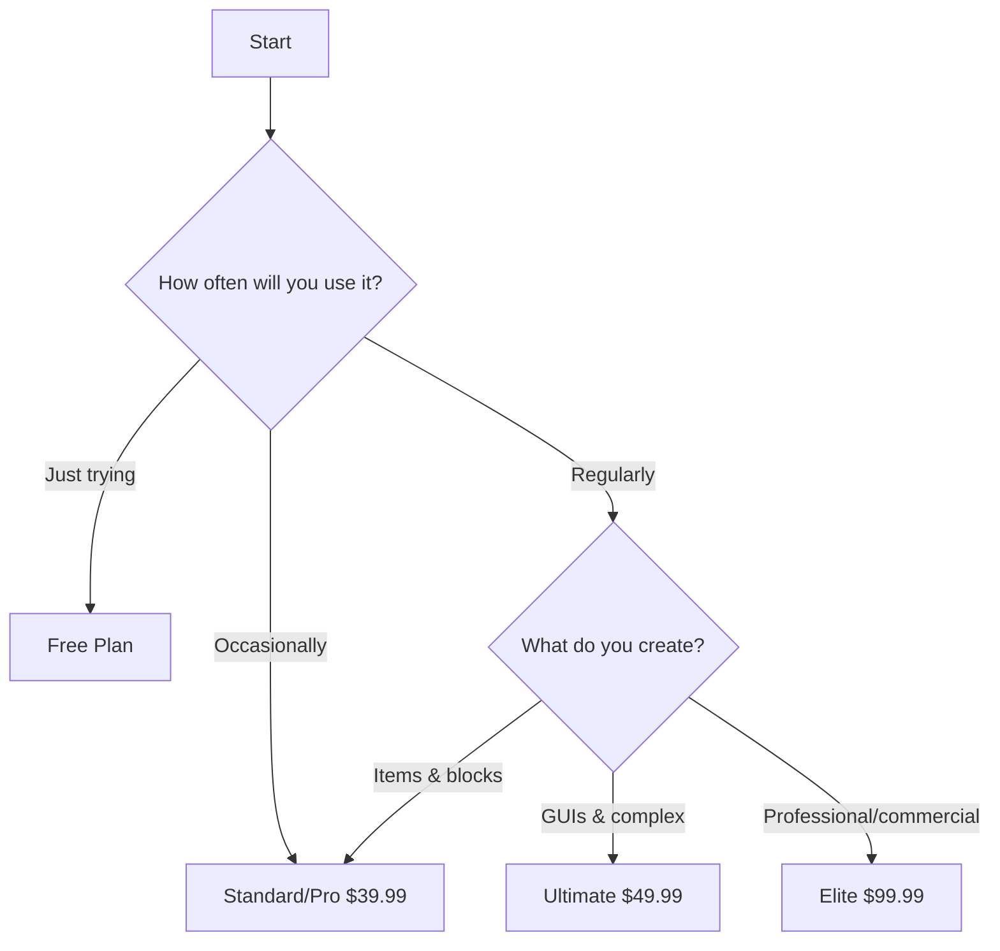

# Pricing Plans

Choose the right plan for your needs.

## 💰 Plan Overview

| Feature | Free | Standard | Pro | Ultimate | Elite |
|---------|------|----------|-----|----------|-------|
| **Price/year** | $0 | $39.99 | $39.99 | $49.99 | $99.99 |
| **Generations** | 128 total | Unlimited | Unlimited | Unlimited | Unlimited |
| **Queue size** | 1 | Higher | Higher | Higher | Highest |
| **Priority** | Low | Medium | Medium | High | Highest |
| **Baby models** | ✅ | ✅ | ✅ | ✅ | ✅ |
| **Standard models** | ❌ | ✅ | ✅ | ✅ | ✅ |
| **Pro models** | ❌ | ✅ | ✅ | ✅ | ✅ |
| **Ultimate models** | ❌ | ❌ | ❌ | ✅ | ✅ |
| **Elite models** | ❌ | ❌ | ❌ | ❌ | ✅ |
| **Orion models** | ❌ | ❌ | ❌ | 4-8/day | 256/day |
| **Batch quota** | ❌ | Limited | Limited | More | Most |
| **Image privacy** | Public | Private | Private | Private | Private |

:::info Most Popular
**Ultimate ($49.99/year)** - Best value for serious users
:::

---

## 🆓 Free Plan

**Perfect for:**
- Testing the platform
- Occasional use
- Learning how it works

**You get:**
```txt
✅ 128 total generations (not renewable)
✅ All Baby (Newbie) models
✅ Basic image tools
✅ Collections
```

**Limitations:**
```txt
❌ Only basic quality models
❌ Slow generation (lowest priority)
❌ No premium models
❌ No batch generation
❌ Images are public
```

**Recommended if:**
- You're trying Pixel GPT for first time
- Need a few textures only
- Just want to experiment

---

## 💎 Standard Plan - $39.99/year

**Perfect for:**
- Hobbyists
- Small projects
- Occasional texture creation

**You get:**
```txt
✅ Unlimited generations
✅ Baby + Standard + Pro models
✅ Faster generation (medium priority)
✅ Private images
✅ Limited batch generation
✅ Style Selector access
```

**Best models:**
- `ultra 16 basic v2` (16px items)
- `vhq 32px v3` (32px items)
- `super-32-base` (blocks)

**Recommended if:**
- You make textures regularly
- Need good quality
- Work on small-medium projects

---

## ⚡ Pro Plan - $39.99/year

**Perfect for:**
- Same as Standard
- Access to Pro-tier models

**You get:**
```txt
Everything in Standard, PLUS:
✅ Pro-tier specialized models
✅ Better quality outputs
```

**Best models:**
- `pro-16-px-v3` (highest 16px quality)
- `pro-32-px-v2` (highest 32px quality)
- `pro-cartoon-v2` (illustrations)

:::info Standard vs Pro
Same price ($39.99), but Pro gives access to specialized high-quality models. Check [model comparison](../models/model-tiers/pro-tier) to decide.
:::

---

## 🌟 Ultimate Plan - $49.99/year

**Perfect for:**
- Texture pack creators
- Server owners
- Content creators
- Professional use

**You get:**
```txt
Everything in Pro, PLUS:
✅ Ultimate & Ultimate Extreme models
✅ Even faster generation (high priority)
✅ More batch generation quota
✅ Best GUI models
✅ 4-8 Orion generations/day
```

**Best models:**
- `ultimate extreme mc item 16 v3` (best 16px)
- `ultimate extreme mc any gui v4` (best GUI)
- `ultimate extreme mc render v1` (best 3D renders)
- `orion pro 16px v2` (limited daily use)

**Recommended if:**
- You create texture packs
- Need high-quality GUIs
- Generate frequently
- Professional projects

:::tip Most Popular
**Best value** - Unlimited access to top-tier models for ~$4/month
:::

---

## 👑 Elite Plan - $99.99/year

**Perfect for:**
- Professional studios
- Large-scale projects
- Commercial use
- Maximum quality & speed

**You get:**
```txt
Everything in Ultimate, PLUS:
✅ All Elite models
✅ 256 Orion generations/day
✅ Fastest generation (highest priority)
✅ Maximum batch quota
✅ Exclusive models
```

**Best models:**
- `elite mc any gui hq boosted v3` (absolute best GUI)
- `mega mc item 16 top hq v1` (absolute best items)
- `orion pro ultra top hq gui v1` (2025 best quality)
- Full Orion access (256/day)

**Recommended if:**
- Commercial projects
- Need absolute best quality
- Maximum speed required
- Professional studio work

---

## 💳 Payment Options

**Billing:**
- Yearly subscription (most plans)
- Some 6-month options available

**Payment methods:**
- Credit/Debit card
- PayPal (if available)

**Currency:**
- USD (United States Dollar)

---

## 🔄 Changing Plans

### Upgrade

1. **Account** → **Pricing**
2. Select new plan
3. Pay difference
4. Instant access

### Downgrade

Contact support:
[https://pixelgpt.io/contact](https://pixelgpt.io/contact)

### Cancel

Contact support for cancellation.

:::warning Cancellation Policy
Review refund policy before canceling. Generally, subscriptions are non-refundable after purchase.
:::

---

## 🎯 Which Plan Should I Choose?

### Decision Tree



### By Use Case

| Use Case | Recommended Plan |
|----------|-----------------|
| Learning/testing | Free |
| Personal projects | Standard/Pro ($39.99) |
| Texture packs | Ultimate ($49.99) |
| Server GUIs | Ultimate ($49.99) |
| Commercial work | Elite ($99.99) |
| YouTube thumbnails | Standard/Pro ($39.99) |
| Mod development | Ultimate ($49.99) |

### By Budget

**Tight budget:**
- Start with **Free** to test
- Upgrade to **Standard** ($39.99) when ready

**Reasonable budget:**
- Go straight to **Ultimate** ($49.99)
- Best value for money

**No budget limit:**
- **Elite** ($99.99) for maximum quality/speed

---

## 💡 Plan Features Explained

### Unlimited Generations

**Free:** 128 total (non-renewable)  
**Premium:** Truly unlimited per day

:::info What "Unlimited" Means
You can generate as many times as you want per day. Only limit is your queue size (how many simultaneous generations).
:::

### Queue Size

How many generations can process at once:
- Free: 1 at a time
- Standard/Pro: 2-3 at a time
- Ultimate: 4-5 at a time
- Elite: 6+ at a time

### Priority

How fast your generations are picked up by servers:
- Free: Lowest (wait longer)
- Standard/Pro: Medium (reasonable wait)
- Ultimate: High (fast)
- Elite: Highest (fastest possible)

### Batch Quota

How many batch jobs per day:
- Free: None
- Standard/Pro: 5-10 per day
- Ultimate: 20-30 per day
- Elite: 50+ per day

:::tip Batch ≠ Generations
Batch quota is separate from unlimited generations. One batch can generate hundreds of images.
:::

### Orion Access

**Orion models** are 2025 next-gen models (highest quality):
- Ultimate: 4-8 generations/day
- Elite: 256 generations/day

---

## 🆘 FAQ

<details>
<summary>Can I try premium before paying?</summary>

No free trial, but you can:
1. Use Free plan to test platform
2. See example outputs in public gallery
3. Join Discord to see user examples

**Refund policy:** Generally non-refundable, check ToS

</details>

<details>
<summary>What if I need more Orion generations?</summary>

**Elite plan** gives 256 Orion/day, which is plenty for most professional use.

For higher limits, contact support for enterprise plans.

</details>

<details>
<summary>Is it really unlimited?</summary>

Yes, unlimited generations per day for normal use.

**Fair use policy:** Don't abuse (e.g., automated scripts generating millions). Normal human use is unlimited.

</details>

<details>
<summary>What happens if I cancel?</summary>

- Subscription ends at period end
- Access to premium features removed
- Your generated images remain in account
- Can re-subscribe anytime

</details>

<details>
<summary>Can I get a refund?</summary>

Generally no refunds after purchase. Review ToS before buying.

Special cases: Contact support.

</details>

---

## ✨ Start Your Journey

<div className="container">
  <div className="row">
    <div className="col col--6">
      <div className="card">
        <div className="card__header">
          <h3>🆓 Start Free</h3>
        </div>
        <div className="card__body">
          Try Pixel GPT risk-free with 128 free generations.
          <br/><br/>
          <a href="account-setup">Create free account →</a>
        </div>
      </div>
    </div>
    <div className="col col--6">
      <div className="card">
        <div className="card__header">
          <h3>💎 Go Premium</h3>
        </div>
        <div className="card__body">
          Unlock full potential with unlimited generations.
          <br/><br/>
          <a href="https://pixelgpt.io/pricing">View pricing →</a>
        </div>
      </div>
    </div>
  </div>
</div>
