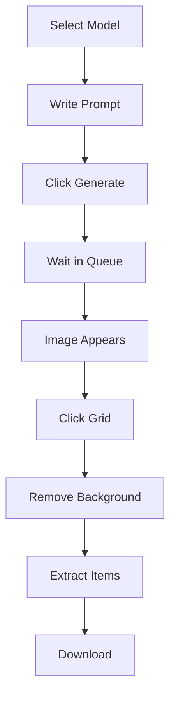

# Understanding the Interface

Navigate Pixel GPT like a pro.

## 🏠 Main Navigation

**Top Navigation Bar:**

| Element | Purpose |
|---------|---------|
| **Home** | Model selection and generation |
| **Account** | Profile, settings, galleries |
| **Pricing** | Subscription plans |
| **Help** | Documentation and support |

[SCREENSHOT: Top navigation bar]

---

## 🎨 Generation Interface

### Model Selection Area

**Location:** Home page

**Layout:**
```
Newbie (Free models)
├── Baby 16px
├── Baby 32px
└── Baby Pixel Art

Newbie Premium
├── Ultra 16px
├── Ultra 32px
└── Ultra Pixel Art

Expert
├── Ultimate
├── Elite
└── Orion
```

[SCREENSHOT: Model selection interface]

### Generation Controls

**Main elements:**

| Element | Location | Purpose |
|---------|----------|---------|
| **Prompt box** | Center-top | Write your description |
| **Generate button** | Bottom | Start generation |
| **Model info** | Top-right | Current model details |
| **Parameters** | Right sidebar | Advanced settings |

[SCREENSHOT: Generation interface labeled]

---

## 📱 Left Sidebar

**Shows your generations:**

### Generation List

**Elements:**
- **Thumbnail** - Preview of generated image
- **"NEW" badge** - Recently completed
- **"Generating..." status** - Currently processing
- **Timestamp** - When generated

[SCREENSHOT: Left sidebar with generations]

### Generation Actions

**Right-click on generation:**
- **Open** - View full image
- **Grid** - Open Grid Editor
- **Download** - Save image
- **Delete** - Remove generation
- **Star** - Mark as favorite

[SCREENSHOT: Right-click menu]

---

## 🎛️ Grid Editor

**Purpose:** Extract items and remove backgrounds

### Tools Panel

**Top toolbar:**

| Tool | Icon | Purpose |
|------|------|---------|
| **Magic Wand** | 🪄 | Remove background |
| **Zoom** | 🔍 | Zoom in/out |
| **Pan** | ✋ | Move around image |
| **Select** | ⬜ | Select areas |

[SCREENSHOT: Grid Editor tools]

### Settings Panel

**Right sidebar:**

| Setting | Purpose | Example |
|---------|---------|---------|
| **Pixel Size** | Item size calculation | 16 (for 16px items) |
| **Grid Size** | How many items | 2×2, 3×3, 4×4 |
| **Threshold** | Wand sensitivity | 5-7 (recommended) |

[SCREENSHOT: Grid Editor settings]

---

## 👤 Account Section

### Profile Page

**Account → Profile**

**Settings:**
- Change email
- Change password
- Language preferences
- Interface settings

[SCREENSHOT: Profile page]

### Galleries

**My Images**
- All your generations
- Filter by favorites
- Search by prompt
- Download/delete

**My Collections**
- Organize by project
- Create named collections
- Star important sets

**My Reference Images**
- Upload for Style Selector
- Max 2150×2150 pixels
- PNG or JPEG format

[SCREENSHOT: Galleries interface]

---

## ⚙️ Advanced Features

### Style Selector

**Location:** Generation interface (green button)

**Purpose:** Guide AI with reference images

**Settings:**
- **Base Image** - Color/style reference
- **Shape Image** - Layout reference
- **Image Strength** - How much to follow colors
- **Shape Strength** - How much to follow layout

[SCREENSHOT: Style Selector interface]

### Batch Generation

**Location:** Generation interface

**Purpose:** Generate multiple variations

**Settings:**
- **Count** - How many to generate
- **Variations** - Different styles
- **Prompt variations** - Slight prompt changes

[SCREENSHOT: Batch generation settings]

---

## 🔍 Interface Tips

### Navigation Shortcuts

**Keyboard shortcuts:**
- **Ctrl+R** - Refresh page
- **F5** - Refresh page
- **Ctrl+Shift+Delete** - Clear cache

**Mouse shortcuts:**
- **Scroll wheel** - Zoom in Grid Editor
- **Right-click** - Context menus
- **Double-click** - Open full image

### Visual Indicators

**Status badges:**
- **"NEW"** - Recently completed
- **"Generating..."** - Currently processing
- **Star** - Marked as favorite
- **Premium badge** - Requires subscription

**Color coding:**
- **Green** - Available/active
- **Gray** - Unavailable/locked
- **Red** - Error/warning

---

## 🎯 Interface Workflow

### Typical Generation Flow



### Interface Areas Used

1. **Home** - Model selection
2. **Generation interface** - Prompt writing
3. **Left sidebar** - Monitor progress
4. **Grid Editor** - Extract items
5. **Account** - Manage galleries

---

## 🆘 Common Interface Issues

<details>
<summary>Can't find my generations</summary>

**Check:**
- Left sidebar (most recent)
- Account → My Images (all generations)
- Scroll down in left sidebar

**Free users:** Images are public
**Premium users:** Images are private

</details>

<details>
<summary>Interface looks broken</summary>

**Try:**
1. Refresh page (F5)
2. Clear browser cache
3. Try different browser
4. Check internet connection

</details>

<details>
<summary>Can't access premium features</summary>

**Check:**
- Are you logged in?
- Do you have premium subscription?
- Is subscription active?

**Upgrade:** Account → Pricing

</details>

<details>
<summary>Grid Editor won't open</summary>

**Check:**
- Click on image in left sidebar first
- Wait for image to fully load
- Try refreshing page

**Alternative:** Right-click image → Grid

</details>

---

## 📱 Mobile Interface

### Mobile Layout

**Adapted for mobile:**
- Touch-friendly buttons
- Simplified navigation
- Responsive design

**Limitations:**
- Grid Editor harder to use
- Smaller text
- Touch precision issues

**Recommendation:** Use desktop for best experience

[SCREENSHOT: Mobile interface]

---

## 🎨 Customization

### Interface Settings

**Account → Profile → Preferences**

**Options:**
- Language selection
- Theme (if available)
- Notification preferences
- Default model selection

### Personal Workflow

**Create collections:**
- Organize by project
- Star important items
- Use descriptive names

**Use bookmarks:**
- Bookmark favorite models
- Save common prompts
- Quick access to tools

---

## ✨ Pro Tips

### Efficiency Tips

**Keyboard navigation:**
- Use Tab to move between fields
- Enter to submit forms
- Escape to close modals

**Mouse efficiency:**
- Right-click for quick actions
- Scroll wheel for zooming
- Drag to pan in Grid Editor

### Organization Tips

**Collections:**
- Create project-specific collections
- Use descriptive names
- Star important collections

**Reference images:**
- Upload high-quality references
- Organize by style/theme
- Use consistent naming

:::success Master the Interface
Now you understand the interface. [See next steps →](next-steps)
:::
