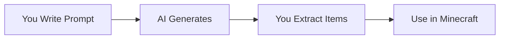
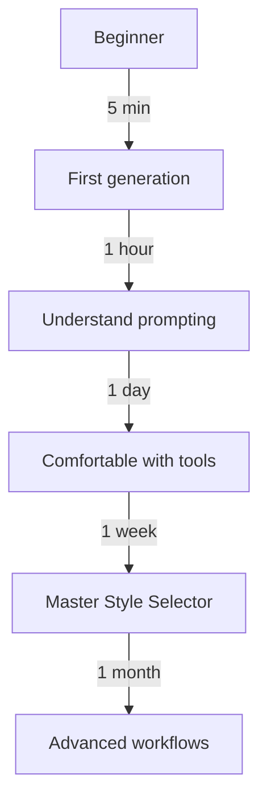

# What is Pixel GPT?

Pixel GPT is an **AI-powered platform** for generating Minecraft textures, pixel art, and game assets.

## 🎨 What Can You Create?

### Minecraft Assets

**Items (16×16, 32×32, 64×64)**
- Swords, pickaxes, tools
- Food, potions, materials
- Custom items for mods/plugins

[SCREENSHOT: Grid of various Minecraft items]

**Blocks**
- Ore blocks, decorative blocks
- Building materials
- Custom block textures

[SCREENSHOT: Various block textures]

**GUIs (Graphical Interfaces)**
- Shop interfaces
- Custom menus
- Inventory screens
- Server GUIs

[SCREENSHOT: Example Minecraft GUIs]

**Armor**
- Complete armor sets
- Custom armor pieces
- Recolored variants

[SCREENSHOT: Armor set examples]

### Beyond Minecraft

**Pixel Art**
- Game sprites (128×128, 256×256)
- Character artwork
- Scenery and backgrounds

**3D Renders**
- Minecraft scene renders
- Item showcases
- Promotional artwork

**Logos & Icons**
- Server logos
- Discord icons
- Badges and emblems

## 🤖 How It Works

1. **Write a text description** (prompt)
2. **AI generates** 4-16 variations
3. **Extract and download** the ones you like
4. **Use in your project**

:::info AI Generation
Pixel GPT uses AI models trained on thousands of images to create new textures based on your text descriptions.
:::

## ✨ Key Features

### Multiple Models

Different AI models for different purposes:
- **Baby models** (free) - Basic quality
- **Standard models** - Good quality
- **Ultimate models** - Highest quality
- **Specialized models** - GUIs, armor, specific styles

### Style Selector

Guide AI using reference images:
- Copy color palettes
- Match compositions
- Create consistent sets

### Batch Generation

Generate many items at once:
- Create full texture packs
- Generate item sets
- Bulk recoloring

### Image Tools

Built-in editing tools:
- Remove backgrounds
- Extract items from grids
- Organize in collections

## 🎯 Who Uses Pixel GPT?

| User Type | Use Case |
|-----------|----------|
| **Server Owners** | Custom GUIs, items for plugins |
| **Texture Pack Creators** | Complete texture packs |
| **Mod Developers** | Custom item/block textures |
| **Content Creators** | Thumbnails, renders, artwork |
| **Game Developers** | Pixel art assets |
| **Hobbyists** | Personal projects, learning |

## 🆚 Pixel GPT vs Traditional Methods

| Task | Traditional | Pixel GPT |
|------|-------------|-----------|
| Create 1 item | 30-60 min (drawing) | 2 min (AI) |
| Create GUI | 2-4 hours | 5 min + iteration |
| Full texture pack | Weeks/months | Hours/days |
| Skill required | Pixel art expertise | Prompt writing |

:::warning Not a Replacement
Pixel GPT is a **tool** that accelerates creation. It doesn't replace:
- Artistic skill (for refinement)
- Technical knowledge (Minecraft integration)
- Creative direction (you decide what to make)
:::

## 🚀 Why Pixel GPT?

**Speed**
- Generate dozens of variations in minutes
- Iterate quickly to find perfect design

**Accessibility**
- No pixel art skills required
- Anyone can create textures

**Variety**
- Try styles you couldn't draw yourself
- Explore creative directions instantly

**Consistency**
- Style Selector maintains coherent sets
- Batch generation for matching items

## 🎓 Learning Curve

**Beginner (Day 1)**
- Generate basic items
- Remove backgrounds
- Extract from grids

**Intermediate (Week 1)**
- Write effective prompts
- Choose right models
- Create item sets

**Advanced (Month 1)**
- Master Style Selector for GUIs
- Batch workflows
- Professional texture packs

:::success Start Now
Ready to create? → [Set up your account](account-setup)

Want to see what's possible? → [Capabilities & Limitations](capabilities-and-limitations)
:::
