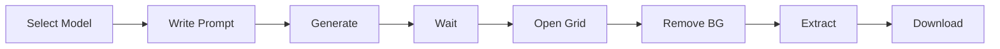

# Your First Generation

Complete walkthrough of generating your first texture.

:::info What You'll Create
A **diamond sword** texture (16×16 pixels) ready for Minecraft.

**Time required:** 10 minutes
:::

## 🎯 Overview



---

## Step 1: Navigate to Generator

1. Click **"Home"** in top navigation
2. Find **"Newbie"** section
3. Click **"Text to Minecraft Item Texture 16 by 16 pixels"**

[SCREENSHOT: Newbie section with model card highlighted]

You'll see the generation interface.

[SCREENSHOT: Generation interface]

---

## Step 2: Understand the Interface

**Main elements:**

| Element | Purpose |
|---------|---------|
| Green text box | Where you write your prompt |
| Generate button | Starts generation |
| Left sidebar | Shows your generations |
| Recent images | Your last generations appear here |

[SCREENSHOT: Interface with elements labeled]

---

## Step 3: Write Your Prompt

In the green text box, type:

```txt
diamond sword
```

[SCREENSHOT: Prompt entered in text box]

:::warning Language
Must be in **English**! Not French, Korean, or any other language.

❌ `épée en diamant`  
✅ `diamond sword`
:::

<details>
<summary>💡 Try better prompts</summary>

**Basic:**
```txt
diamond sword
```

**Better (adds color):**
```txt
blue diamond sword
```

**Even better (adds details):**
```txt
blue diamond sword with golden handle
```

**Best (full description):**
```txt
enchanted blue diamond sword with ornate golden handle and glowing effects
```

</details>

---

## Step 4: Generate

1. Scroll to bottom of page
2. Click **"Generate Image"** button

[SCREENSHOT: Generate button]

**What happens now:**
- Your request enters the generation queue
- A server picks it up
- AI generates 4 variations (2×2 grid)
- Image appears in left sidebar

:::caution Be Patient
**Free users:** 1-3 minutes  
**Premium users:** 30s-1 minute

Do NOT refresh the page or click multiple times!
:::

---

## Step 5: Watch for Completion

**Left sidebar** will show:
1. "Generating..." status
2. Progress bar (may not be accurate)
3. "NEW" badge when complete

[SCREENSHOT: Left sidebar showing generation progress]

**When complete:**
- Image appears with **"new"** badge
- 4 sword variations in a 2×2 grid

[SCREENSHOT: Completed generation with "new" badge]

<details>
<summary>🔧 Generation stuck?</summary>

If nothing appears after 5 minutes:

1. Click **"Delete"** button **6 times**
2. Try generating again

**Why:** Sometimes requests get stuck in queue. Clicking Delete 6 times resets it.

</details>

---

## Step 6: Open Grid Editor

1. Click on the new image (in left sidebar)
2. Click **"Grid"** button

[SCREENSHOT: Grid button location]

**Grid Editor opens** - This is where you:
- Remove white background
- Extract individual items
- Adjust settings

[SCREENSHOT: Grid Editor interface]

---

## Step 7: Remove White Background

AI generates with white background. You must make it transparent for Minecraft.

**Steps:**

1. Click **magic wand** tool (🪄 icon)
2. Click on **white areas** around swords
3. They turn transparent (checkered pattern)

[SCREENSHOT: Before - white background]
[SCREENSHOT: After - transparent background]

**Settings:**

| Setting | Recommended | Purpose |
|---------|-------------|---------|
| Wand Threshold | 5-7 | How similar colors to select |
| Remove Color | White | Color to remove |

<details>
<summary>🔧 Wand not working?</summary>

**Selecting too much:**
- Lower threshold (try 3-4)
- Click more carefully

**Selecting too little:**
- Raise threshold (try 7-8)
- Click multiple times

**Still issues:**
- Make sure wand tool is selected
- Try clicking different white areas
- Zoom in for precision

</details>

---

## Step 8: Calculate Pixel Size

**Why:** Grid Editor needs to know how big each pixel is to extract items correctly.

**Check canvas size:**
- Look bottom-left: "Select Canvas **512 x 512**"

[SCREENSHOT: Canvas size indicator]

**Count grid items:**
- You have **2 swords across, 2 down** = 2×2 grid

**Calculate:**
```
Pixel Size = Canvas Size ÷ (Grid Width × Item Size)
           = 512 ÷ (2 × 16)
           = 512 ÷ 32
           = 16
```

**Set "Pixel Size" to 16**

[SCREENSHOT: Pixel Size field set to 16]

:::tip Quick Reference
For 512×512 canvas with 2×2 grid of 16px items:
**Pixel Size = 16** (always)
:::

---

## Step 9: Set Grid Size

Count the items:
- **2 across**
- **2 down**

Set **"Grid Size"** to **2 x 2**

[SCREENSHOT: Grid Size dropdown set to 2×2]

**Items should now align perfectly in grid cells**

[SCREENSHOT: Items aligned in grid]

<details>
<summary>Items don't align?</summary>

**Check:**
1. Pixel Size is correct (16)
2. Grid Size is correct (2×2)
3. Canvas size is 512×512

**Try:**
- Click **Apply** button if available
- Refresh Grid Editor
- Recalculate Pixel Size

</details>

---

## Step 10: Extract Your Item

**Method 1: Save Individual Item**

1. **Right-click** on the sword you like best
2. Select **"Save as image (16x16)"**
3. PNG file downloads

[SCREENSHOT: Right-click menu showing save option]

**Method 2: Copy to Clipboard**

1. **Right-click** item
2. Select **"Copy image to clipboard"**
3. Paste (Ctrl+V) in image editor

**Method 3: Download All**

1. Click **"Download"** button
2. All 4 items download as separate files

---

## Step 11: Verify Your File

**Check the downloaded file:**

**File name:** `pixelgpt_[timestamp].png`

**Properties should be:**
- ✅ Format: PNG
- ✅ Size: 16×16 pixels
- ✅ Transparency: Yes (alpha channel)
- ✅ File size: ~500 bytes - 2KB

[SCREENSHOT: File properties showing correct specs]

**Open in image editor** to verify transparency (checkered background visible)

[SCREENSHOT: Image in editor showing transparent background]

---

## ✅ Success! You Did It!

You've successfully:
- ✅ Written a prompt
- ✅ Generated an AI image
- ✅ Removed the background
- ✅ Extracted a 16×16 PNG
- ✅ Ready for Minecraft

---

## 🎨 Next Steps

### Try More Items

Generate these to practice:

```txt
golden pickaxe
iron axe
red apple
blue potion bottle
emerald gem
wooden shield
```

### Improve Quality

- Use more descriptive prompts
- Try different models (Newbie Premium)
- Learn [prompting techniques](../prompting/)

### Create a Set

Generate matching items:
```txt
diamond sword
diamond pickaxe
diamond axe
diamond shovel
diamond hoe
```

Use **Style Selector** to keep consistent style!

---

## 🔧 Troubleshooting

<details>
<summary>Generation never appeared</summary>

**After 5 minutes:**
1. Click Delete 6 times
2. Retry generation

**Still not working:**
- Check server status
- Try different browser
- Clear cache

</details>

<details>
<summary>Image quality is poor</summary>

**Try:**
1. More descriptive prompt
2. Different model (Newbie Premium)
3. Multiple generations (pick best)

**Remember:** First try may not be perfect!

</details>

<details>
<summary>Can't remove background properly</summary>

**Check:**
- Wand tool selected?
- Threshold adjusted (try 5-7)?
- Clicked all white areas?

**Zoom in** and click carefully around item edges.

</details>

<details>
<summary>Items are wrong size when extracted</summary>

**Recalculate Pixel Size:**
1. Check canvas size (bottom-left)
2. Count grid items
3. Use formula: Canvas ÷ (Grid × 16)

**Common mistake:** Using wrong canvas size in calculation

</details>

---

## 📚 Learn More

<div className="container">
  <div className="row">
    <div className="col col--4">
      <div className="card">
        <div className="card__header">
          <h3>✍️ Better Prompts</h3>
        </div>
        <div className="card__body">
          <a href="../prompting/prompting-basics/what-is-a-prompt">Learn prompting →</a>
        </div>
      </div>
    </div>
    <div className="col col--4">
      <div className="card">
        <div className="card__header">
          <h3>🎯 Choose Models</h3>
        </div>
        <div className="card__body">
          <a href="../models/understanding-models/choosing-a-model">Model guide →</a>
        </div>
      </div>
    </div>
    <div className="col col--4">
      <div className="card">
        <div className="card__header">
          <h3>🖼️ Create GUIs</h3>
        </div>
        <div className="card__body">
          <a href="../tutorials/gui-creation/gui-complete-guide">GUI tutorial →</a>
        </div>
      </div>
    </div>
  </div>
</div>

:::success Congratulations!
You're now ready to explore Pixel GPT. [Understand the interface →](understanding-the-interface)
:::
