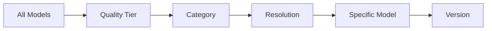
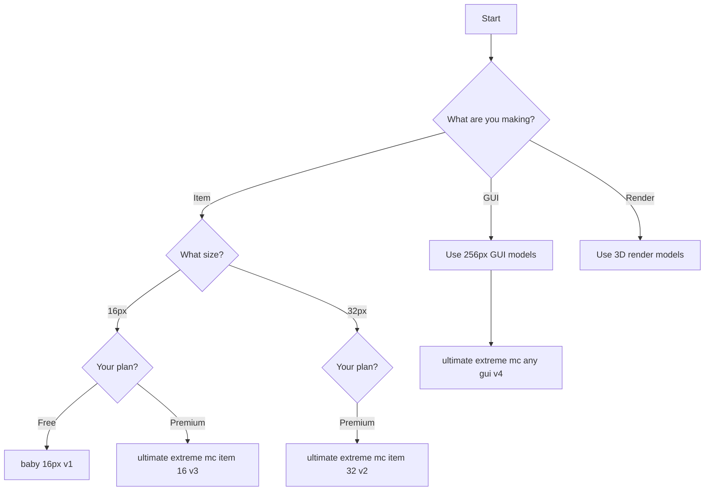

# AI Models

Complete guide to Pixel GPT's AI models.

## 🤖 What is a Model?

An **AI model** is the engine that generates images from your prompts.

**Different models** = Different specializations:
- Resolution (16px, 32px, 256px)
- Quality (Baby, Ultimate, Orion)
- Purpose (items, GUIs, renders)
- Style (vanilla, creative, RPG)

[SCREENSHOT: Model selection interface]

---

## 🎯 Model Organization



**Example path:**
```
Ultimate → Pixel Art → 16px → ultimate extreme mc item 16 → v3
```

---

## 📊 Quick Model Selection

<div className="container">
  <div className="row">
    <div className="col col--4">
      <div className="card">
        <div className="card__header">
          <h3>🆓 Free Users</h3>
        </div>
        <div className="card__body">
          <p><strong>Use:</strong> Baby tier models</p>
          <ul>
            <li>baby 16px v1</li>
            <li>baby 32px v2</li>
            <li>baby pixel art v1</li>
          </ul>
        </div>
      </div>
    </div>
    <div className="col col--4">
      <div className="card">
        <div className="card__header">
          <h3>💎 Premium Users</h3>
        </div>
        <div className="card__body">
          <p><strong>Use:</strong> Ultimate tier</p>
          <ul>
            <li>ultimate extreme mc item 16 v3</li>
            <li>ultimate extreme mc any gui v4</li>
            <li>All Standard/Pro models</li>
          </ul>
        </div>
      </div>
    </div>
    <div className="col col--4">
      <div className="card">
        <div className="card__header">
          <h3>👑 Elite Users</h3>
        </div>
        <div className="card__body">
          <p><strong>Use:</strong> Orion tier</p>
          <ul>
            <li>orion pro ultra top hq gui v1</li>
            <li>orion pro 16px v2</li>
            <li>All Elite models</li>
          </ul>
        </div>
      </div>
    </div>
  </div>
</div>

---

## 🗂️ Model Categories

### By Quality Tier

| Tier | Access | Quality | Speed | Models |
|------|--------|---------|-------|--------|
| Baby | Free | ⭐⭐⭐ | Fast | 10+ |
| Standard | $39.99+ | ⭐⭐⭐⭐ | Medium | 50+ |
| Pro | $39.99+ | ⭐⭐⭐⭐ | Slow | 20+ |
| Ultimate | $49.99+ | ⭐⭐⭐⭐⭐ | Slow | 100+ |
| Elite | $99.99+ | ⭐⭐⭐⭐⭐ | Slowest | 50+ |
| Orion | $49.99+ (limited) | ⭐⭐⭐⭐⭐ | Slow | 20+ |

### By Resolution

```
12px, 16px, 24px, 32px, 42px, 48px, 52px, 64px, 96px,
128px, 192px, 224px, 256px, Custom
```

[See all resolutions →](models-by-resolution/)

### By Purpose

```
Items, Blocks, GUIs, Armor, Icons, Logos, Thumbnails,
3D Renders, Illustrations, Animations
```

[See by type →](models-by-type/)

---

## 🎯 Choosing the Right Model

### Decision Tree



[Complete selection guide →](understanding-models/choosing-a-model)

---

## 📚 Learning Path

| Step | Topic | Purpose |
|------|-------|---------|
| 1 | [What is a Model](understanding-models/what-is-a-model) | Understand basics |
| 2 | [Why Multiple Models](understanding-models/why-multiple-models) | See the need for variety |
| 3 | [Model Quality Tiers](understanding-models/model-quality-levels) | Understand quality differences |
| 4 | [Choosing a Model](understanding-models/choosing-a-model) | Make smart selections |
| 5 | [Browse by Resolution](models-by-resolution/) | Find your resolution |
| 6 | [Browse by Type](models-by-type/) | Find your purpose |

---

## 🔍 Finding Models

### Method 1: Browse by Tier

**Home Page Tabs:**
```
Newbie → Baby tier
Newbie Premium → Standard tier
Newbie Ultimate Premium → Ultimate tier (limited selection)
Expert → ALL tiers organized
```

**Expert tab shows everything.**

### Method 2: Browse by Resolution

**Expert Tab Navigation:**
```
Baby → Pixel Art → 16px → [See all 16px Baby models]
Standard → Pixel Art → 32px → [See all 32px Standard models]
Ultimate → Pixel Art → 256px → [See all 256px Ultimate models]
```

### Method 3: Model Explorer

**Features Menu:**
```
Features → Explore All Models
Search bar to find specific models
```

[SCREENSHOT: Model Explorer interface]

---

## ⚡ Quick Recommendations

### For Beginners

**Start with:**
```
Newbie → "Text to Minecraft Item Texture 16 by 16 pixels"
```

**Then try:**
```
Newbie Premium → "Ultimate Premium 16px models"
```

### For GUIs

**Best models (in order):**
```
1. orion pro ultra top hq gui v1 (Elite plan)
2. ultimate extreme mc any gui v4 (Ultimate plan)
3. elite mc any gui hq boosted v2 (Elite plan)
```

[Complete GUI model guide →](recommended-models/best-for-guis)

### For Quality

**Highest quality per resolution:**
```
16px: orion pro 16px v2
32px: orion pro 32px v2
64px: mega mc item 64 top hq v1
256px: orion pro ultra top hq gui v1
```

---

## 📊 Model Comparison

[See detailed comparisons →](model-comparison/)

---

## ✅ Model Selection Checklist

Choose right model:

- [ ] Identified what you're making (item, GUI, block)
- [ ] Determined resolution needed (16px, 32px, 256px)
- [ ] Checked your plan tier (free, premium, elite)
- [ ] Found appropriate model in Expert tab
- [ ] Verified model supports your resolution
- [ ] Clicked "SELECT THIS AI MODEL" button

:::success Ready to Explore Models
[Learn what is a model →](understanding-models/what-is-a-model)

Or jump to: [Complete model list →](complete-model-list)
:::
