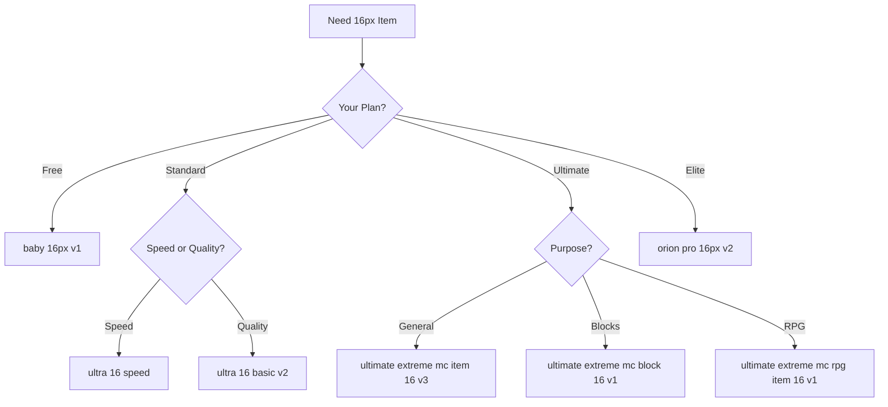

# 16px Models

Complete guide to 16×16 pixel models.

## 🎯 Why 16px?

**16×16 is Minecraft's standard resolution:**
```
✅ All vanilla items
✅ All vanilla blocks
✅ Default texture pack format
✅ Universal compatibility
```

**Most popular resolution** on Pixel GPT.

---

## 🏆 Best 16px Models

### Top Recommendations

| Goal | Model | Tier | Quality |
|------|-------|------|---------|
| Free testing | `baby 16px v1` | Baby | ⭐⭐⭐ |
| Good quality | `ultra 16 basic v2` | Standard | ⭐⭐⭐⭐ |
| Best quality | `ultimate extreme mc item 16 v3` | Ultimate | ⭐⭐⭐⭐⭐ |
| 2025 best | `orion pro 16px v2` | Orion | ⭐⭐⭐⭐⭐ |
| Fast generation | `ultra 16 super speed` | Standard | ⭐⭐⭐⭐ |
| Blocks only | `ultimate extreme mc block 16 v1` | Ultimate | ⭐⭐⭐⭐⭐ |
| RPG style | `ultimate extreme mc rpg item 16 v1` | Ultimate | ⭐⭐⭐⭐⭐ |

---

## 📊 Complete 16px Model List

### Baby Tier (Free)

<details>
<summary><strong>baby 16px v1</strong> - Basic free model</summary>

**Quality:** ⭐⭐⭐  
**Speed:** ⚡⚡⚡  
**Access:** Free users

**Best for:**
- Testing platform
- Learning prompting
- Simple vanilla replacements

**Limitations:**
- Basic quality
- Limited detail
- Simple prompt understanding

**Parameters:**
- Generation Precision (1-4)

</details>

<details>
<summary><strong>super speed 16px v1</strong> - Fastest free model</summary>

**Quality:** ⭐⭐⭐  
**Speed:** ⚡⚡⚡⚡  
**Access:** Free users

**Best for:**
- Very fast testing
- Rapid iterations
- Placeholder generation

</details>

### Standard Tier ($39.99+)

<details>
<summary><strong>ultra 16 basic v2</strong> - Best standard 16px</summary>

**Quality:** ⭐⭐⭐⭐⭐  
**Speed:** ⚡⚡  
**Access:** Premium users

**Best for:**
- Most general use
- Texture packs
- Custom items
- High quality needs

**Parameters:**
- Creativity (1-5)
- ColorMatch toggle
- Precise Text Guidance
- Style Selector support

**Most popular standard model.**

</details>

<details>
<summary><strong>ultra 16 speed</strong> - Fast premium generation</summary>

**Quality:** ⭐⭐⭐⭐  
**Speed:** ⚡⚡⚡  
**Generates:** 64 items at once

**Best for:**
- Batch generation
- Quick iterations
- Testing many prompts

</details>

<details>
<summary><strong>ultra hq 16px v1</strong> - High quality standard</summary>

**Quality:** ⭐⭐⭐⭐⭐  
**Speed:** ⚡⚡  

**Features:**
- Precise Text Guidance
- Improve composition
- Improve Quality
- High-res patch
- Style Selector

**Best for:**
- Quality-focused standard tier users

</details>

<details>
<summary><strong>icon 16px speed v1</strong> - Icon generator</summary>

**Quality:** ⭐⭐⭐⭐  
**Speed:** ⚡⚡⚡  

**Specialized for:**
- GUI icons
- Buttons
- Small UI elements
- Badge designs

</details>

<details>
<summary><strong>only block 16 v1</strong> - Block textures only</summary>

**Quality:** ⭐⭐⭐⭐  
**Purpose:** Block faces only

**Best for:**
- Block textures
- Tileable patterns
- Terrain textures

</details>

### Pro Tier ($39.99+)

<details>
<summary><strong>pro 16 px v3</strong> - Highest Pro quality</summary>

**Quality:** ⭐⭐⭐⭐⭐  
**Speed:** ⚡  

**Best for:**
- Professional quality
- Slow but excellent
- Fine details

</details>

### Ultimate Tier ($49.99+)

<details>
<summary><strong>ultimate extreme mc item 16 v3</strong> ⭐ BEST OVERALL</summary>

**Quality:** ⭐⭐⭐⭐⭐  
**Speed:** ⚡  
**Access:** Ultimate plan

**Features:**
- Base Accuracy (0-30)
- Max Creativity (0-100)
- Style Selector (advanced)
- High Quality toggle
- Custom Text Editor

**Best for:**
- Professional texture packs
- Highest quality items
- Complex requirements
- Advanced users

**Most recommended Ultimate model.**

</details>

<details>
<summary><strong>ultimate extreme mc block 16 v1</strong> - Best blocks</summary>

**Quality:** ⭐⭐⭐⭐⭐  
**Purpose:** Block textures

**Best for:**
- Block-specific generation
- Tileable textures
- Terrain blocks

</details>

<details>
<summary><strong>ultimate extreme mc rpg item 16 v1</strong> - RPG style</summary>

**Quality:** ⭐⭐⭐⭐⭐  
**Style:** Fantasy/RPG

**Best for:**
- Fantasy servers
- RPG items
- Magical weapons
- Custom fantasy items

</details>

<details>
<summary><strong>ultimate extreme mc creative item 16 v1</strong> - Artistic</summary>

**Quality:** ⭐⭐⭐⭐⭐  
**Style:** Creative/artistic

**Best for:**
- Unique designs
- Artistic interpretations
- Creative projects

</details>

### Elite Tier ($99.99+)

<details>
<summary><strong>mega mc item 16 top hq v1</strong> - Elite quality</summary>

**Quality:** ⭐⭐⭐⭐⭐  
**Speed:** ⚡  
**Access:** Elite plan

**Best for:**
- Maximum quality
- Professional studios
- Commercial projects

</details>

<details>
<summary><strong>elite animate any 16px</strong> - Animation generator</summary>

**Quality:** ⭐⭐⭐⭐⭐  
**Purpose:** Animated items

**Use via:** Presets tab only

**Best for:**
- Item animations
- Animated textures
- Optifine CIT animations

</details>

### Orion Tier (Next-Gen)

<details>
<summary><strong>orion pro 16px v2</strong> ⭐ 2025 BEST</summary>

**Quality:** ⭐⭐⭐⭐⭐ (Best)  
**Speed:** ⚡  
**Access:** Ultimate (4-8/day), Elite (256/day)

**Features:**
- 2025 next-gen quality
- Best prompt understanding
- Superior details
- State-of-the-art

**Best for:**
- Flagship items
- Critical generations
- Absolute best quality

**Recommended as:** Your top-tier generations when daily quota allows.

</details>

---

## 🎯 Model Selection Flowchart

### For 16px Items



---

## 🔧 Choosing Between Similar Models

### When Multiple Options Exist

**Example:** Multiple Ultimate 16px models

**Test approach:**
```
1. Pick 2-3 models
2. Generate same prompt with each
3. Compare results
4. Choose favorite
5. Use that model going forward
```

### Version Selection

**v1 vs v2 vs v3:**

```
Usually: Higher version = better
But: Sometimes older versions have different style

Recommend: Test latest version first (v3, v4)
If issues: Try previous version
```

---

## 📊 16px Model Comparison

| Model | Tier | Quality | Speed | Style Selector | Advanced Params |
|-------|------|---------|-------|---------------|----------------|
| baby 16px v1 | Baby | ⭐⭐⭐ | ⚡⚡⚡ | ❌ | ❌ |
| ultra 16 basic v2 | Standard | ⭐⭐⭐⭐ | ⚡⚡ | ✅ | Limited |
| ultra hq 16px v1 | Standard | ⭐⭐⭐⭐⭐ | ⚡⚡ | ✅ | ✅ |
| pro 16 px v3 | Pro | ⭐⭐⭐⭐⭐ | ⚡ | ✅ | ✅ |
| ultimate extreme mc item 16 v3 | Ultimate | ⭐⭐⭐⭐⭐ | ⚡ | ✅ | ✅✅ |
| orion pro 16px v2 | Orion | ⭐⭐⭐⭐⭐ | ⚡ | ✅ | ✅✅ |

---

## ✅ 16px Model Selection Checklist

Choose right 16px model:

- [ ] Checked plan tier (free, premium, elite)
- [ ] Identified purpose (item, block, icon)
- [ ] Considered style (vanilla, RPG, creative)
- [ ] Evaluated speed needs
- [ ] Selected model in Expert tab
- [ ] Clicked "SELECT THIS AI MODEL"

:::success 16px Models Mastered
[See 32px models →](32px-models)

Or: [See models by type →](../models-by-type/)
:::
