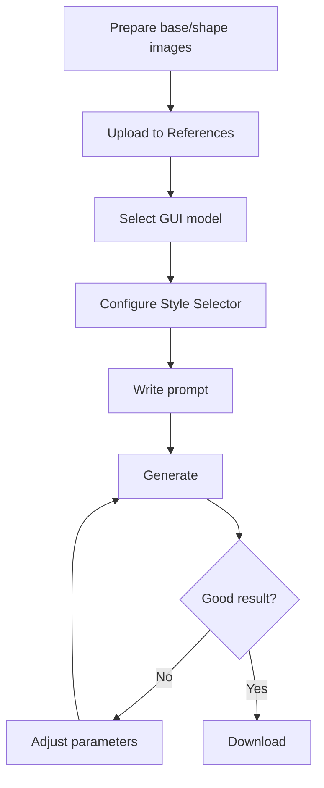

# GUI Models

All models for Minecraft interface generation.

## 🖼️ GUI Model Overview

**Purpose:** Generate Minecraft menu interfaces (chests, shops, custom menus)

**Resolution:** Primarily 256×256  
**Complexity:** High (most complex Pixel GPT feature)  
**Requirement:** Premium subscription + Style Selector

---

## 🏆 Recommended GUI Models (2025)

### Tier 1: Best Overall ⭐

**orion pro ultra top hq gui v1**
```
Quality: ⭐⭐⭐⭐⭐ (Absolute best)
Access: Ultimate (4-8/day), Elite (256/day)
Difficulty: Hard
Speed: ⚡ Slow

Best for: Flagship server GUIs, maximum quality
```

### Tier 2: Best for Most Users ⭐

**ultimate extreme mc any gui v4**
```
Quality: ⭐⭐⭐⭐⭐
Access: Ultimate plan ($49.99+)
Difficulty: Medium
Speed: ⚡ Slow

Best for: Most GUI projects, great balance
```

### Tier 3: Elite Quality ⭐

**elite mc any gui hq boosted v3**
```
Quality: ⭐⭐⭐⭐⭐
Access: Elite plan ($99.99+)
Difficulty: Medium
Speed: ⚡ Slow

Best for: Professional GUIs, commercial use
```

### Tier 4: Good Quality

**elite mc any gui v2**
```
Quality: ⭐⭐⭐⭐
Access: Elite plan
Difficulty: Medium
Speed: ⚡⚡ Medium

Best for: Good GUIs, faster than v4
```

---

## 📊 All GUI Models

### 256px GUI Models

<details>
<summary><strong>mc gui 256</strong> - Legacy</summary>

**Status:** ⚠️ Outdated  
**Quality:** ⭐⭐⭐  
**Recommend:** Use newer models instead

</details>

<details>
<summary><strong>mc any gui 256 v1</strong></summary>

**Quality:** ⭐⭐⭐⭐  
**Status:** Older version

**Note:** v4 significantly better

</details>

<details>
<summary><strong>mc any gui 256 v2</strong></summary>

**Quality:** ⭐⭐⭐⭐  
**Status:** Older version

</details>

<details>
<summary><strong>mc any gui 256 v3</strong></summary>

**Quality:** ⭐⭐⭐⭐  
**Status:** Good, but v4 better

**Features:**
- Preset GUI templates
- Enhance Accuracy toggle

</details>

<details>
<summary><strong>ultimate extreme mc any gui v4</strong> ⭐</summary>

**Quality:** ⭐⭐⭐⭐⭐  
**Access:** Ultimate ($49.99+)  
**Recommended:** Yes

**Parameters:**
```
Precise Text Guidance: ✓
Enhance GUI Preset Accuracy: ✓
Force Flat Slot (0-10): Unique to v4
High Quality toggle: ✓
Preset GUI (templates): ✓
Style Selector: Full support
```

**Best for:**
- Most GUI projects
- Shop interfaces
- Custom menus

[SCREENSHOT: GUI v4 interface]

**Usage guide:** [Complete GUI tutorial](../../tutorials/gui-creation/gui-complete-guide)

</details>

<details>
<summary><strong>ultimate extreme mc any gui v5</strong></summary>

**Quality:** ⭐⭐⭐⭐⭐  
**Status:** Experimental

**Note:** Test if v4 doesn't meet needs

</details>

<details>
<summary><strong>ultimate extreme mc any gui v6</strong></summary>

**Quality:** ⭐⭐⭐⭐⭐  
**Status:** Experimental

</details>

<details>
<summary><strong>ultimate extreme mc any gui v7</strong></summary>

**Quality:** ⭐⭐⭐⭐⭐  
**Status:** Latest experimental

</details>

<details>
<summary><strong>mc any gui 256 mini v1</strong></summary>

**Quality:** ⭐⭐⭐⭐  
**Speed:** ⚡⚡ (Faster)  

**Best for:**
- Faster generation
- Good quality compromise

</details>

### Elite Tier

<details>
<summary><strong>elite mc any gui v1/v2/v3</strong></summary>

**Quality:** ⭐⭐⭐⭐⭐  
**Access:** Elite ($99.99+)

**Versions:**
- v1: Initial Elite
- v2: Improved
- v3: Latest non-boosted

</details>

<details>
<summary><strong>elite mc any gui boosted v1/v2/v3</strong></summary>

**Quality:** ⭐⭐⭐⭐⭐  
**Variant:** Boosted (enhanced)

**Better than:** Non-boosted versions

</details>

<details>
<summary><strong>elite mc any gui hq boosted v1/v2/v3</strong></summary>

**Quality:** ⭐⭐⭐⭐⭐  
**Variant:** HQ Boosted (highest Elite quality)

**Best Elite options** before Orion.

</details>

### Orion Tier

<details>
<summary><strong>orion gui v1</strong></summary>

**Quality:** ⭐⭐⭐⭐⭐  
**Access:** Ultimate/Elite (limited)

**Orion tier entry model.**

</details>

<details>
<summary><strong>orion pro gui v1</strong></summary>

**Quality:** ⭐⭐⭐⭐⭐  
**Variant:** Pro (higher accuracy)

</details>

<details>
<summary><strong>orion pro top hq gui v1</strong></summary>

**Quality:** ⭐⭐⭐⭐⭐  
**Variant:** Top HQ (very high quality)

</details>

<details>
<summary><strong>orion pro ultra top hq gui v1</strong> ⭐ #1 BEST</summary>

**Quality:** ⭐⭐⭐⭐⭐ (Platform best)  
**Access:** Ultimate (4-8/day), Elite (256/day)

**Description:** "The best of the website as of 2025!"

**Features:**
- State-of-the-art GUI generation
- Best slot accuracy
- Superior detail control
- Best prompt understanding
- Maximum quality

**Best for:**
- Production server GUIs
- Flagship interfaces
- Maximum quality requirements
- Public-facing GUIs

**Use when:** Quality is critical, you have Orion quota available.

</details>

---

## 📐 Inventory GUI Models (192×192)

<details>
<summary><strong>mc inventory gui 192 easy v3</strong></summary>

**Resolution:** 192×192  
**Quality:** ⭐⭐⭐⭐⭐  
**Purpose:** Inventory-style interfaces

**Parameters:**
- Style Mode (1-4)
- GUI Freedom (1-6)
- Force GUI (1-4)

**Best for:**
- Player inventory GUIs
- Storage interfaces

</details>

---

## 🎯 GUI Model Selection Guide

### By Experience Level

**Beginner (first GUI):**
```
Use: ultimate extreme mc any gui v4
Why: Good balance, well-documented, reliable
```

**Intermediate (made 3-5 GUIs):**
```
Use: elite mc any gui hq boosted v3
Why: Higher quality, more control
```

**Advanced (GUI expert):**
```
Use: orion pro ultra top hq gui v1
Why: Absolute best, full control
```

### By Priority

**Speed needed:**
```
Use: mc any gui 256 mini v1
Quality: Good (⭐⭐⭐⭐)
Speed: Medium (⚡⚡)
```

**Quality needed:**
```
Use: ultimate extreme mc any gui v4
or: orion pro ultra top hq gui v1 (if available)
```

**Learning/testing:**
```
Use: ultimate extreme mc any gui v4
Most community support
```

---

## 🎨 GUI Model Parameters

### Common Parameters

**All Ultimate/Elite GUI models have:**

```
Precise Text Guidance: Control prompt adherence
Style Selector: Essential for GUIs
Enhance GUI Preset Accuracy: Better slot alignment
Improve composition/quality: Quality toggles
```

### v4-Specific Parameters

**Ultimate extreme mc any gui v4 has unique:**

```
Force Flat Slot (0-10):
- Controls slot background flatness
- Higher = flatter slots (cleaner)
- Recommended: 5-7
```

### Preset GUI

**Some models support preset templates:**

```
Select from dropdown:
- Generic 54 (chest)
- Double chest
- Hopper
- Custom layouts
```

**Helps maintain structure.**

---

## 🔧 GUI Model Workflow

### Basic Workflow



**Iteration expected:** 3-10 generations typical.

---

## 📊 GUI Model Comparison

### Quality Comparison

```
mc gui 256 (old): ⭐⭐⭐ - Outdated
mc any gui v3: ⭐⭐⭐⭐ - Good
ultimate extreme v4: ⭐⭐⭐⭐⭐ - Excellent
elite hq boosted v3: ⭐⭐⭐⭐⭐ - Superior
orion pro ultra v1: ⭐⭐⭐⭐⭐ - Best
```

### Feature Comparison

| Feature | v4 Ultimate | Elite HQ Boosted | Orion Ultra |
|---------|-------------|------------------|-------------|
| Slot accuracy | Excellent | Excellent | Best |
| Detail level | High | Very High | Maximum |
| Prompt following | Excellent | Superior | Best |
| Speed | Slow | Slower | Slowest |
| Force Flat Slot | ✅ | ✅ | ✅ |

---

## ✅ GUI Model Selection Checklist

Choose right GUI model:

- [ ] Have premium subscription (required for all GUI models)
- [ ] Prepared 256×256 base/shape images
- [ ] Determined quality needs
- [ ] Checked Orion quota if using Orion
- [ ] Know difficulty level of chosen model
- [ ] Ready for iteration (3-10 tries)
- [ ] Read Style Selector guide

:::success GUI Models Mastered
[See complete model list →](../complete-model-list)

[GUI tutorial →](../../tutorials/gui-creation/gui-complete-guide)
:::
