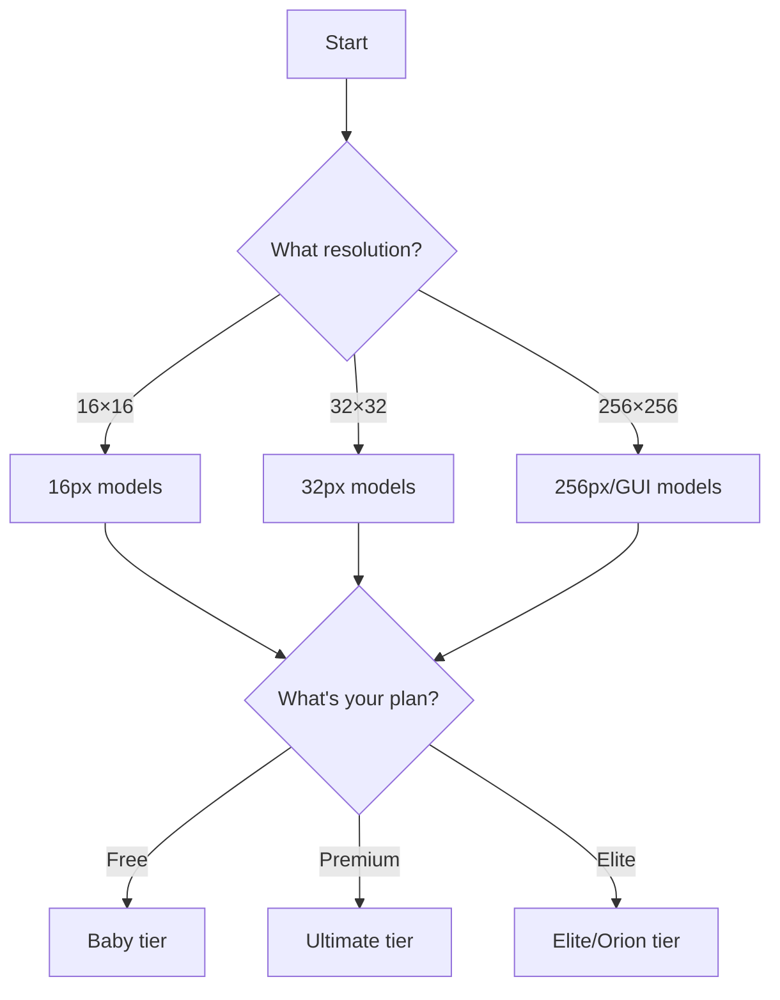

# Choosing the Right Model

Strategic model selection for best results.

## 🎯 The Selection Process



---

## 📐 Step 1: Determine Resolution

### What Size Do You Need?

**Minecraft items/blocks:**
```
Vanilla style → 16×16 (most common)
HD pack → 32×32 or 64×64
Very HD pack → 128×128
```

**GUIs:**
```
Custom GUIs → 256×256
Inventory GUIs → 192×192
Tags → 120×32
```

**Renders/Art:**
```
3D renders → 1024×1024
Pixel art scenes → 128×128 or 256×256
Logos → 128×128 or 256×256
```

:::tip Resolution First
Always start by determining target resolution. This narrows model choices immediately.
:::

---

## 🏷️ Step 2: Identify Purpose

### Item Types

**What are you making?**

```
Regular items → Item models
Blocks only → Block-specific models
Icons/badges → Icon models
Armor → Armor models or presets
GUIs → GUI models (256px)
Renders → 3D render models
Logos → Logo models
```

### Model Purpose Tags

**Look for keywords in model names:**

```
"item" → General items
"block" → Blocks only
"gui" → Interface elements
"armor" → Armor pieces
"icon" → Icons/badges
"render" → 3D renders
"cartoon" → Illustrations
```

---

## 💰 Step 3: Check Your Plan

### Access by Plan

**Free users:**
```
Access: Baby tier only
Available: ~15 models
Best choice: baby 16px v1 (items)
```

**Standard/Pro ($39.99):**
```
Access: Baby + Standard + Pro tiers
Available: ~100 models
Best choice: ultra 16 basic v2 (items)
             vhq 32px v3 (32px items)
```

**Ultimate ($49.99):**
```
Access: All tiers + Ultimate + Orion (limited)
Available: 250+ models
Best choice: ultimate extreme mc item 16 v3 (items)
             ultimate extreme mc any gui v4 (GUIs)
```

**Elite ($99.99):**
```
Access: Everything + full Orion access
Available: 300+ models
Best choice: orion pro 16px v2 (items)
             orion pro ultra top hq gui v1 (GUIs)
```

---

## 🎨 Step 4: Consider Style

### Style Requirements

**Do you need specific aesthetic?**

**Vanilla Minecraft:**
```
Look for: "mc", "minecraft", "vanilla" in name
Avoid: "creative", "RPG", "stylized"

Example: ultimate extreme mc item 16 v3
```

**RPG/Fantasy:**
```
Look for: "RPG", "fantasy" in name

Example: ultimate extreme mc rpg item 16 v1
```

**Creative/Artistic:**
```
Look for: "creative", "stylized" in name

Example: ultimate extreme mc creative item 16 v1
```

**Cartoon:**
```
Look for: "cartoon", "colorful" in name

Example: pro cartoon v2
```

---

## ⚡ Step 5: Speed vs Quality

### Trade-off Decision

**Need it fast?**
```
Choose: "speed" variants
Examples: ultra 16 speed, icon 16px speed

Quality: ⭐⭐⭐⭐
Speed: ⚡⚡⚡ (Fast)
```

**Need best quality?**
```
Choose: "hq", "extreme", "ultimate" variants
Examples: ultimate extreme mc item 16 v3

Quality: ⭐⭐⭐⭐⭐
Speed: ⚡ (Slow)
```

**Balanced?**
```
Choose: Standard/Pro models
Examples: ultra 16 basic v2

Quality: ⭐⭐⭐⭐
Speed: ⚡⚡ (Medium)
```

---

## 🎯 Practical Selection Examples

### Example 1: Vanilla Item Replacement

**Goal:** Replace vanilla diamond sword

**Selection:**
```
Resolution: 16×16 ✓
Purpose: Item ✓
Plan: Ultimate ✓
Style: Vanilla ✓
Speed: Quality over speed ✓

Choose: ultimate extreme mc item 16 v3
```

### Example 2: Custom Shop GUI

**Goal:** Fantasy shop GUI for server

**Selection:**
```
Resolution: 256×256 ✓
Purpose: GUI ✓
Plan: Ultimate ✓
Style: Fantasy theme ✓
Speed: Quality (GUIs take time) ✓

Choose: ultimate extreme mc any gui v4
        or orion pro ultra top hq gui v1 (if Elite)
```

### Example 3: Quick Testing

**Goal:** Test idea quickly

**Selection:**
```
Resolution: 16×16 ✓
Purpose: Item ✓
Plan: Free ✓
Speed: Fast ✓

Choose: baby 16px v1
        or super speed 16px v1
```

### Example 4: HD Texture Pack

**Goal:** 32×32 HD pack for release

**Selection:**
```
Resolution: 32×32 ✓
Purpose: Items ✓
Plan: Ultimate ✓
Style: High quality ✓
Speed: Quality matters ✓

Choose: ultimate extreme mc item 32 v2
```

---

## 🔍 Finding Models in Expert Tab

### Navigation

**Home → Expert Tab → [Quality Tier] → [Category] → [Resolution]**

**Example for 16px items:**
```
Expert → Ultimate → Pixel Art → 16px
→ See all Ultimate 16px models
```

[SCREENSHOT: Expert tab navigation path]

### Identifying Best Model

**Look for indicators:**

```
"ultimate extreme" = Very high quality
"hq" = High quality
"v3" or "v4" = Latest version (usually best)
"boosted" = Enhanced variant
"top hq" = Top quality
```

**Newest + highest quality keywords = best model.**

---

## 📊 Model Decision Matrix

| Your Goal | Resolution | Your Plan | Recommended Model |
|-----------|------------|-----------|------------------|
| Test idea | 16px | Free | baby 16px v1 |
| Good item | 16px | Premium | ultra 16 basic v2 |
| Best item | 16px | Ultimate | ultimate extreme mc item 16 v3 |
| Best item 2025 | 16px | Elite | orion pro 16px v2 |
| Simple GUI | 256px | Ultimate | elite mc any gui v2 |
| Best GUI | 256px | Ultimate/Elite | ultimate extreme mc any gui v4 |
| Best GUI 2025 | 256px | Elite | orion pro ultra top hq gui v1 |
| HD item | 32px | Ultimate | ultimate extreme mc item 32 v2 |
| Quick generation | 16px | Premium | ultra 16 speed |

---

## ⚙️ Advanced Selection Criteria

### Model Features

**Some models have special features:**

```
Style Selector support: ✓/✗
Custom Text Editor: ✓/✗
Advanced parameters: ✓/✗
Preset compatibility: ✓/✗
```

**Check model parameters** before selecting.

### Model-Specific Parameters

**Ultimate tier models often have:**
```
Base Accuracy (0-30)
Max Creativity (0-100)
High Quality toggle
Custom size options
```

**More control = better results** (if you know how to use them).

---

## 🔧 Selection Troubleshooting

<details>
<summary>Too many models, can't choose</summary>

**Simplify:**
1. What resolution? (16px, 32px, 256px)
2. What's your plan? (Free, Premium, Elite)
3. Go to Expert tab
4. Navigate to your resolution
5. Pick latest version of highest quality available

**Example:**
- Want 16px
- Have Ultimate plan
- Go to: Expert → Ultimate → Pixel Art → 16px
- Pick: ultimate extreme mc item 16 v3 (latest)

</details>

<details>
<summary>Model not available/greyed out</summary>

**Causes:**
- Model requires higher plan tier
- You don't have premium subscription
- Orion model daily limit reached

**Check:**
- Model description for plan requirement
- Your current plan in Account settings
- Orion quota if using Orion model

</details>

<details>
<summary>Don't know difference between models</summary>

**Test approach:**
1. Generate same prompt with 2-3 models
2. Compare results
3. Pick model that gives best results
4. Use that model going forward

**Experimentation** reveals differences.

</details>

---

## ✅ Model Selection Checklist

Before generating:

- [ ] Determined target resolution (16px, 32px, etc.)
- [ ] Identified purpose (item, block, GUI)
- [ ] Checked plan tier access
- [ ] Considered speed vs quality needs
- [ ] Found model in Expert tab
- [ ] Clicked "SELECT THIS AI MODEL" button
- [ ] Ready to generate

:::success Model Selection Mastered
[Explore models by resolution →](../models-by-resolution/)

Or jump to: [Complete model list →](../complete-model-list)
:::
