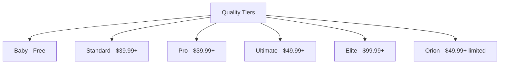

# Model Quality Levels

Understanding quality tiers.

## 🏆 Quality Hierarchy



**From lowest to highest quality.**

---

## 🆓 Baby Tier (Free)

### Characteristics

```
Quality: ⭐⭐⭐
Speed: ⚡⚡⚡ (Fast)
Understanding: Basic
Detail level: Low-Medium
Access: Free users
```

### What Baby Models Can Do

```
✅ Generate recognizable items
✅ Basic colors and materials
✅ Simple shapes
✅ Standard Minecraft items

Limitations:
⚠️ Limited detail
⚠️ Basic prompt understanding
⚠️ Simpler outputs
⚠️ Less style control
```

### Example Models

```
baby 16px v1 (items)
baby 32px v2 (items)
baby pixel art v1 (scenes)
super speed variants (fast)
```

### Best For

```
✅ Testing the platform
✅ Learning how it works
✅ Simple vanilla replacements
✅ Quick generations
```

**Not for:** Professional work, complex items, GUIs

---

## 💼 Standard Tier ($39.99+)

### Characteristics

```
Quality: ⭐⭐⭐⭐
Speed: ⚡⚡ (Medium)
Understanding: Good
Detail level: Medium-High
Access: Premium users
```

### What Standard Models Can Do

```
✅ High-quality items
✅ Good prompt following
✅ Style Selector support
✅ Detailed textures
✅ Color accuracy

Improvements over Baby:
+ Better details
+ More accurate colors
+ Style control
+ Reference image support
```

### Example Models

```
ultra 16 basic v2 (best standard 16px)
vhq 32px v3 (high quality 32px)
super-32-base (blocks)
64px item ultimate (detailed items)
```

### Best For

```
✅ Texture packs
✅ Custom items
✅ Good quality needs
✅ Most projects
```

---

## 🎓 Pro Tier ($39.99+)

### Characteristics

```
Quality: ⭐⭐⭐⭐
Speed: ⚡ (Slower)
Understanding: Very Good
Detail level: High
Access: Premium users (same price as Standard)
```

### What Pro Models Can Do

```
✅ Specialized high quality
✅ Excellent prompt adherence
✅ Advanced style control
✅ Professional outputs

Focus: Quality over speed
```

### Example Models

```
pro-16-px-v3 (highest quality 16px)
pro-32-px-v2 (highest quality 32px)
pro-cartoon-v2 (illustrations)
pro-mc-render-v2 (3D renders)
```

### Best For

```
✅ Professional quality
✅ Client work
✅ Publication-ready
✅ Showcase pieces
```

:::info Standard vs Pro
Same price ($39.99), but Pro models are slower, higher quality, more specialized. Choose based on need.
:::

---

## 🌟 Ultimate Tier ($49.99+)

### Characteristics

```
Quality: ⭐⭐⭐⭐⭐
Speed: ⚡ (Slow)
Understanding: Excellent
Detail level: Very High
Access: Ultimate plan users
```

### What Ultimate Models Can Do

```
✅ Best quality (except Orion)
✅ Deep prompt understanding
✅ Advanced parameters (Base Accuracy, Max Creativity)
✅ Perfect style matching
✅ Complex multi-part items
✅ Professional GUIs

Premium features:
+ Base Accuracy control
+ Max Creativity control
+ Advanced Style Selector
+ Best resolution options
```

### Example Models

```
ultimate extreme mc item 16 v3 (best 16px item)
ultimate extreme mc any gui v4 (best GUI)
ultimate extreme mc render v1 (best render)
ultimate extreme custom size v1 (custom resolutions)
```

### Best For

```
✅ Professional texture packs
✅ Complex GUIs
✅ Highest quality work
✅ Commercial projects
✅ Advanced workflows
```

**Most popular premium tier** - best value.

---

## 👑 Elite Tier ($99.99+)

### Characteristics

```
Quality: ⭐⭐⭐⭐⭐
Speed: ⚡ (Slowest)
Understanding: Superior
Detail level: Maximum
Access: Elite plan users
```

### What Elite Models Can Do

```
✅ Absolute best quality
✅ Perfect detail control
✅ Advanced specialized models
✅ Boosted variants (enhanced quality)
✅ HQ boosted (highest quality)

Exclusive features:
+ Armor pack generators (full sets)
+ Mega quality variants
+ Maximum parameter control
```

### Example Models

```
elite mc any gui hq boosted v3 (absolute best GUI)
mega mc item 16 top hq v1 (best 16px)
elite mc armor pack 32 v1 (full armor sets)
elite animate any 16px (advanced animation)
```

### Best For

```
✅ Commercial studios
✅ Large-scale projects
✅ Maximum quality requirements
✅ Professional production
```

---

## 🚀 Orion Tier (Next-Gen 2025)

### Characteristics

```
Quality: ⭐⭐⭐⭐⭐ (Best)
Speed: ⚡ (Slow)
Understanding: State-of-the-art
Detail level: Maximum
Access: Ultimate (4-8/day), Elite (256/day)
```

### What Orion Models Can Do

```
✅ 2025 next-generation quality
✅ Best prompt understanding
✅ Superior details
✅ Best color accuracy
✅ Advanced composition

Cutting-edge:
+ Latest AI technology
+ Best available quality
+ Future-proof
```

### Example Models

```
orion pro ultra top hq gui v1 (BEST GUI model)
orion pro 16px v2 (best 16px item)
orion pro 32px v2 (best 32px item)
orion badge top hq v1 (best badges/icons)
```

### Best For

```
✅ Absolute highest quality
✅ Flagship projects
✅ Maximum prompt control
✅ 2025 cutting-edge
```

:::warning Daily Limit
Orion models have daily generation limits:
- Ultimate plan: 4-8 generations/day
- Elite plan: 256 generations/day

Use wisely for critical generations.
:::

---

## 📊 Tier Comparison

| Tier | Quality | Speed | Prompt Understanding | Style Control | Price |
|------|---------|-------|---------------------|---------------|-------|
| Baby | ⭐⭐⭐ | ⚡⚡⚡ | Basic | Limited | Free |
| Standard | ⭐⭐⭐⭐ | ⚡⚡ | Good | Good | $39.99 |
| Pro | ⭐⭐⭐⭐ | ⚡ | Very Good | Excellent | $39.99 |
| Ultimate | ⭐⭐⭐⭐⭐ | ⚡ | Excellent | Excellent | $49.99 |
| Elite | ⭐⭐⭐⭐⭐ | ⚡ | Superior | Superior | $99.99 |
| Orion | ⭐⭐⭐⭐⭐ | ⚡ | Best | Best | $49.99+ |

---

## 🎯 Which Tier Should You Use?

### Decision Guide

**Free user:**
```
Use: Baby tier
Upgrade when: Results not good enough
```

**Premium user ($39.99):**
```
Use: Standard/Pro for most work
Try: Ultimate if available in your plan
```

**Ultimate user ($49.99):**
```
Use: Ultimate tier for everything
Save Orion: For critical generations (4-8/day)
```

**Elite user ($99.99):**
```
Use: Elite tier as default
Use Orion: Freely (256/day)
```

---

## 🔬 Real-World Quality Differences

### Same Prompt, Different Tiers

**Prompt:** `blue diamond sword with golden handle`

**Baby model:**
```
- Basic blue sword
- Simple golden handle
- Minimal details
- Flat appearance
Quality: 70%
```

**Standard model:**
```
- Clear blue blade
- Defined golden handle
- Some details
- Good shading
Quality: 85%
```

**Ultimate model:**
```
- Vibrant blue blade
- Ornate golden handle
- Excellent details
- Professional shading
Quality: 95%
```

**Orion model:**
```
- Perfect blue tone
- Intricate golden handle
- Maximum details
- Flawless execution
Quality: 98%
```

[SCREENSHOT: Same prompt across all tiers]

**Visible quality progression.**

---

## 💡 Choosing Wisely

### When Baby is Enough

```
✅ Testing prompts
✅ Learning platform
✅ Placeholder textures
✅ Quick mockups
```

### When Ultimate is Needed

```
✅ Texture pack release
✅ Server GUIs (public-facing)
✅ Client projects
✅ Professional work
```

### When Orion is Worth It

```
✅ Flagship items
✅ Hero GUIs
✅ Promotional materials
✅ Absolute best quality needed
```

**Save Orion for important generations** if on limited daily quota.

---

## ✅ Quality Tier Checklist

Choose right tier:

- [ ] Identified my plan level
- [ ] Know which tiers I can access
- [ ] Understand quality differences
- [ ] Matched tier to project importance
- [ ] Aware of speed trade-offs
- [ ] Know when to use Orion (if limited)

:::success Quality Tiers Mastered
[Learn to choose the right model →](choosing-a-model)
:::
