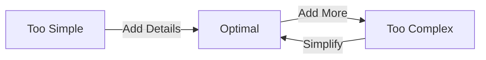

# Complex Descriptions

Writing detailed multi-part prompts.

## 🎯 When to Use Complex Prompts

**Complex items need complex prompts:**

```
Simple item: Apple → Simple prompt
Complex item: Ornate magical staff → Complex prompt
```

**Use complex descriptions for:**
- Multi-material items (blade + handle + decorations)
- Heavily detailed items (engravings, patterns, gems)
- Specific style requirements
- Professional/client work

---

## 🏗️ Building Complex Prompts

### Layer 1: Base Item

**Start with core subject:**
```txt
"staff"
```

### Layer 2: Primary Material

**Add main material/color:**
```txt
"wooden staff"
```

### Layer 3: Primary Details

**Add key characteristics:**
```txt
"wooden staff with purple crystal orb"
```

### Layer 4: Secondary Details

**Add additional elements:**
```txt
"wooden staff with purple crystal orb and silver metal bands"
```

### Layer 5: Effects & Style

**Add finishing touches:**
```txt
"enchanted wooden staff with glowing purple crystal orb and silver metal bands with rune engravings"
```

**Final prompt:** 13 words, highly specific.

---

## 🎨 Multi-Part Item Descriptions

### Specifying Different Parts

**Swords have multiple parts:**

```
Blade
├── Material
├── Color
└── Details

Handle/Grip
├── Material
├── Color
└── Texture

Crossguard
├── Material
└── Shape

Pommel
└── Decoration
```

**Prompt formula:**
```txt
"sword with [blade description] and [handle description]"

Example:
"sword with blue diamond blade and golden ornate handle"
```

### Part-by-Part Example

**Complex sword prompt:**

```txt
"enchanted diamond sword with glowing blue blade, ornate golden crossguard with wing design, leather-wrapped handle, and ruby pommel gem"
```

**Breakdown:**
```
Blade: "glowing blue blade"
Crossguard: "ornate golden crossguard with wing design"
Handle: "leather-wrapped handle"
Pommel: "ruby pommel gem"
Style: "enchanted diamond sword"
```

**Each part specified separately.**

---

## 🔧 Advanced Techniques

### Technique 1: Nested Descriptions

**Describe items within items:**

```txt
"wooden staff with (purple glowing crystal orb with arcane symbols) at top and (silver metal bands with rune engravings) along shaft"
```

**Parentheses for mental organization** (not in actual prompt):
```txt
"wooden staff with purple glowing crystal orb with arcane symbols at top and silver metal bands with rune engravings along shaft"
```

### Technique 2: Spatial Descriptors

**Specify where elements are:**

```txt
"sword with blue blade (top), golden middle section, and dark handle (bottom)"

"staff with glowing orb at top, metal bands along shaft, and wooden base at bottom"

"helmet with horns on sides and crest on top"
```

**Spatial words:**
- at top, at bottom
- on sides, in center
- along shaft, around edge

### Technique 3: Texture Layering

**Multiple texture descriptions:**

```txt
"stone block with rough weathered surface, deep cracks, patches of green moss, and small embedded pebbles"
```

**Each texture element adds to complexity.**

---

## 💎 Material Combinations

### Dual Materials

**Different parts, different materials:**

```txt
"sword with diamond blade and golden handle"
"pickaxe with iron head and oak wood handle"
"staff with crystal orb and wooden shaft"
```

### Triple Materials

**Three or more materials:**

```txt
"sword with diamond blade, golden crossguard, and leather-wrapped wooden handle"

"staff with purple crystal orb, silver metal bands, and dark oak wood shaft"

"helmet with iron base, golden decorations, and blue gem centerpiece"
```

### Material Properties

**Specify material characteristics:**

```txt
"polished diamond blade" (smooth, shiny)
"rough iron blade" (textured, matte)
"weathered wooden handle" (aged, worn)
"pristine golden decoration" (new, flawless)
```

---

## 🌈 Complex Color Schemes

### Multi-Color Items

**Different colors for different parts:**

```txt
"sword with bright blue blade, deep purple crossguard, and golden yellow handle"

"staff with glowing cyan orb, silver shaft, and dark brown base"

"armor with red primary color, golden trim, and black shadow details"
```

### Color Gradients

**Transitioning colors:**

```txt
"sword with gradient blade from light blue at tip to dark blue at base"

"potion with color gradient from purple at top to pink at bottom"

"crystal with rainbow prismatic colors shifting across surface"
```

### Accent Colors

**Primary + accent colors:**

```txt
"blue diamond sword with small golden accent details"
"green emerald staff with silver accent bands"
"red armor with black accent lines"
```

---

## 🎨 Decorative Elements

### Engravings

```txt
"sword with intricate rune engravings along blade"
"helmet with Celtic knot pattern engravings"
"shield with dragon engraving in center"
"block with ancient hieroglyph carvings"
```

### Embedded Gems

```txt
"sword with three ruby gems embedded in hilt"
"staff with multiple small diamonds along shaft"
"crown with large emerald centerpiece and small sapphire accents"
```

### Patterns

```txt
"shield with checkered red and white pattern"
"banner with diagonal stripe pattern"
"block with geometric triangle pattern"
"armor with scale mail pattern"
```

---

## 🎯 Style-Specific Complex Prompts

### Vanilla Minecraft

```txt
"minecraft style diamond sword with simple shading and clear outline"

"minecraft grass block texture with pixelated green top and dirt sides"

"minecraft iron armor with standard gray metallic finish and simple design"
```

**Keep relatively simple** for vanilla style.

### RPG Fantasy

```txt
"epic fantasy sword with glowing magical blue blade, ornate golden crossguard featuring dragon wings, leather-wrapped silver handle, and large ruby pommel gem with enchantment glow"

"legendary wizard staff with floating purple crystal orb surrounded by magical runes, twisted dark wood shaft with silver binding bands, and ancient engravings along length"
```

**Can be very detailed** for fantasy style.

### Tech/Futuristic

```txt
"futuristic plasma sword with glowing neon blue energy blade, chrome metallic handle with circuit pattern details, holographic display on grip, and cyan power core"

"advanced laser pickaxe with orange energy beam head, black carbon fiber handle with tech panels, and glowing battery indicator"
```

---

## 📊 Complexity Sweet Spot



**Finding balance:**

| Word Count | Complexity | Result Quality |
|------------|------------|----------------|
| 1-3 words | Too simple | 60-70% |
| 5-8 words | Good | 85-90% |
| 10-15 words | Optimal | 95-98% |
| 20-30 words | Too complex | 70-80% |
| 30+ words | Way too complex | 40-60% |

**Sweet spot: 10-15 words** for complex items.

---

## 🔧 Complex Prompt Examples

### Example 1: Magical Staff

**Simple:**
```txt
"staff"
Quality: 50%
```

**Medium:**
```txt
"wooden staff with purple orb"
Quality: 80%
```

**Complex (optimal):**
```txt
"dark wooden staff with glowing purple crystal orb at top, silver metal bands with rune engravings, and mystical aura effect"
Quality: 96%
```

**Over-complex:**
```txt
"incredibly detailed ancient legendary magical mystical enchanted dark wooden staff with extremely bright glowing magnificent purple crystal orb featuring beautiful arcane symbols at top and ornate silver metal bands with intricate Celtic rune engravings along entire shaft and powerful mystical purple aura effect surrounding everything"
Quality: 65% (AI confused)
```

### Example 2: Ornate Helmet

**Simple:**
```txt
"helmet"
Quality: 50%
```

**Medium:**
```txt
"golden helmet with horns"
Quality: 80%
```

**Complex (optimal):**
```txt
"golden royal helmet with steel horns on sides, blue gemstone on forehead, red plume on top, and intricate engravings"
Quality: 95%
```

### Example 3: Detailed GUI

**Simple:**
```txt
"shop gui"
Quality: 40%
```

**Medium:**
```txt
"medieval shop gui with wooden frame"
Quality: 75%
```

**Complex (optimal):**
```txt
"medieval marketplace shop gui with warm brown wooden frame, stone brick background, 4x4 item display grid at center, iron decorative corner brackets, and navigation arrows"
Quality: 93%
```

---

## ✅ Complex Description Checklist

Well-structured complex prompt:

- [ ] Builds from simple to complex
- [ ] Each part specified separately
- [ ] Materials mentioned for each part
- [ ] Colors assigned to specific parts
- [ ] Spatial relationships clear (top, bottom, sides)
- [ ] Still under 20 words total
- [ ] Each word adds value (no filler)

:::success Complex Prompting Mastered
[Learn style prompting →](style-prompting)
:::
