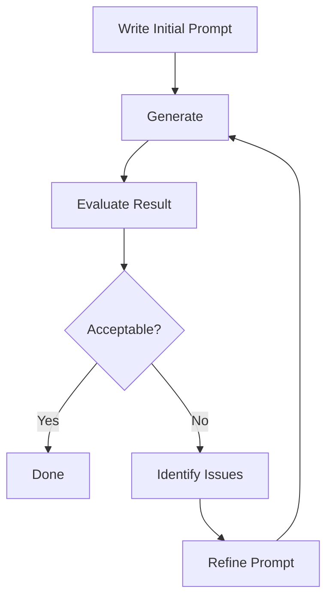

# Prompt Iteration

Systematic refinement for perfect results.

## 🔄 The Iteration Philosophy

**Iteration is not failure** - it's the professional process.

```
❌ Wrong thinking: "It should work first try"
✅ Right thinking: "I'll refine until perfect"
```

**Even professionals iterate** - this is how quality is achieved.

---

## 📊 Iteration Process

### Standard Iteration Cycle



**Expected iterations:**
- Simple items: 1-3 iterations
- Complex items: 3-5 iterations
- GUIs: 5-10 iterations

---

## 🎯 Systematic Refinement

### Step 1: Start Simple

**First prompt - basic:**

```txt
"sword"
```

**Evaluate:**
- ✓ Correct item type?
- ✗ Material not specified
- ✗ No color
- ✗ No details

### Step 2: Add Material

**Second prompt:**

```txt
"diamond sword"
```

**Evaluate:**
- ✓ Correct material
- ✗ Generic diamond appearance
- ✗ No custom colors
- ✗ Plain design

### Step 3: Add Color

**Third prompt:**

```txt
"blue diamond sword"
```

**Evaluate:**
- ✓ Correct colors
- ✗ Handle also blue (unintended)
- ✗ No decorations

### Step 4: Specify Parts

**Fourth prompt:**

```txt
"blue diamond sword with golden handle"
```

**Evaluate:**
- ✓ Colors correct on right parts
- ✓ Good quality
- ⚠️ Could add more detail if desired

### Step 5: Add Details (Optional)

**Fifth prompt:**

```txt
"enchanted blue diamond sword with ornate golden handle and purple gems"
```

**Evaluate:**
- ✓ Perfect! All elements present
- ✓ High quality
- ✓ Matches vision

**Stop here** - achieved goal.

---

## 🔬 Analytical Iteration

### Problem Identification

**After each generation, ask:**

| Question | If Yes | If No |
|----------|--------|-------|
| Correct item type? | Continue | Fix subject |
| Correct materials? | Continue | Add material words |
| Correct colors? | Continue | Specify colors |
| Correct style? | Continue | Add style keywords |
| Correct details? | Continue | Add detail descriptions |
| Acceptable quality? | Done! | Try better model |

### Targeted Fixes

**Problem:** Wrong colors

**Fix:**
```txt
Original: "diamond sword"
Fixed: "blue diamond sword with golden handle"
```

**Problem:** Missing decorations

**Fix:**
```txt
Original: "blue diamond sword"
Fixed: "blue diamond sword with ruby gems"
```

**Problem:** Wrong style

**Fix:**
```txt
Original: "sword"
Fixed: "medieval iron sword"
```

---

## 🎨 Iteration Strategies

### Strategy 1: Additive Iteration

**Keep adding details:**

```txt
v1: "sword"
v2: "diamond sword"
v3: "blue diamond sword"
v4: "blue diamond sword with golden handle"
v5: "blue diamond sword with golden handle and gems"
```

**Each version builds on previous.**

### Strategy 2: Substitution Iteration

**Replace elements:**

```txt
v1: "blue diamond sword"
v2: "red ruby sword" (changed material + color)
v3: "green emerald sword" (changed again)
```

**Test different options.**

### Strategy 3: Refinement Iteration

**Polish existing:**

```txt
v1: "blue diamond sword"
v2: "bright blue diamond sword" (refined color)
v3: "bright blue polished diamond sword" (refined finish)
```

**Incremental improvement.**

### Strategy 4: A/B Testing

**Test variations:**

```txt
Test A: "blue diamond sword with golden handle"
Test B: "blue diamond sword with silver handle"

Compare results, choose better one
```

---

## 📈 Tracking Iteration Progress

### Documentation Method

**Keep notes:**

```markdown
## Diamond Sword Project

### Iteration 1
Prompt: "sword"
Result: Generic brown sword
Issue: Too vague
Next: Add material

### Iteration 2
Prompt: "diamond sword"
Result: Gray diamond sword
Issue: Need color
Next: Specify blue

### Iteration 3
Prompt: "blue diamond sword"
Result: Good! But handle also blue
Issue: Handle color
Next: Specify golden handle

### Iteration 4
Prompt: "blue diamond sword with golden handle"
Result: Perfect! ✓
Status: DONE
```

**Track what works** for future reference.

---

## 🔧 Advanced Iteration Techniques

### Bracket Testing

**Test different options systematically:**

```txt
[Color options]: blue, red, purple, green
[Material options]: diamond, crystal, iron, obsidian
[Handle options]: golden, silver, wooden

Test combinations:
1. "blue diamond sword with golden handle"
2. "red crystal sword with silver handle"
3. "purple obsidian sword with wooden handle"

Pick best
```

### Parameter Iteration

**Not just prompt - iterate parameters too:**

```txt
Attempt 1: Text Accuracy 7, Creativity 50
Result: Too plain

Attempt 2: Text Accuracy 5, Creativity 70
Result: Better detail!

Attempt 3: Text Accuracy 5, Creativity 70, Different model
Result: Perfect! ✓
```

**Iterate on multiple dimensions.**

### Style Selector Iteration

**For GUIs and complex items:**

```txt
Iteration 1: No Style Selector
Result: Wrong layout

Iteration 2: With Shape image, Shape Strength 5
Result: Better but too creative

Iteration 3: Shape Strength 8
Result: Perfect layout! ✓
```

---

## 🎯 Knowing When to Stop

### Diminishing Returns

```
Iteration 1 → 2: +40% quality
Iteration 2 → 3: +20% quality
Iteration 3 → 4: +10% quality
Iteration 4 → 5: +5% quality
Iteration 5+: +2% quality
```

**After 3-5 iterations**, improvements become minimal.

### "Good Enough" Threshold

**Ask yourself:**

```
Is it usable? ✓
Does it match vision closely? ✓
Would more iterations significantly improve it? ✗

If all yes → Stop iterating
```

**Perfection is the enemy** of progress.

### When Manual Editing is Better

**If after 5+ iterations:**
- Still not exactly right
- Need pixel-perfect precision
- Want specific detail placement

**Consider:**
- Use best AI result as base
- Manually edit in Photopea
- Touch up specific pixels

**Hybrid approach** often most efficient.

---

## 📊 Iteration Patterns

### Fast Iteration (Items)

```
Average iterations: 2-3
Time: 6-10 minutes total
Success rate: 90%+
```

**For:** Standard items, vanilla replacements

### Medium Iteration (Detailed Items)

```
Average iterations: 4-6
Time: 15-25 minutes total
Success rate: 95%+
```

**For:** Custom items, themed packs, detailed work

### Slow Iteration (GUIs)

```
Average iterations: 5-10+
Time: 30-60 minutes total
Success rate: 85%+ (with Style Selector)
```

**For:** Complex GUIs, exact specifications

---

## 🔧 Iteration Examples

### Example 1: Ruby Sword

**Iteration log:**

```txt
Try 1: "sword"
→ Brown generic sword
→ Issue: No material

Try 2: "ruby sword"
→ Slight red tint, not clear
→ Issue: Need explicit red color

Try 3: "red ruby sword"
→ Red blade, but no shine
→ Issue: Need sparkle/gem quality

Try 4: "red ruby gemstone sword with sparkle effect"
→ Perfect! ✓
→ Iterations: 4
→ Time: 8 minutes
```

### Example 2: Magical Staff

**Iteration log:**

```txt
Try 1: "staff"
→ Plain brown stick
→ Issue: Too simple

Try 2: "magical staff"
→ Slight glow, still plain
→ Issue: Need orb

Try 3: "magical staff with orb"
→ Has orb, but wrong color
→ Issue: Need purple specification

Try 4: "magical staff with purple orb"
→ Good, but plain wood
→ Issue: Want darker wood

Try 5: "magical staff with purple glowing orb and dark wood"
→ Excellent! ✓
→ Iterations: 5
→ Time: 12 minutes
```

---

## ✅ Iteration Best Practices

**Do:**
```
✅ Start simple, add complexity
✅ Change one thing at a time
✅ Document what works
✅ Know when to stop
✅ Try different models if stuck
```

**Don't:**
```
❌ Give up after first try
❌ Change everything at once
❌ Iterate forever (diminishing returns)
❌ Ignore successful elements
❌ Forget what worked
```

---

## 🎯 Iteration Shortcuts

### Use Previous Successes

**Keep successful prompt templates:**

```txt
Successful prompt:
"blue diamond sword with golden handle"

Template for next items:
"blue diamond [item] with golden [part]"

Examples:
"blue diamond pickaxe with golden handle"
"blue diamond axe with golden handle"
```

### Style Selector Reduces Iteration

**Instead of 5 iterations:**

```
Use Style Selector with reference
Often get good result in 1-2 tries
```

[See Style Selector guide →](../../features/style-selector/style-selector-overview)

---

## ✅ Iteration Mastery Checklist

Professional iteration:

- [ ] Start with simple baseline prompt
- [ ] Add one element per iteration
- [ ] Evaluate each result objectively
- [ ] Document successful prompts
- [ ] Know when to stop (3-5 iterations)
- [ ] Consider parameter changes, not just prompt
- [ ] Use Style Selector for complex items

:::success Iteration Mastered
[Learn to combine concepts →](combining-concepts)
:::
