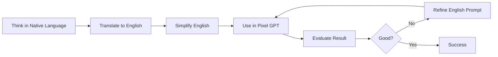

# Use English

Why English prompts are critical for quality.

## ⚠️ Critical Rule #1

**ALWAYS use English prompts.**

This is the **single most important** prompting rule.

:::danger Non-Negotiable
Using non-English prompts reduces quality by 50-70%. There is no workaround - you must use English.
:::

---

## 📊 Language Quality Comparison

### Test Results

Same prompt in different languages:

| Language | Prompt | Success Rate | Quality |
|----------|--------|--------------|---------|
| English | "diamond sword" | 95% | ⭐⭐⭐⭐⭐ |
| French | "épée en diamant" | 45% | ⭐⭐ |
| Spanish | "espada de diamante" | 40% | ⭐⭐ |
| German | "Diamantschwert" | 35% | ⭐⭐ |
| Korean | "다이아몬드 검" | 25% | ⭐ |
| Japanese | "ダイヤモンドの剣" | 25% | ⭐ |

[SCREENSHOT: Same prompt in different languages showing quality difference]

---

## 🧠 Why English Works Best

### Training Data

**AI was trained primarily on English text:**

```
Training data breakdown (approximate):
├── English: 80-90%
├── French/Spanish/German: 5-10%
├── Asian languages: 2-5%
└── Other languages: 1-3%
```

**More English data = better English understanding.**

### Concept Associations

**AI learned strongest connections in English:**

```
English "diamond sword"
└── Thousands of examples in training

French "épée en diamant"
└── Maybe dozens of examples in training
```

**Stronger associations = better results.**

---

## ❌ What Happens with Non-English

### Common Issues

**Non-English prompts often produce:**
```
❌ Generic/random results
❌ Wrong items entirely
❌ Ignored keywords
❌ Confused interpretations
❌ Poor quality
❌ Inconsistent results
```

### Example Failures

**French prompt:**
```txt
Prompt: "épée magique bleue"
Expected: Blue magical sword
Result: Random brown sword (ignored colors)
```

**Korean prompt:**
```txt
Prompt: "마법 지팡이"
Expected: Magic staff
Result: Generic stick or wrong item
```

[SCREENSHOT: Non-English prompt failures]

---

## ✅ Using English Successfully

### If English is Your Native Language

**Just write naturally:**
```txt
✅ "diamond sword with blue blade"
✅ "red apple with stem"
✅ "golden pickaxe with leather grip"
```

### If English is NOT Your Native Language

**Use translation tools:**

**Step 1:** Write in your language
```txt
French: "épée en diamant bleu avec poignée dorée"
```

**Step 2:** Translate to English (Google Translate, DeepL)
```txt
English: "blue diamond sword with golden handle"
```

**Step 3:** Simplify if needed
```txt
Simplified: "blue diamond sword golden handle"
```

**Step 4:** Use English version in Pixel GPT

**Recommended translators:**
- [Google Translate](https://translate.google.com)
- [DeepL](https://www.deepl.com/translator) (often better quality)

---

## 🎯 English Prompting Tips

### Keep It Simple

**Don't overcomplicate:**

```txt
❌ "I would like to have a very beautiful blue diamond sword please"
✅ "blue diamond sword"

❌ "Can you make me a nice red apple?"
✅ "red apple"

❌ "Please generate an iron pickaxe for my Minecraft server"
✅ "iron pickaxe"
```

**Direct descriptions only** - no pleasantries or requests.

### Use Common English Words

**Prefer simple over complex:**

```txt
✅ "blue" over "azure" (unless specific)
✅ "golden" over "aureate"
✅ "shiny" over "lustrous"
```

**Unless the complex word is necessary:**
```txt
✅ "crimson" (specific red shade)
✅ "obsidian" (specific material)
```

---

## 🌍 Multilingual User Workflow

### Recommended Process

**For non-English speakers:**



### Building English Vocabulary

**Learn key Minecraft terms in English:**

```
Weapons: sword, pickaxe, axe, bow, dagger, staff
Materials: diamond, iron, gold, wood, stone, crystal
Colors: red, blue, green, yellow, purple, orange
Effects: glowing, shiny, rusty, ancient, enchanted
```

**Create personal glossary:**
```
My Language → English
épée → sword
pioche → pickaxe
diamant → diamond
doré → golden
```

---

## 🚫 Common Non-English Mistakes

<details>
<summary>Using French</summary>

```txt
❌ "épée en diamant"
❌ "pioche en or"
❌ "pomme rouge"

✅ "diamond sword"
✅ "golden pickaxe"
✅ "red apple"
```

</details>

<details>
<summary>Using Spanish</summary>

```txt
❌ "espada de diamante"
❌ "pico de oro"
❌ "manzana roja"

✅ "diamond sword"
✅ "golden pickaxe"
✅ "red apple"
```

</details>

<details>
<summary>Using Korean</summary>

```txt
❌ "다이아몬드 검"
❌ "황금 곡괭이"
❌ "빨간 사과"

✅ "diamond sword"
✅ "golden pickaxe"
✅ "red apple"
```

</details>

<details>
<summary>Using Japanese</summary>

```txt
❌ "ダイヤモンドの剣"
❌ "金のつるはし"
❌ "赤いリンゴ"

✅ "diamond sword"
✅ "golden pickaxe"
✅ "red apple"
```

</details>

---

## 📈 Quality Improvement Chart

```
Using native language:
Quality: ⭐⭐ (40%)
↓ Translate to English
Quality: ⭐⭐⭐⭐⭐ (95%)

Difference: +55% quality improvement
```

**Using English is not optional** - it's essential for quality.

---

## 🎓 English Learning Resources

### For Prompting

**You don't need perfect English** - just know key words:

**Essential vocabulary:**
```
Items: sword, pickaxe, helmet, shield, staff
Materials: diamond, iron, gold, wood, stone, crystal, metal
Colors: red, blue, green, yellow, purple, orange, black, white
Descriptors: glowing, shiny, dark, bright, ornate, simple
```

**50 words** covers 90% of prompting needs.

### Translation Tips

**For complex descriptions:**
1. Write detailed description in native language
2. Translate with DeepL (better than Google for nuance)
3. Simplify translated English
4. Remove unnecessary words
5. Use result in Pixel GPT

**Example:**
```
Korean: "보라색 크리스탈로 만든 마법의 지팡이와 황금색 장식"
Google Translate: "A magic staff made of purple crystal and golden decorations"
Simplified: "purple crystal staff with golden decorations"
Use: "purple crystal staff with golden decorations" ✓
```

---

## ✅ English Usage Checklist

Before submitting prompt:

- [ ] Prompt is entirely in English (no mixed languages)
- [ ] Used simple, common English words
- [ ] Translated correctly (if from another language)
- [ ] Removed unnecessary filler words
- [ ] Double-checked spelling

:::success English Mastered
Using English unlocks full AI potential.

[Learn to be specific →](be-specific)
:::
