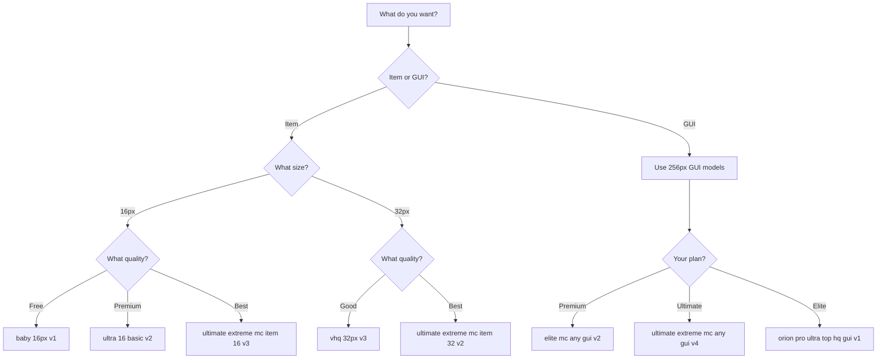

# Which Model to Use

Quick model selection guide.

## 🎯 By Goal

### I Want to Create...

<details>
<summary>**A 16×16 Minecraft Item**</summary>

| Quality Level | Model | Location |
|---------------|-------|----------|
| Free/Test | `baby 16px v1` | Newbie → 16px item |
| Good | `ultra 16 basic v2` | Newbie Premium → Ultimate 16px |
| Best | `ultimate extreme mc item 16 v3` | Expert → Ultimate → 16px |
| Fastest | `ultra 16 speed` | Newbie Premium → Speed models |

</details>

<details>
<summary>**A 32×32 Item/Block**</summary>

| Quality Level | Model | Location |
|---------------|-------|----------|
| Good | `vhq 32px v3` | Standard → 32px |
| Best | `ultimate extreme mc item 32 v2` | Expert → Ultimate → 32px |
| Block only | `ultimate extreme mc block 32 v1` | Expert → Ultimate → 32px |

</details>

<details>
<summary>**A Minecraft GUI**</summary>

| Quality Level | Model | Location |
|---------------|-------|----------|
| Good | `elite mc any gui v2` | Expert → Elite → 256px |
| Better | `ultimate extreme mc any gui v4` | Expert → Ultimate → 256px |
| Best (2025) | `orion pro ultra top hq gui v1` | Expert → Orion → GUI Interface |

[Complete GUI model guide →](../models/recommended-models/best-for-guis)

</details>

<details>
<summary>**An Armor Set**</summary>

| Type | Model | Location |
|------|-------|----------|
| Single piece | `ultimate extreme mc item 32 v2` | Expert → Ultimate → 32px |
| Full set | `elite mc armor pack 32 v1` | Expert → Elite → 256px |
| With items | Use **Presets** tab → Items to Armor Set | Presets |

</details>

<details>
<summary>**A Logo or Icon**</summary>

| Size | Model | Location |
|------|-------|----------|
| 16px | `icon 16px speed v1` | Standard → 16px |
| 32px | `icon 32px speed v1` | Standard → 32px |
| 128px | `orion badge top hq v1` | Expert → Orion → 128px |

</details>

<details>
<summary>**A 3D Render**</summary>

| Style | Model | Location |
|-------|-------|----------|
| Minecraft scene | `ultimate extreme mc render v1` | Expert → Ultimate → 3D Render |
| Item render | `pro mc render v2` | Expert → Pro → 3D Render |
| Best quality | `elite mc render boosted v1` | Expert → Elite → 3D Render |

</details>

## 💰 By Plan

### Free Users

**You can use:**
- All **Newbie** (Baby) models
- Limited generations per day

**Best free models:**
- Items: `baby 16px v1`
- Blocks: `baby 32px v2`
- Pixel art: `baby pixel art v1`

### Premium Users ($39.99+)

**You can use:**
- All **Standard** models
- All **Pro** models
- Faster generation
- More daily generations

**Recommended:**
- Items: `ultra 16 basic v2`
- Blocks: `vhq 32px v3`
- GUIs: `elite mc any gui v2`

### Ultimate Users ($49.99+)

**You can use:**
- All **Ultimate** models
- All previous tiers
- Even faster generation

**Recommended:**
- Items: `ultimate extreme mc item 16 v3`
- GUIs: `ultimate extreme mc any gui v4`
- Renders: `ultimate extreme mc render v1`

### Elite Users ($99.99+)

**You can use:**
- All **Elite** models
- All **Orion** models (limited)
- Fastest generation
- Highest quality

**Recommended:**
- Items: `mega mc item 16 top hq v1`
- GUIs: `orion pro ultra top hq gui v1`
- Armor: `elite mc armor pack 32 hq boosted v1`

## ⚡ By Speed

| Speed | Quality | Models |
|-------|---------|--------|
| Fastest | ⭐⭐⭐ | `ultra 16 super speed`, `icon 16px speed` |
| Fast | ⭐⭐⭐⭐ | `ultra 16 speed`, `baby 16px v1` |
| Medium | ⭐⭐⭐⭐⭐ | `ultra 16 basic v2`, `vhq 32px v3` |
| Slow | ⭐⭐⭐⭐⭐ | `ultimate extreme` models, `orion` models |

## 🎨 By Style

### Vanilla Minecraft Style
```
ultimate extreme mc item 16 v3
ultimate extreme mc block 16 v1
```

### RPG/Fantasy Style
```
ultimate extreme mc rpg item 16 v1
ultimate extreme mc rpg2 item 16 v1
```

### Creative/Cartoon Style
```
ultimate extreme mc creative item 16 v1
ultimate extreme item hq and pixe art 16 v1
```

## 🔍 Model Comparison

### 16px Items

| Model | Speed | Quality | Creativity | Best For |
|-------|-------|---------|-----------|----------|
| `baby 16px v1` | ⚡⚡⚡ | ⭐⭐⭐ | Low | Testing |
| `ultra 16 basic v2` | ⚡⚡ | ⭐⭐⭐⭐ | Medium | General use |
| `ultimate extreme mc item 16 v3` | ⚡ | ⭐⭐⭐⭐⭐ | High | Best quality |
| `orion pro 16px v2` | ⚡ | ⭐⭐⭐⭐⭐ | Very High | 2025 quality |

### GUI Models

| Model | Accuracy | Quality | Speed | Difficulty |
|-------|----------|---------|-------|-----------|
| `elite mc any gui v2` | ⭐⭐⭐⭐ | ⭐⭐⭐⭐ | ⚡⚡ | Medium |
| `ultimate extreme mc any gui v4` | ⭐⭐⭐⭐⭐ | ⭐⭐⭐⭐⭐ | ⚡ | Medium |
| `orion pro ultra top hq gui v1` | ⭐⭐⭐⭐⭐ | ⭐⭐⭐⭐⭐ | ⚡ | Hard |

## 🤔 Decision Tree



## ⚡ Quick Recommendations

**New user?** Start with:
```
Newbie → "Text to Minecraft Item Texture 16 by 16 pixels"
```

**Premium user?** Use:
```
Newbie Premium → "Ultimate Premium 16px models"
```

**Making a GUI?** Use:
```
Expert → Ultimate → 256px → "ultimate extreme mc any gui v4"
```

**Want best quality?** Use:
```
Expert → Orion → "orion pro 16px v2"
```

:::tip Still Unsure?
See [complete model list →](../models/complete-model-list) or ask in [Discord](https://discord.gg/pixelgpt)
:::
