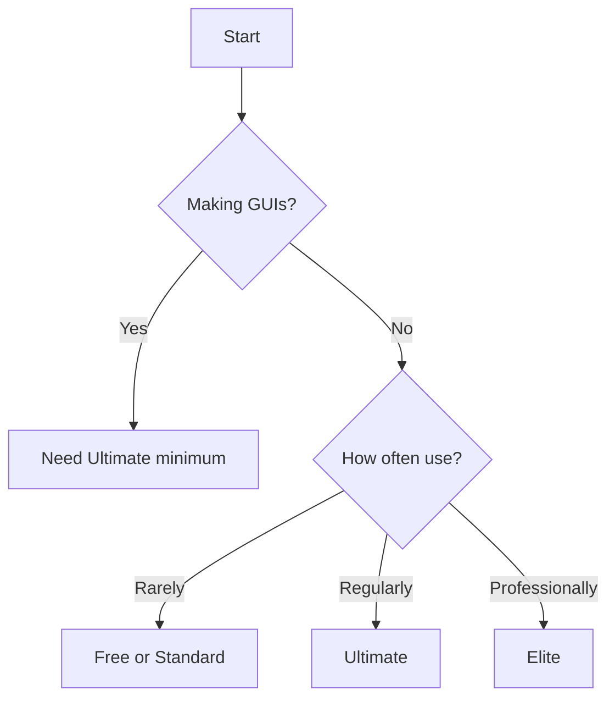

# Pricing Table

Complete plan comparison reference.

## 💰 All Plans

| Feature | Free | Standard | Pro | Ultimate | Elite |
|---------|------|----------|-----|----------|-------|
| **Price/year** | $0 | $39.99 | $39.99 | $49.99 | $99.99 |
| **Generations** | 128 total | ∞ | ∞ | ∞ | ∞ |
| **Queue size** | 1 | 3 | 3 | 5 | 8 |
| **Priority** | Lowest | Medium | Medium | High | Highest |
| **Baby models** | ✅ | ✅ | ✅ | ✅ | ✅ |
| **Standard models** | ❌ | ✅ | ✅ | ✅ | ✅ |
| **Pro models** | ❌ | ❌ | ✅ | ✅ | ✅ |
| **Ultimate models** | ❌ | ❌ | ❌ | ✅ | ✅ |
| **Elite models** | ❌ | ❌ | ❌ | ❌ | ✅ |
| **Orion models** | ❌ | ❌ | ❌ | 4-8/day | 256/day |
| **Batch quota/day** | 0 | 5-10 | 5-10 | 20-30 | 50+ |
| **Image privacy** | Public | Private | Private | Private | Private |
| **Style Selector** | ❌ | ✅ | ✅ | ✅ | ✅ |
| **Best for** | Testing | Hobbyists | Quality focus | Professionals | Studios |

---

## 🎯 Plan Recommendations

### By Use Case

```
Learning/Testing → Free
Personal projects → Standard/Pro ($39.99)
Texture packs → Ultimate ($49.99)
Server GUIs → Ultimate ($49.99)
Commercial work → Elite ($99.99)
Maximum quality → Elite ($99.99)
```

### By Budget

```
No budget → Free (128 generations total)
$3-4/month → Standard/Pro ($39.99/year)
$4-5/month → Ultimate ($49.99/year)
$8-9/month → Elite ($99.99/year)
```

---

## 💎 Feature Breakdown

### Unlimited Generations

**All premium plans:** Truly unlimited daily generations

**Except:**
- Orion models (daily quota)
- Batch jobs (daily quota)
- Regular generations: No limit

### Queue and Priority

**Queue size:**
```
How many simultaneous generations
Free: 1 (one at a time)
Elite: 8 (eight at once)
```

**Priority:**
```
How fast your request is picked up
Free: Last
Elite: First
```

---

## ✅ Quick Plan Decision



:::success Pricing Reference Complete
[See complete specifications →](../specifications/)
:::
