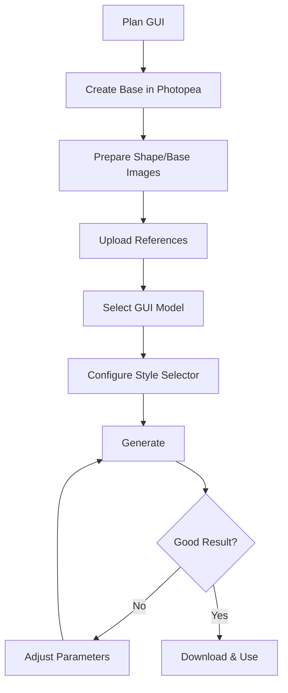

# Complete GUI Guide

Comprehensive tutorial for creating Minecraft GUIs.

:::warning Advanced Tutorial
**Difficulty:** ⭐⭐⭐⭐⭐ Hard  
**Time:** 2-3 hours first time  
**Prerequisites:** Premium subscription, Photopea knowledge, Style Selector understanding

**This is the most complex Pixel GPT feature.**
:::

## 🎯 What You'll Create

**A custom Minecraft shop GUI** with:
- 4×4 item grid for shop items
- Navigation buttons (← Home →)
- Player inventory at bottom
- Themed decorations (medieval, fantasy, etc.)
- Proper slot alignment
- Professional appearance

[SCREENSHOT: Example completed GUI]

**Final output:** 256×256 PNG ready for server use.

---

## 📋 Prerequisites Checklist

**Before starting:**

- [ ] Premium subscription ($49.99+ for best models)
- [ ] Completed [Your First Item](../minecraft-items/your-first-item) tutorial
- [ ] Understand [Style Selector basics](../../features/style-selector/style-selector-overview)
- [ ] Can use [Photopea](https://photopea.com) for basic image editing
- [ ] Understand [what is a GUI](../../fundamentals/minecraft-textures/gui-textures)
- [ ] 2-3 hours available (first time)
- [ ] Patience for iteration (expect 5-10 tries)

**Missing any?** Complete prerequisites first.

---

## 🗺️ Tutorial Overview



**8 main parts, 30+ steps total.**

---

## 🎨 Part 1: Planning Your GUI

### Step 1: Define GUI Purpose

**What kind of GUI?**

```
Shop/Merchant → Item display grid
Chest → Storage slots
Custom menu → Buttons and info
Quest GUI → Text and buttons
```

**For this tutorial:** Shop GUI

### Step 2: Sketch Layout

**On paper or digitally, sketch:**

```
┌─────────────────────────┐
│  Shop Items Display     │ ← 4×4 grid of items
│  □ □ □ □               │
│  □ □ □ □               │
│  □ □ □ □               │
│  □ □ □ □               │
│                         │
│  ← [Home] →            │ ← Navigation
│                         │
│  Player Inventory       │ ← 9×3 standard slots
│  □□□□□□□□□           │
└─────────────────────────┘
```

[SCREENSHOT: Hand-drawn or digital sketch]

### Step 3: Choose Theme

**Visual theme:**

```
Medieval: Stone, wood, iron decorations
Fantasy: Magical, glowing, mystical
Modern: Clean, tech, holographic
Nature: Wood, leaves, organic
```

**For this tutorial:** Medieval shop (wooden frame, stone background)

### Step 4: Define Colors

**Color scheme:**

```
Background: Warm brown/tan (wood theme)
Panels: Stone gray
Accents: Iron gray, dark brown
Highlights: Light tan, white
```

**Document your palette** - use consistently.

---

## 🖼️ Part 2: Creating Base Image (Photopea)

### Step 5: Open Photopea

**Go to:** [https://photopea.com](https://photopea.com)

**Free online image editor** - no download needed.

[SCREENSHOT: Photopea homepage]

### Step 6: Create New Project

**File → New**

**Settings:**

```
Width: 256 pixels
Height: 256 pixels
Resolution: 72 dpi (default OK)
Background: White
```

**Click "Create"**

[SCREENSHOT: New project dialog with 256×256]

**Blank 256×256 canvas appears.**

### Step 7: Draw GUI Layout

**Using Rectangle Tool (U):**

**Top panel (shop items):**
```
Draw rectangle from top
Height: ~120 pixels
Full width
Fill: Light brown color (#A0876C)
```

**Navigation area:**
```
Below shop panel
Height: ~30 pixels
Three buttons: ← Home →
Fill: Darker brown (#8B6F47)
```

**Bottom panel (inventory):**
```
Bottom area
Height: ~70 pixels
For player inventory slots
Fill: Medium brown (#9D7F5C)
```

[SCREENSHOT: Basic panels drawn]

:::tip Don't Worry About Perfection
This is just a base. AI will improve it. Focus on **slot positions** and **overall layout**, not artistic quality.
:::

### Step 8: Mark Slot Positions

**Using Rectangle Tool:**

**4×4 shop grid:**
```
Draw small rectangles (18×18 pixels)
4 across, 4 down
Spacing: 2-4 pixels between
Fill: Slightly darker color
```

[SCREENSHOT: Slots marked in grid]

**Bottom inventory (optional):**
```
9 across, 3 down
Standard inventory layout
```

**Slots define structure** - AI will follow these positions.

### Step 9: Add Simple Decorations (Optional)

**Draw basic shapes:**

```
Corners: Small rectangles/squares (decorative corners)
Borders: Lines around panels
Frame: Outline around entire GUI
```

**Keep it SIMPLE** - AI adds detail.

[SCREENSHOT: Basic GUI with simple decorations]

**Your base should look simple/rough** - that's OK!

### Step 10: Export Base (Clean Version)

**File → Export As → PNG**

**Name:** `gui_shop_base_clean.png`

**Save to computer.**

[SCREENSHOT: Export dialog]

---

## 🌫️ Part 3: Adding Noise

### Step 11: Add Gaussian Noise

**Still in Photopea:**

**Filter → Noise → Add Noise**

**Settings:**

```
Amount: 20%
Distribution: Gaussian
Monochrome: ✓ Checked
```

[SCREENSHOT: Add Noise dialog]

**Click OK**

**Image now has grainy texture.**

[SCREENSHOT: Image with noise added]

### Step 12: Export Noise Version

**File → Export As → PNG**

**Name:** `gui_shop_base_noise.png`

**Save to computer.**

**Now you have 2 files:**
```
gui_shop_base_clean.png (no noise)
gui_shop_base_noise.png (with noise)
```

**Both essential for GUI generation.**

---

## 📤 Part 4: Uploading References

### Step 13: Access Reference Images

**Account → My Reference Images**

[SCREENSHOT: My Reference Images page]

### Step 14: Upload Both Files

**Drag and drop:**

```
gui_shop_base_clean.png
gui_shop_base_noise.png
```

**Or click to browse.**

**Wait for upload** - both appear in gallery.

[SCREENSHOT: Both images uploaded]

---

## 🤖 Part 5: Model Selection

### Step 15: Choose GUI Model

**Home → Expert → Ultimate → Pixel Art → 256px**

**Scroll through GUI models:**

**Recommended models:**

| Model | Best For | Plan Required |
|-------|----------|---------------|
| `ultimate extreme mc any gui v4` | First GUI, learning | Ultimate ($49.99) |
| `elite mc any gui hq boosted v3` | Higher quality | Elite ($99.99) |
| `orion pro ultra top hq gui v1` | Best quality (2025) | Elite ($99.99) |

**For this tutorial:** `ultimate extreme mc any gui v4`

[SCREENSHOT: GUI model selection in Expert tab]

**Click model card** to open parameters.

### Step 16: Select Model

**Click green button:**

```
┌─────────────────────────────┐
│  SELECT THIS AI MODEL       │
└─────────────────────────────┘
```

**Critical:** Don't forget this step!

---

## ⚙️ Part 6: Style Selector Configuration

### Step 17: Open Style Selector

**Click green button:**

```
┌─────────────────────────────┐
│  Select Image References    │
└─────────────────────────────┘
```

**Style Selector popup opens.**

[SCREENSHOT: Style Selector interface]

**Shows your uploaded references.**

### Step 18: Select Base Image

**Find:** `gui_shop_base_noise.png`

**Click radio button:** **[B] Base**

[SCREENSHOT: Base image selected]

**This guides colors and style.**

### Step 19: Select Shape Image

**Find:** `gui_shop_base_clean.png`

**Click radio button:** **[SH] Shape**

[SCREENSHOT: Shape image selected]

**This guides layout and slot positions.**

### Step 20: Configure Parameters

**Set these values:**

```yaml
Image Strength: 0-1
  Recommendation: 0 (maximum creativity with colors)
  
Shape Strength: 7-8
  Recommendation: 7 (follows layout closely)
  
Shape Affected By Small/Transparent details: 8-10
  Recommendation: 9 (captures slot positions)
  
Shape Affects percent of Generation: 7-8
  Recommendation: 7 (70% structure, 30% creativity)
  
Overall Style Strength: 10 (leave default)

Force Flat Slot (v4 only): 5-7
  Recommendation: 6 (flatter slot backgrounds)

Use Color Style: Off (leave default)
Blur Mask: 0 (leave default)
```

[SCREENSHOT: Parameters configured]

:::info These Are Starting Settings
You'll likely need to adjust these. These settings are good baseline for first try.
:::

### Step 21: Apply Selections

**Critical:** Click button at bottom of Style Selector:

```
┌─────────────────────────────┐
│  Apply Selections           │
└─────────────────────────────┘
```

**Popup closes** - settings saved.

---

## ✍️ Part 7: Prompting and Generating

### Step 22: Write GUI Prompt

**In main text box (green):**

```txt
beautiful minecraft shop gui with wooden frame and 4x4 item grid with medieval decorations
```

**Prompt components:**

```
"beautiful minecraft shop gui" → Type and aesthetic
"wooden frame" → Theme element
"4x4 item grid" → Layout specification
"medieval decorations" → Style detail
```

[SCREENSHOT: Prompt entered]

### Step 23: Generate

**Click bottom button:**

```
┌─────────────────────────────┐
│  GENERATE IMAGE             │
└─────────────────────────────┘
```

**Generation starts.**

**Wait time:** 2-4 minutes (GUIs are slower)

---

## 🔄 Part 8: Iteration and Refinement

### Step 24: Evaluate First Result

**When generation completes:**

**Check generation in sidebar:**

[SCREENSHOT: Generated GUI result]

**Evaluate:**

```
✓ Layout matches your base? (4×4 grid, panels)
✓ Colors match theme? (medieval, wooden)
✓ Slots aligned properly?
✓ Quality acceptable?
✓ Theme consistent?
```

**Likely issues on first try:**
```
⚠️ Slots slightly off
⚠️ Colors not perfect
⚠️ Some elements unexpected
⚠️ Not quite matching vision
```

**This is NORMAL.** GUI generation requires iteration.

### Step 25: Identify Issues

**Common first-try problems:**

<details>
<summary>Slots not aligned / Wrong positions</summary>

**Fix:**
```
Increase Shape Strength: 7 → 8-9
Increase Shape Generation %: 7 → 8-9
Increase Shape Details: 9 → 10
```

**Or:**
```
Redraw base image with clearer slot positions
Make slots larger/more obvious in base
```

</details>

<details>
<summary>Colors wrong / Not matching theme</summary>

**Fix:**
```
Change base image colors in Photopea
Use different colored base
Increase Image Strength: 0 → 1-2
```

</details>

<details>
<summary>Too similar to base (flat/boring)</summary>

**Fix:**
```
Add MORE noise: 20% → 30-40%
Lower Shape Strength: 8 → 6-7
Lower Image Strength: 1 → 0
```

</details>

<details>
<summary>Too different from base (wrong layout)</summary>

**Fix:**
```
Increase Shape Strength: 6 → 8-9
Increase Shape Generation %: 6 → 8
Reduce noise: 40% → 20%
```

</details>

<details>
<summary>Theme doesn't match prompt</summary>

**Fix:**
```
More specific prompt: Add more theme keywords
Change base image to better match theme
Try different model version
```

</details>

### Step 26: Adjust and Regenerate

**Based on issues identified:**

**Adjust parameters** in Style Selector.

**Adjust prompt** if needed.

**Click "Apply Selections"** if changed Style Selector.

**Generate again.**

**Repeat until satisfied** - typically 5-10 iterations.

---

## 🎨 Example Iterations

### Iteration Log Example

**Iteration 1:**
```
Settings: Shape Strength 7, Shape % 7, Image Strength 0
Result: Layout mostly right, slots slightly off
Issue: Need more precise slots
```

**Iteration 2:**
```
Settings: Shape Strength 8, Shape % 8, Shape Details 10
Result: Slots better aligned!
Issue: Colors too dull
```

**Iteration 3:**
```
Settings: Same as iteration 2
Changed: Base image to brighter colors
Result: Good colors, good slots!
Issue: Top decoration wrong
```

**Iteration 4:**
```
Settings: Same
Changed: Prompt to "with wooden top awning"
Result: Perfect! ✓
```

**4 iterations to success** - realistic for GUIs.

---

## 💾 Part 9: Downloading GUI

### Step 27: Download Final GUI

**Once satisfied with generation:**

**Click image in sidebar**

**Click "Download" button**

**Or open Grid Editor:**
- Don't need to set pixel size/grid for GUIs
- Just download full 256×256 image

**Verify downloaded file:**
```
✅ PNG format
✅ 256×256 pixels
✅ Looks good when opened
```

### Step 28: Post-Processing (Optional)

**If minor issues:**

```
Open in Photopea/image editor
Manually adjust:
- Slot positions (move slightly)
- Colors (adjust specific areas)
- Remove unwanted elements
Export final version
```

**Most GUIs don't need post-processing** if parameters right.

---

## 🎮 Part 10: Using in Minecraft

### For Vanilla Chest Replacement

**Resize to vanilla dimensions:**

```
Vanilla chest GUI: 176×166 pixels
Your GUI: 256×256 pixels

Resize in image editor to 176×166
Or use as custom GUI (next section)
```

### For Custom Server GUI

**Plugin integration** (e.g., DeluxeMenus):

**1. Place GUI PNG in plugin folder**

**2. Configure in plugin YAML:**

```yaml
menu_title: "Shop"
size: 54
gui_texture: "gui_shop_medieval.png"
```

**3. Reload plugin**

**4. Test in-game**

**GUI appears** when opening menu!

[SCREENSHOT: Custom GUI in-game]

---

## 🎯 Advanced GUI Techniques

### Multiple GUI Styles

**Use different base images:**

```
Medieval shop: Brown wood base
Futuristic shop: Blue tech base
Fantasy shop: Purple magical base
```

**Generate multiple themes** from same layout.

### Slot Configuration

**Different slot arrangements:**

```
Base 1: 3×3 grid (9 items)
Base 2: 4×4 grid (16 items)
Base 3: 5×5 grid (25 items)
Base 4: Custom arrangement
```

**Create base for each layout.**

### Preset GUI Templates (v4+)

**Some models have preset templates:**

```
Preset GUI dropdown:
- Generic 54 (chest layout)
- Double chest
- Custom
```

**Select preset** for automatic slot layout.

---

## 📊 GUI Model Comparison

### Which Model to Use?

**For beginners:**
```
ultimate extreme mc any gui v4
- Good balance
- Well-documented
- Reliable
- Force Flat Slot feature
```

**For best quality (if Elite plan):**
```
orion pro ultra top hq gui v1
- 2025 best quality
- Superior slot accuracy
- Maximum detail
```

**For faster iterations:**
```
elite mc any gui v2
- Faster than v4
- Still good quality
- Easier parameter tuning
```

---

## 🔧 Complete Troubleshooting

<details>
<summary>Slots are in completely wrong positions</summary>

**Solutions:**
1. **Increase Shape Strength to 9**
2. **Increase Shape Generation % to 9**
3. **Redraw base with VERY clear slot positions** (larger, more obvious)
4. **Remove decorations from base** (keep only slots and panels)
5. **Use Preset GUI template** if available

**Often:** Base image slots not clear enough.

</details>

<details>
<summary>GUI too similar to base (exact copy)</summary>

**Solutions:**
1. **Add more noise** (40-50%)
2. **Lower Shape Strength** (8 → 6)
3. **Lower Image Strength** (1 → 0)
4. **Different model version** (try v5, v7)

</details>

<details>
<summary>GUI completely random/wrong</summary>

**Solutions:**
1. **Verify Shape image selected as [SH]** (not [B])
2. **Verify clicked "Apply Selections"**
3. **Increase all Shape parameters** (Strength, %, Details all to 8-9)
4. **Redraw base more clearly**
5. **Try different model**

</details>

<details>
<summary>Colors don't match theme</summary>

**Solutions:**
1. **Change base image colors** in Photopea
2. **Increase Image Strength** (0 → 2)
3. **More specific color prompt** ("warm brown wooden theme")
4. **Different base image** with better colors

</details>

<details>
<summary>Theme inconsistent (medieval + futuristic mix)</summary>

**Solutions:**
1. **More specific prompt** ("medieval only, no tech elements")
2. **Themed base image** (make base look medieval)
3. **Reinforce style** in prompt multiple times

</details>

<details>
<summary>After 10 tries, still not working</summary>

**Options:**
1. **Post in Discord** with your base images - community can help
2. **Try completely different base** (restart from scratch)
3. **Use different model** (try Elite/Orion if available)
4. **Simplify requirements** (maybe your layout too complex)
5. **Manual editing** (use AI result as base, edit manually)

</details>

---

## 💡 GUI Generation Tips

:::tip Tip #1: Start Simple
First GUI: Simple layout, 2×2 or 3×3 grid. Complexity later.
:::

:::tip Tip #2: Clear Slot Positions
Make slots OBVIOUS in base image. Large, high contrast, clear spacing.
:::

:::tip Tip #3: Consistent Theme Base
If base has medieval colors/style, prompt should also be medieval. Match base and prompt themes.
:::

:::tip Tip #4: Noise is Your Friend
More noise = more AI creativity. Start with 20%, go up to 40% if too similar to base.
:::

:::tip Tip #5: Iteration is Normal
Professional GUI creators iterate 5-10+ times. Don't give up after 2-3 tries.
:::

:::tip Tip #6: Save Working Settings
When you get good result, save parameters as preset. Reuse for future GUIs.
:::

:::tip Tip #7: Document Everything
Take notes: What settings worked? What base colors? What prompt? Use for next GUI.
:::

---

## 📊 Expected Results Timeline

### First GUI (This Tutorial)

```
Preparation: 30-45 minutes (learning Photopea, creating base)
Generation: 1-2 hours (5-10 iterations at 5-10 min each)
Post-processing: 15 minutes
Total: 2-3 hours
```

### Second GUI (After Learning)

```
Preparation: 15 minutes (faster with experience)
Generation: 30-45 minutes (3-5 iterations)
Post-processing: 10 minutes
Total: 1 hour
```

### Tenth GUI (Experienced)

```
Preparation: 10 minutes
Generation: 20-30 minutes (1-3 iterations)
Post-processing: 5 minutes
Total: 30-45 minutes
```

**Gets faster with practice.**

---

## ✅ GUI Tutorial Completion Checklist

You've mastered GUI creation if you:

- [x] Created base/shape images in Photopea
- [x] Added noise properly
- [x] Uploaded references
- [x] Selected GUI model
- [x] Configured Style Selector correctly
- [x] Wrote effective GUI prompt
- [x] Iterated to good result (5-10 tries)
- [x] Downloaded final GUI
- [x] (Optional) Integrated into Minecraft

:::success First GUI Complete! 🎉
**This is the hardest Pixel GPT feature.** If you completed this, you can do anything on the platform.

**Next steps:**
- [Create more GUIs](gui-examples) with different themes
- [Troubleshooting guide](gui-troubleshooting) for future issues
- [Advanced GUI techniques](../../advanced/) for refinement
:::
