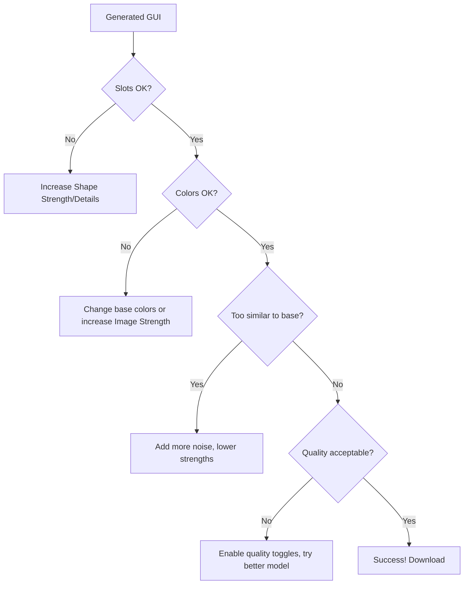

# GUI Troubleshooting

Comprehensive solutions for GUI generation issues.

## 🔧 Common GUI Problems

### Quick Diagnosis

| Problem | Most Likely Cause | Quick Fix |
|---------|------------------|-----------|
| Slots wrong position | Shape Strength too low | Increase to 8-9 |
| Too similar to base | Too little noise | Add 30-40% noise |
| Random layout | Shape image not selected | Select as [SH], increase strength |
| Wrong colors | Base image colors wrong | Change base colors |
| Flat/boring | High strengths, low creativity | Lower strengths to 6-7 |

---

## ❌ Slot Alignment Issues

<details>
<summary><strong>Slots in wrong positions entirely</strong></summary>

**Problem:** 4×4 grid appears as 3×3, or slots scattered randomly

**Diagnosis:**
```
Shape not being followed
Shape Strength too low
Shape image unclear
```

**Solutions (try in order):**

**1. Increase Shape parameters:**
```yaml
Shape Strength: Current → 9
Shape Generation %: Current → 9
Shape Affected By Details: Current → 10
```

**2. Verify Shape image:**
```
- Selected as [SH]? (not [B])
- Clicked "Apply Selections"?
- Shape image has clear slots?
```

**3. Redraw base with clearer slots:**
```
Make slots bigger (20×20 instead of 18×18)
Higher contrast (darker slots on lighter background)
Remove decorations (keep only slots)
```

**4. Try different model version:**
```
v4 → try v7
Elite v2 → try hq boosted v3
```

</details>

<details>
<summary><strong>Slots slightly misaligned</strong></summary>

**Problem:** Slots exist but 1-2 pixels off from correct 18-pixel grid

**Solutions:**

**1. Increase precision:**
```yaml
Shape Strength: 7 → 8
Shape Affected By Details: 8 → 10
Force Flat Slot: 5 → 7 (v4 models)
```

**2. Redraw base with pixel precision:**
```
Use Photopea grid (View → Grid)
Set grid to 18×18
Snap slots to grid perfectly
```

**3. Accept and manually adjust:**
```
Use AI result as base
Open in Photopea
Move slots 1-2 pixels manually
Export final version
```

</details>

<details>
<summary><strong>Wrong number of slots</strong></summary>

**Problem:** Asked for 4×4 (16 slots), got 3×3 (9 slots)

**Solutions:**

**1. Make slots more obvious in base:**
```
Draw all 16 slots clearly
Larger size (20×20)
High contrast
Label with numbers if needed
```

**2. More specific prompt:**
```
"gui with exactly 4x4 grid of 16 slots"
"gui with 4 slots across and 4 slots down"
```

**3. Use Preset GUI (if available):**
```
Some v4+ models have preset templates
Select "4×4 grid" preset
```

</details>

---

## 🎨 Color and Theme Issues

<details>
<summary><strong>Colors completely wrong</strong></summary>

**Problem:** Asked for brown wood, got blue tech

**Solutions:**

**1. Change base image colors:**
```
Open base in Photopea
Paint over with correct colors
Re-export
Re-upload
Regenerate
```

**2. Increase Image Strength:**
```
Current: 0
New: 2-3
```

**3. More specific color prompt:**
```
"warm brown wooden medieval shop gui"
Instead of: "shop gui"
```

</details>

<details>
<summary><strong>Colors too dull/flat</strong></summary>

**Problem:** GUI looks washed out, gray

**Solutions:**

**1. Use brighter base colors:**
```
Open base in Photopea
Adjust: Image → Adjustments → Hue/Saturation
Increase saturation: +20-30
```

**2. Add color variety to base:**
```
Not all gray - add browns, tans, accents
Mix colors in base
```

**3. Prompt for vibrancy:**
```
"colorful minecraft shop gui"
"vibrant medieval shop"
```

</details>

<details>
<summary><strong>Theme inconsistent (mix of styles)</strong></summary>

**Problem:** Medieval GUI has futuristic elements

**Solutions:**

**1. Reinforce theme in prompt:**
```
"medieval shop gui, traditional design only, no modern elements"
```

**2. Theme-appropriate base:**
```
Make base look medieval (browns, stone colors)
Not modern (no blues, no tech shapes)
```

**3. Add exclusions:**
```
"medieval wooden shop, no technology, no futuristic elements"
```

</details>

---

## 📐 Layout and Structure Issues

<details>
<summary><strong>Panels in wrong places</strong></summary>

**Problem:** Shop panel at bottom instead of top

**Solutions:**

**1. Increase Shape Strength:**
```
7 → 9 (forces layout more)
```

**2. Clearer base structure:**
```
More obvious panel separation
Higher contrast between panels
Thicker borders between sections
```

**3. Verify Shape image:**
```
Shape selected as [SH]?
Clean version (no noise)?
Layout clearly visible?
```

</details>

<details>
<summary><strong>Navigation buttons missing/wrong</strong></summary>

**Problem:** No ← Home → buttons, or in wrong spot

**Solutions:**

**1. Draw buttons in base image:**
```
Simple arrow shapes
Home icon (house shape)
Clear positioning
```

**2. Mention in prompt:**
```
"gui with navigation arrows at bottom"
"gui with left arrow, home button, and right arrow"
```

**3. Add buttons manually after:**
```
Generate GUI
Add buttons in image editor
Easier than forcing AI sometimes
```

</details>

---

## 🔄 Generation Quality Issues

<details>
<summary><strong>Result too similar to base (boring/flat)</strong></summary>

**Problem:** Generated GUI looks exactly like your simple base drawing

**Causes:**
```
Too little noise
Shape Strength too high
Shape Generation % too high
Not enough AI creativity
```

**Solutions:**

**1. Add more noise:**
```
30-40% instead of 20%
More variation for AI
```

**2. Lower constraints:**
```yaml
Shape Strength: 9 → 7
Shape Generation %: 9 → 7
Image Strength: 2 → 0
```

**3. Simplify base:**
```
Remove decorations from base
Keep only essential structure
Let AI add decorations
```

</details>

<details>
<summary><strong>Result too different from base (wrong layout)</strong></summary>

**Problem:** AI ignored your layout completely

**Causes:**
```
Shape Strength too low
Shape not selected properly
Base too complex/unclear
```

**Solutions:**

**1. Increase Shape control:**
```yaml
Shape Strength: 5 → 8-9
Shape Generation %: 5 → 8
Shape Affected By Details: 5 → 9-10
```

**2. Verify selections:**
```
Shape selected as [SH]? ✓
Clicked "Apply Selections"? ✓
```

**3. Clearer base structure:**
```
Simpler layout
More obvious slots
High contrast panels
```

</details>

<details>
<summary><strong>Quality poor/pixelated/artifacts</strong></summary>

**Solutions:**

**1. Enable quality toggles:**
```
High Quality: On
Improve Composition: On
Improve Quality: On
```

**2. Try different model version:**
```
v4 → v7
Standard → Ultimate
Ultimate → Elite
```

**3. Higher Generation Precision:**
```
Precision: 2 → 3-4
```

</details>

---

## 🎯 Advanced Issues

<details>
<summary><strong>Specific element keeps appearing unwanted</strong></summary>

**Problem:** AI keeps adding torches when you don't want them

**Solutions:**

**1. Exclude in prompt:**
```
"shop gui without torches"
"shop gui, no flame elements"
```

**2. Remove from base:**
```
If base has similar elements, remove them
```

**3. Higher Text Accuracy:**
```
Raise to 8-9 (follows prompt more literally)
```

</details>

<details>
<summary><strong>Text/numbers appearing in GUI</strong></summary>

**Problem:** AI generates unreadable text in GUI

**Common:** AI cannot generate readable text.

**Solutions:**

**1. Ignore if decorative:**
```
If just texture, not meant to be read, OK
```

**2. Remove in post-processing:**
```
Open in Photopea
Paint over text areas
```

**3. Add real text after:**
```
Generate GUI
Add actual text in image editor
```

</details>

---

## 🔧 Parameter-Specific Fixes

### If Adjusting Shape Strength

```
Too low (1-5):
❌ Layout ignored
→ Increase to 7-8

Perfect (7-8):
✅ Follows layout with creativity
→ Keep as is

Too high (10):
❌ Exact copy, flat
→ Decrease to 7-8
```

### If Adjusting Shape Generation %

```
Too low (1-5):
❌ Layout used only briefly, then ignored
→ Increase to 7-8

Perfect (7-8):
✅ Structure through most of process, details at end
→ Keep as is

Too high (10):
❌ Structure entire process, no detail freedom
→ Decrease to 7-8
```

### If Adjusting Image Strength

```
Too low (0):
✅ Maximum color creativity (often good for GUIs)
→ Usually leave at 0

Medium (1-3):
✅ Guided by base colors
→ Use if want color matching

Too high (5+):
❌ Colors too literal
→ Decrease to 0-2
```

---

## 📊 Systematic Troubleshooting

### Troubleshooting Flowchart



**Use this flowchart** to diagnose systematically.

---

## 💡 Prevention Tips

:::tip Tip #1: Test with Simple Layout First
First GUI? Try 2×2 or 3×3 grid. Master that before 4×4 or larger.
:::

:::tip Tip #2: Clear Base is Critical
80% of GUI success is good base image. Spend time on base quality.
:::

:::tip Tip #3: Document Successful Settings
When GUI works, screenshot your settings. Reuse for future GUIs.
:::

:::tip Tip #4: Iterate Systematically
Change ONE parameter at a time. Identify what each does for your use case.
:::

:::tip Tip #5: Join Discord
GUI generation is complex. Community can provide specific help with your base images.
:::

---

## ✅ GUI Troubleshooting Checklist

Systematic problem solving:

- [ ] Identified specific issue (slots, colors, layout, quality)
- [ ] Checked obvious causes (selections, Apply button)
- [ ] Tried parameter adjustments
- [ ] Regenerated with changes
- [ ] Considered base image quality
- [ ] Tried different model if stuck
- [ ] Ready to iterate more if needed

:::success Troubleshooting Mastered
[Return to complete GUI guide →](gui-complete-guide)

[See GUI examples →](gui-examples)
:::
