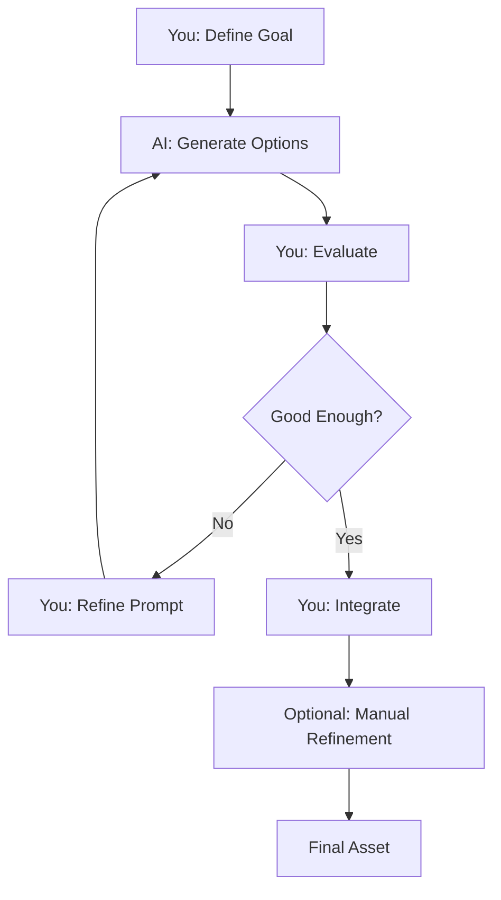

# AI is a Tool

Understanding AI's role in your workflow.

## 🛠️ AI as Tool, Not Replacement

**AI doesn't replace:**
```
❌ Your creative vision
❌ Your artistic judgment
❌ Your decision-making
❌ Your skill and knowledge
❌ Your project direction
```

**AI accelerates:**
```
✅ Asset creation speed
✅ Variation exploration
✅ Iteration cycles
✅ Workflow efficiency
```

---

## ⚡ Speed vs Skill

### Traditional Workflow

**Creating one item texture:**
```
Learn pixel art: 10-50 hours
Practice fundamentals: 10-50 hours
Draw one sword: 30-60 minutes
Master consistency: 100+ hours
Create 50-item pack: 40-80 hours
```

**Total:** Months to learn, weeks to create.

### AI-Assisted Workflow

**Creating one item texture:**
```
Learn Pixel GPT: 1-2 hours
Write prompt: 30 seconds
Generate: 2 minutes
Extract: 1 minute
Iterate (3×): 10 minutes
```

**Total:** Hours to learn, minutes to create.

**But you still need:**
- Understanding of what makes good textures
- Ability to recognize quality
- Knowledge to integrate into Minecraft
- Vision for your project

---

## 🎯 What AI Doesn't Compensate

### Lack of Knowledge

**AI doesn't teach you:**
```
❌ What an image is
❌ How Minecraft textures work
❌ How to use image editors
❌ How to integrate textures
❌ Basic computer skills
```

**You must learn fundamentals** - AI assumes baseline knowledge.

:::danger Knowledge Gap = Poor Results
If you don't understand images, transparency, resolution, Minecraft integration → You'll get poor results regardless of AI quality.

**Learn fundamentals first** → [Fundamentals Section](../fundamentals/)
:::

### Lack of Direction

**AI doesn't decide:**
```
❌ What style to use
❌ What items to create
❌ What colors to choose
❌ When result is "good enough"
```

**You must provide creative direction.**

### Lack of Quality Judgment

**AI doesn't know:**
```
❌ If result matches your vision
❌ If colors are appropriate for your project
❌ If quality is acceptable for your standards
❌ Which variation is best
```

**You must evaluate and select.**

---

## 🔧 Tool Analogy

### AI is Like Photoshop

**Photoshop:**
- Powerful tool
- Speeds up image editing
- Doesn't make you an artist automatically
- Requires learning
- Results depend on user skill

**Pixel GPT:**
- Powerful tool
- Speeds up texture creation
- Doesn't make you a texture artist automatically
- Requires learning
- Results depend on user skill

**Same principle** - tool amplifies skill, doesn't replace it.

---

## 🎨 Skill Amplification

### Low Skill + AI

```
Vague prompts → Random results
No iteration → Hit-or-miss quality
No refinement → Mediocre outputs
No knowledge → Integration issues
```

**Result:** Marginally useful

### Medium Skill + AI

```
Clear prompts → Good results
Some iteration → Better quality
Basic refinement → Decent outputs
Some knowledge → Successful integration
```

**Result:** Productive workflow

### High Skill + AI

```
Expert prompts → Excellent results
Strategic iteration → Top quality
Professional refinement → Professional outputs
Deep knowledge → Seamless integration
```

**Result:** Professional productivity

**Pattern:** AI amplifies your existing skill level.

---

## 🎯 Optimal Usage

### AI Does

**Let AI handle:**
```
✅ Generating multiple variations quickly
✅ Trying different color schemes
✅ Creating base assets
✅ Exploring stylistic options
✅ Bulk generation (batch)
```

### You Do

**You handle:**
```
✅ Creative direction
✅ Quality evaluation
✅ Prompt refinement
✅ Final selection
✅ Manual touch-ups (if needed)
✅ Project integration
```

### Together

**Hybrid workflow:**


**Best results** come from collaboration.

---

## 🚫 What AI is NOT

### Not a Substitute for Learning

```
❌ "I don't need to learn pixel art, AI does it"
❌ "I don't need to understand images"
❌ "I don't need to know Minecraft formats"
```

**Wrong mindset.**

**Better:**
```
✅ "AI accelerates pixel art creation"
✅ "I still need to understand images"
✅ "I still need to know Minecraft integration"
```

### Not a Shortcut to Expertise

**AI doesn't make you:**
- Instant texture artist
- Expert game developer
- Professional designer

**AI makes you:**
- Faster at creation
- Able to explore more options
- More productive

**You still need base knowledge.**

### Not Fully Autonomous

```
❌ AI cannot work independently
❌ AI cannot make creative decisions
❌ AI cannot evaluate quality
```

**AI requires your input** at every step.

---

## 💡 Mindset Shift

### From "AI Will Do Everything"

```
❌ "AI will create my entire texture pack for me"
❌ "AI will handle all the hard parts"
❌ "I just click and get perfect results"
```

### To "AI Helps Me Create"

```
✅ "AI generates base textures I can refine"
✅ "AI helps me explore ideas quickly"
✅ "AI accelerates my workflow significantly"
```

**Partnership mindset** = better results.

---

## 🎨 Real-World Analogy

### Power Tools

**Compare to:**
- Electric drill vs hand drill
- Chainsaw vs hand saw
- CAD software vs hand drafting

**AI is like power tools:**
```
✅ Makes work faster
✅ Enables larger projects
✅ Requires training to use
✅ Doesn't replace understanding
✅ Results depend on operator
```

**Skilled operator + power tool = Best results**

---

## 📈 Skill Development Curve

### Without AI

```
Month 1: Learning pixel art basics
Month 2-3: Practice fundamentals
Month 4-6: Create simple items
Month 7-12: Professional quality
Year 2+: Master level
```

### With AI

```
Week 1: Learn Pixel GPT + fundamentals
Week 2: Generate quality items
Month 1: Create texture packs
Month 2-3: Master advanced features
Month 4+: Professional workflows
```

**AI accelerates learning** by providing immediate feedback.

---

## ✅ Tool Philosophy

### AI Empowers You To

```
✅ Create faster than manual drawing
✅ Try more variations
✅ Explore styles you couldn't draw
✅ Iterate rapidly
✅ Complete larger projects
```

### But You Must Still

```
✅ Learn fundamentals
✅ Understand your medium
✅ Develop taste and judgment
✅ Direct the creative process
✅ Integrate results properly
```

---

## 🎯 Success Formula

```
Your Skill × AI Power = Results Quality

High Skill × AI = Excellent Results
Medium Skill × AI = Good Results
Low Skill × AI = Poor Results

AI amplifies skill, doesn't create it.
```

**Invest in learning** for best AI results.

---

## ✅ Tool Mindset Checklist

Healthy AI usage:

- [ ] I see AI as creative accelerator
- [ ] I don't expect AI to compensate for my gaps
- [ ] I take responsibility for learning fundamentals
- [ ] I provide direction and judgment
- [ ] I iterate and refine results
- [ ] I recognize AI's role as helper, not creator

:::success Tool Philosophy Understood
[Complete Understanding AI](../understanding-ai/)

Ready to master prompting → [Prompting Guide](../prompting/)
:::
