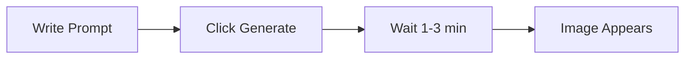
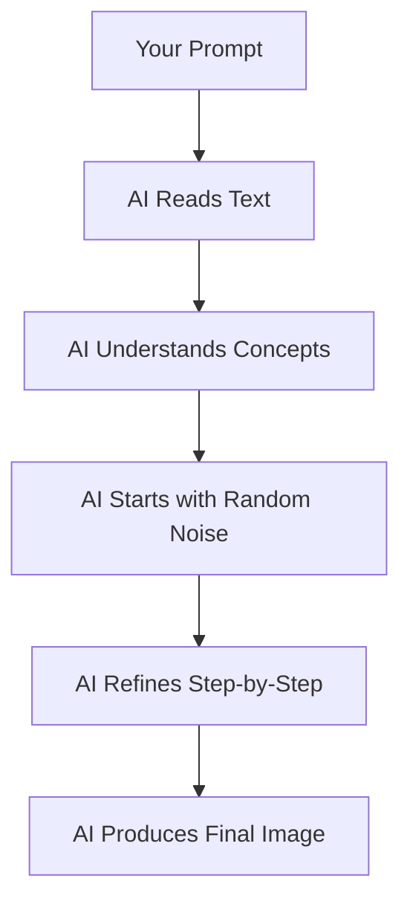
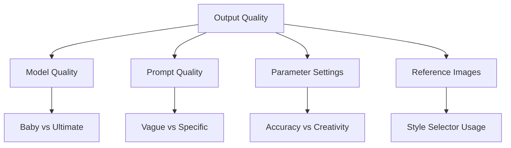

# How AI Creates Images

Understanding the image generation process.

## 🎨 The Process (User View)

### What You See



Simple: Text in → Image out

### What's Actually Happening



**More complex than it seems.**

---

## 🔬 Generation Steps (Simplified)

### Step 1: Understanding Your Prompt

**AI breaks down your text:**

```txt
Prompt: "blue diamond sword with golden handle"

AI understands:
├── "blue" → Color information
├── "diamond" → Material, texture, style
├── "sword" → Shape, structure, orientation
├── "golden" → Secondary color
└── "handle" → Specific part to color
```

**AI doesn't "read" like humans** - it converts text to numerical patterns.

### Step 2: Starting Point

**AI begins with:**
```
Random noise (static/TV snow)
```

[SCREENSHOT: Random noise pattern]

**This is intentional** - AI refines noise into image.

### Step 3: Refinement Process

**Multiple steps (typically 20-50):**

```
Step 1: Noise
Step 5: Vague sword shape
Step 10: Clear sword outline
Step 15: Colors appear
Step 20: Details refined
Step 25: Final polish
```

[SCREENSHOT: Generation steps progression]

**Each step** makes image clearer.

### Step 4: Final Image

**After all steps:**
```
Noise → Coherent image of blue diamond sword
```

**You see only final result** - intermediate steps hidden.

---

## 🎯 What Guides the Process

### Your Prompt (Primary)

**Text description steers generation:**
```
"blue diamond sword" → AI makes blue/diamond/sword pixels
"red ruby pickaxe" → AI makes red/ruby/pickaxe pixels
```

**More specific = better guidance.**

### Parameters (Secondary)

**Settings affect generation:**

| Parameter | Effect |
|-----------|--------|
| Text Accuracy | How closely to follow prompt |
| Creativity | How much freedom AI has |
| Generation Precision | Quality vs speed |

### Reference Images (If Used)

**Style Selector adds guidance:**
```
Base image → Colors/style to match
Shape image → Composition/layout to follow
Style images → Artistic style to copy
```

**More guidance = more control.**

---

## 🔄 Variation & Randomness

### Why Each Generation is Different

**AI uses controlled randomness:**
1. Starts from random noise
2. Random choices during refinement
3. Multiple valid interpretations of prompt

**Same prompt → Different results**

[SCREENSHOT: 4 variations of same prompt]

### Getting Multiple Options

**Pixel GPT generates grids:**
```
2×2 = 4 variations
3×3 = 9 variations
4×4 = 16 variations
```

**Pick the best one** or regenerate if none are good.

---

## 🧠 What AI "Learned"

### During Training

**AI was shown:**
- Thousands of Minecraft textures
- Thousands of pixel art images
- Each with text descriptions

**AI learned:**
```
"sword" usually looks like: [pattern]
"diamond" texture looks like: [pattern]
"blue" means: [color information]
```

### Knowledge is Fixed

**After training:**
```
✅ AI knows what it learned
❌ AI cannot learn new things
❌ AI cannot search internet
❌ AI cannot update knowledge
```

**Knowledge cutoff** - AI doesn't know anything added after training.

:::warning Knowledge Gaps
If something didn't exist during training, AI may not know it. Example: very recent Minecraft items, new mods.
:::

---

## 🎯 Practical Implications

### For You as User

**Understand:**
1. AI needs clear descriptions
2. AI may not know niche topics
3. AI provides variations, not exact copies
4. Iteration improves results

**Don't expect:**
```
❌ Perfect result first try
❌ AI to know everything
❌ Exact pixel-perfect recreation
❌ Mind-reading
```

**Do expect:**
```
✅ Good starting points
✅ Fast iterations
✅ Creative interpretations
✅ Need for refinement
```

### Optimization Strategy

**To get best results:**
1. Write clear, specific prompts
2. Use English (best training data)
3. Generate multiple times
4. Refine based on what you see
5. Use Style Selector for control

---

## 📊 Quality Factors

### What Affects Output Quality



**All factors matter:**
- Better model = better baseline quality
- Better prompt = better guidance
- Better parameters = better balance
- Better references = better control

### Model Tiers

**Different model qualities:**

| Tier | Understanding | Quality | Speed |
|------|---------------|---------|-------|
| Baby | Basic | ⭐⭐⭐ | Fast |
| Standard | Good | ⭐⭐⭐⭐ | Medium |
| Ultimate | Excellent | ⭐⭐⭐⭐⭐ | Slower |
| Elite | Best | ⭐⭐⭐⭐⭐ | Slowest |

**Bigger models = smarter, better quality, slower**

---

## 🎯 Creativity vs Accuracy

### The Balance

**High Accuracy:**
```
Follows prompt very closely
Less creative interpretation
May look rigid/exact
```

**High Creativity:**
```
Adds artistic flourishes
More interesting details
May deviate from prompt
```

**You control this** with Text Accuracy parameter.

### Example

**Prompt:** `diamond sword`

**High Accuracy (9-10):**
- Plain diamond sword
- Exactly as described
- No extra details

**Balanced (5-7):**
- Diamond sword
- Nice shading
- Some decorative touches

**High Creativity (1-3):**
- Diamond sword basis
- Creative decorations
- Artistic interpretation
- May add unexpected elements

---

## ✅ Understanding Checklist

You understand AI if you can answer:

- [ ] What does AI do? (Generates images from text)
- [ ] Can AI search internet? (No - fixed knowledge)
- [ ] Why different each time? (Controlled randomness)
- [ ] Is AI intelligent? (Pattern recognition, not human intelligence)
- [ ] Will first try be perfect? (Usually no - iteration needed)

:::success AI Basics Clear
[Learn what AI knows →](what-ai-knows)
:::
