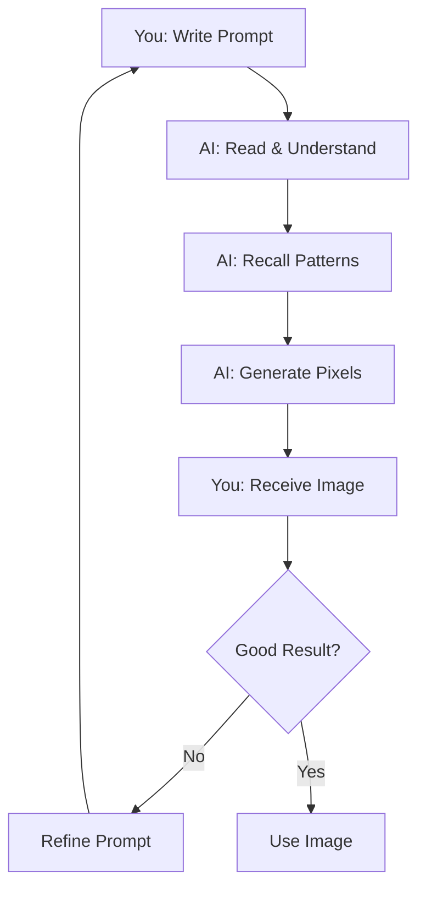

# What is AI Generation?

Simple explanation of AI image generation.

## 🤖 Simple Definition

**AI generation** is when a computer creates images from text descriptions.

**You type:** `diamond sword`  
**AI creates:** [Image of diamond sword]

[SCREENSHOT: Prompt and generated result]

---

## 🎨 How is This Different?

### Traditional Methods

**Human artist:**
1. Opens image editor
2. Manually draws each pixel
3. Takes 30-60 minutes per item

**Result:** Exact control, slow process

### AI Generation

**AI system:**
1. Reads your text description
2. Automatically creates pixels
3. Takes 1-3 minutes per item

**Result:** Fast process, needs iteration

---

## 🧠 What "AI" Means Here

### Not Like ChatGPT

**ChatGPT:**
- Generates text
- Answers questions
- Can search/browse

**Pixel GPT:**
- Generates images only
- Cannot answer questions
- Cannot search internet

### Specialized Tool

**Pixel GPT AI is specialized for:**
```
✅ Creating pixel art
✅ Minecraft textures
✅ Game assets
✅ Following text descriptions

❌ Chatting
❌ Answering questions
❌ General tasks
```

:::info Different AI Types
AI is a broad term. Pixel GPT uses **image generation AI**, not conversational AI like ChatGPT.
:::

---

## 🎯 Text-to-Image Process

### Step by Step

**1. You Write Prompt**
```txt
"blue diamond sword with golden handle"
```

**2. AI Reads and Understands**
```
AI recognizes:
- "blue" = color
- "diamond" = material  
- "sword" = weapon type
- "golden" = metal color
- "handle" = grip part
```

**3. AI Generates Pixels**
```
Creates 16×16 grid of pixels
Applies blue to blade
Applies gold to handle
Adds diamond texture
```

**4. You Get Result**
```
Image of blue diamond sword
```

[SCREENSHOT: Step-by-step visual]

---

## 🔬 Behind the Scenes (Simplified)

### AI Training (Past)

**Before you use it:**
1. AI was shown thousands of images
2. Each image had text descriptions
3. AI learned patterns: "sword" → [sword shapes]
4. Knowledge is now fixed

**You don't do this** - already done.

### AI Generation (Now)

**When you use it:**
1. You provide prompt
2. AI recalls learned patterns
3. AI combines patterns creatively
4. AI produces new image

**This is what you do** - use trained AI.

---

## 💭 What AI "Understands"

### Concepts AI Knows

**Common objects:**
```
✅ sword, pickaxe, apple, diamond
✅ red, blue, golden, dark
✅ wooden, iron, crystal, magical
```

**AI learned these from training data.**

### How AI "Sees" Prompts

**Your prompt:** `red apple`

**AI understands:**
```
"red" → Color information
"apple" → Shape (round), context (food)
Combines → Creates red apple image
```

**Not magic** - pattern recognition from training.

---

## 🎯 Important Distinctions

### AI Cannot

```
❌ Search the internet for your topic
❌ Learn new concepts you teach it
❌ Understand context outside training
❌ Read your mind
❌ Guarantee specific exact output
```

### AI Can

```
✅ Generate based on learned patterns
✅ Combine concepts creatively
✅ Produce variations
✅ Follow text descriptions (mostly)
✅ Create new images (not copies)
```

---

## 🔄 Generation Process



**Iteration is normal** - refine until satisfied.

---

## 🎨 Creativity in AI

### How AI is Creative

**AI doesn't copy** - it creates new combinations:

```
Learned:
- What swords look like
- What "diamond" texture is
- What "blue" means
- What "golden" looks like

Generates:
New sword with those characteristics
```

**Each generation is unique** - never exact copy.

### Randomness

**Why results differ each time:**
```
AI uses controlled randomness
Same prompt → Different results
This is intentional (provides variations)
```

**You get 4+ variations** - pick the best.

---

## ✅ Key Takeaways

1. **AI generates images from text** descriptions
2. **AI learned from past data** - knowledge is fixed
3. **AI cannot search internet** or learn new things
4. **AI provides variations** - iterate to find best
5. **AI is a tool** - you guide it with prompts

<details>
<summary>Self-check quiz</summary>

**Question 1:** Can AI search the internet for latest Minecraft items?  
**Answer:** ❌ No - AI knowledge is fixed from training.

**Question 2:** Why do I get different results each time?  
**Answer:** ✅ AI uses randomness to provide variations.

**Question 3:** Can AI read my mind and know what I want?  
**Answer:** ❌ No - you must describe clearly in prompt.

**Question 4:** Is AI like ChatGPT?  
**Answer:** ❌ No - Pixel GPT AI generates images only, not text conversations.

</details>

:::success AI Basics Understood
[Learn how AI creates images →](how-ai-creates-images)
:::
