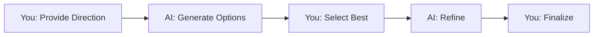

# Working with AI

How to collaborate effectively with AI for best results.

## 🤝 AI as Creative Partner

Think of AI as a **creative assistant**, not a magic solution.



**Collaboration** - not replacement.

---

## 🎯 The Iteration Cycle

### Expect Iteration

**Normal workflow:**
```
Generate → Evaluate → Refine → Generate → Evaluate → Success
```

**NOT:**
```
Generate → Perfect → Done
```

**First try rarely perfect** - this is normal.

### Example Iteration

**Goal:** Blue diamond sword with gold handle

**Attempt 1:**
```txt
Prompt: "sword"
Result: Generic brown sword
Analysis: Too vague
```

**Attempt 2:**
```txt
Prompt: "diamond sword"
Result: Diamond sword, but colors not right
Analysis: Need to specify colors
```

**Attempt 3:**
```txt
Prompt: "blue diamond sword"
Result: Blue sword, but handle is blue too
Analysis: Need to specify handle color
```

**Attempt 4:**
```txt
Prompt: "blue diamond sword with golden handle"
Result: Perfect! ✓
```

**4 iterations to perfection** - normal and expected.

---

## 🎨 Guiding AI Effectively

### Clear Communication

**Be explicit, not implicit:**

```txt
❌ "cool sword" (What does "cool" look like?)
✅ "ice blue sword with frost crystals"

❌ "nice pickaxe" (What is "nice"?)
✅ "ornate golden pickaxe with engravings"
```

**AI needs visual descriptions**, not subjective terms.

### Specificity Balance

**Too vague:**
```txt
"sword" → Too many possibilities, random result
```

**Too complex:**
```txt
"legendary ancient mystical powerful cosmic divine eternal blessed enchanted supreme ultimate sacred holy magical glowing shimmering sparkling..." 
→ AI gets confused, ignores half the words
```

**Just right:**
```txt
"enchanted blue diamond sword with golden handle and purple gems"
→ Clear, specific, not overwhelming
```

**Sweet spot:** 5-15 descriptive words.

---

## 🔄 Learning from Results

### Analyze What Works

**After each generation:**

**Ask yourself:**
```
What worked well?
├── Colors correct?
├── Shape recognizable?
├── Style appropriate?
└── Details as expected?

What didn't work?
├── Wrong colors?
├── Wrong shape?
├── Missing elements?
└── Unexpected additions?
```

### Refine Based on Analysis

**If colors wrong:**
```
Next prompt: Add specific color words
"bright blue", "dark red", "metallic gold"
```

**If shape wrong:**
```
Next prompt: Describe shape better
"curved blade", "straight handle", "pointed tip"
```

**If style wrong:**
```
Next prompt: Add style keywords
"minecraft style", "cartoon", "medieval fantasy"
```

---

## 🎯 Using AI Strengths

### AI is Great At

**Rapid variation:**
```
✅ Generate 4-16 versions instantly
✅ Try different color combos
✅ Explore style options
✅ Test ideas quickly
```

**Use AI for:** Exploring possibilities

**Creative combinations:**
```
✅ Mix concepts you describe
✅ Add decorative elements
✅ Create unique variations
```

**Use AI for:** Creative inspiration

**Consistency (with Style Selector):**
```
✅ Match color palettes
✅ Maintain style across sets
✅ Create coherent collections
```

**Use AI for:** Maintaining cohesion

### You are Great At

**Creative direction:**
```
✅ Deciding what to make
✅ Choosing visual style
✅ Setting constraints
```

**Judgment:**
```
✅ Selecting best results
✅ Identifying issues
✅ Knowing when to stop
```

**Refinement:**
```
✅ Manual touch-ups
✅ Final adjustments
✅ Integration into project
```

---

## 🤖 AI Behavior Patterns

### Randomness

**AI adds variation** even with same prompt:
```
Same prompt × 4 generations = 4 different results
```

**Why?** Controlled randomness provides options.

**What to do:**
- Generate multiple times
- Pick favorite variation
- Or combine elements from multiple

### Literal Interpretation

**AI takes prompts literally:**

```txt
"broken sword" → AI makes visually broken sword
"old pickaxe" → AI makes rusty, aged pickaxe
"dark apple" → AI makes black/dark colored apple
```

**Be careful with adjectives** - AI interprets visually.

### Combination Logic

**AI combines concepts logically:**

```txt
"ice sword" = Sword + ice aesthetic
"fire apple" = Apple + flame elements
"wooden diamond" = Diamond shape + wood texture
```

**Sometimes unexpected** - AI's interpretation may surprise you.

---

## 🔧 Handling Unexpected Results

### When AI Surprises You

**Unexpected but good:**
```
✅ Keep it! Creative interpretation can be better
✅ Save for later use
✅ Note prompt for future
```

**Unexpected and bad:**
```
❌ Analyze why it went wrong
❌ Refine prompt to be clearer
❌ Try different model
❌ Add constraints
```

### Common Surprises

<details>
<summary>AI added elements not in prompt</summary>

**Example:** Prompted "diamond sword", got sword with gems

**Why:** AI's creative interpretation

**Fix if unwanted:**
```txt
Add constraints: "simple diamond sword, no decorations"
Lower creativity parameter
```

</details>

<details>
<summary>AI ignored part of prompt</summary>

**Example:** Prompted "blue blade golden handle", only blade is colored

**Why:** Prompt unclear or AI prioritized differently

**Fix:**
```txt
Be more explicit: "sword with blue blade and golden handle, two different colors"
Emphasize: "blue BLADE, golden HANDLE"
```

</details>

<details>
<summary>AI generated wrong item entirely</summary>

**Example:** Prompted "pickaxe", got sword

**Why:** AI didn't understand or term not in knowledge

**Fix:**
```txt
More descriptive: "mining pickaxe with wooden handle"
Visual details: "T-shaped tool with pointed metal head"
Try different model
```

</details>

---

## 🎨 Collaborative Workflow

### Your Role

```
1. Define goal (what you want)
2. Write clear prompt
3. Choose appropriate model
4. Evaluate results
5. Provide refinement
6. Make final decision
```

### AI's Role

```
1. Interpret your prompt
2. Generate multiple variations
3. Apply learned patterns
4. Produce images quickly
```

### Together

```
You guide → AI generates → You select → AI refines → Success
```

**Neither can succeed alone** - collaboration required.

---

## 📈 Improving Over Time

### You Get Better At

**With practice:**
```
✅ Writing effective prompts
✅ Choosing right models
✅ Predicting AI behavior
✅ Faster iteration cycles
```

**Track your progress:**
- Save successful prompts
- Document what works
- Build personal prompt library

### AI Stays Consistent

**AI doesn't learn from you:**
```
AI behavior doesn't change
Same prompt → Similar results (with randomness)
You must adapt, not AI
```

**But you learn to use it better!**

---

## 🎯 Mindset for Success

### Realistic Expectations

```
✅ "AI will give me great starting points"
✅ "I'll need to iterate a few times"
✅ "AI accelerates my workflow significantly"

❌ "AI will create exactly what I imagine instantly"
❌ "AI will compensate for my lack of knowledge"
❌ "AI will do everything for me"
```

### Growth Mindset

**View each generation as learning:**
```
Bad result? → What can I improve in prompt?
Good result? → What made this work well?
Unexpected result? → Interesting! Can I use this?
```

**Every generation teaches you** how to prompt better.

---

## 🛠️ Practical Tips

### Start Simple

```
First generation: Basic prompt ("diamond sword")
Evaluate: What's good/bad?
Next generation: Add details
Iterate until satisfied
```

**Don't overwhelm AI** with complex prompts immediately.

### Use AI's Randomness

**Generate 4-16 variations:**
```
Same prompt → Different results
Pick favorite elements from each
Combine best aspects
```

**Variety is valuable** - don't dismiss it.

### Know When to Stop

**Diminishing returns:**
```
Iterations 1-3: Big improvements
Iterations 4-7: Small improvements
Iterations 8+: Minimal difference
```

**Stop when "good enough"** - perfection may require manual editing.

---

## ✅ Collaboration Checklist

Effective AI collaboration:

- [ ] I provide clear descriptions (not vague terms)
- [ ] I expect iteration (not perfection first try)
- [ ] I evaluate results objectively
- [ ] I refine prompts based on results
- [ ] I use AI's strengths (speed, variation)
- [ ] I apply my strengths (judgment, direction)
- [ ] I know when manual editing is better

:::success Ready to Work with AI
[Complete Understanding AI section](../understanding-ai/)

Next: [Master Prompting →](../prompting/)
:::
